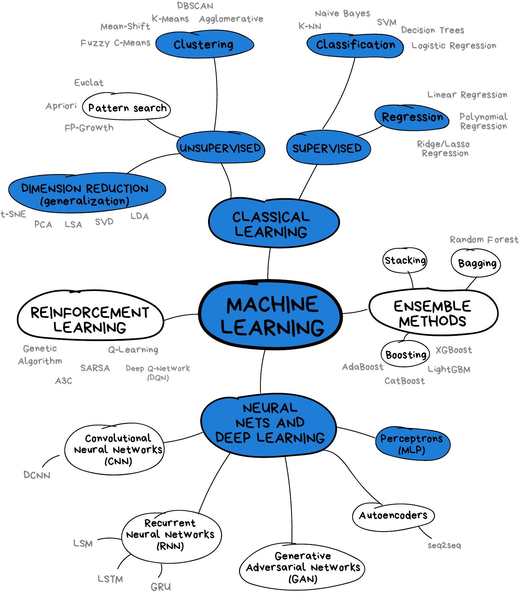

# What is machine learning?

Machine learning is a set of techniques that enable computers to use data to improve the performance of a given task. This is similar in concept to how humans learn to make predictions based upon previous experience and knowledge. Machine learning can address a wide range of tasks and problems, but broadly speaking it can be used to find trends in a dataset, classify data into groups or categories, make decisions and predictions based upon data, and even "learn" how to interact in an environment when provided with goals to achieve.

### Machine learning in our daily lives

Machine learning has quickly become an integral part of the technology industry and is used throughout many aspects of society. Here are a just a few examples that we may take for granted during our daily lives:

* Banks look for trends in transaction data to detect outliers that may be fraudulent
* Email inboxes use text to classify whether an email is spam or not, and adjust their classification rules based upon how we flag emails
* Travel apps use live and historic data to predict traffic, travel times, and journey routes
* Retail companies and streaming services use data to recommend new content we might like based upon our demographic and historical preferences
* Image, object, and pattern recognition is used to identify humans and vehicles, capture text, generate subtitles, and much more
* Self-driving cars and robots use object detection and performance feedback to improve their interaction with the world

> ### Categorise these examples into types of machine learning tasks
>
> Using the following 4 broad tasks, categorise the examples of Machine learning in our daily lives into one or more of the following:
>
> 1. finding trends in data
> 2. classifying data into groups and categories
> 3. making decisions and predictions
> 4. learning to interact in an environment
{: .challenge}

### Artificial Intelligence vs Machine Learning

The term machine learning (ML) is often mentioned alongside artificial intelligence (AI) and deep learning (DL). Deep learning is a subset of machine learning, and machine learning is a subset of artificial intelligence.

AI is a very broad term that is used to describe a system than has a "general intelligence" that the system can apply to solve a wide range of different problems, often mimicking the behaviour of intelligent biological systems. Another definition of AI dates back to the 1950s and Alan Turing's "Immitation Game". This said that we could consider a system intelligent when it could fool a human into thinking they were talking to another human when they were actually talking to a computer. Modern attempts at this are getting close to fooling humans, but although there have been great advances in AI and ML research we can only come close to human-like intelligence in a few specialist areas, and we are still a long way from a general purpose AI.

ML refers to techniques where a computer can "learn" patterns in data, usually by being shown numerous examples to train it to solve a particular problem. While they can learn to solve specific problems, or multiple similar problems, they are not considered a general intelligence as they cannot solve a wide range of different problems. They often need hundreds or thousands of examples to learn a task and are confined to relatively simple classifications. A human-like system could learn much quicker, and potentially learn from a single example by using it's knowledge of many other problems.

DL is particular field of machine learning that uses a specific type of ML algorithm called a neural network to create highly-complex systems, built out of many neural networks, to learn from vast quantities of data. Deep learning can be used to solve an incredible range of problems, but can require huge amounts of input data and computational resources to train. The image below shows some the relationship between artificial intelligence, Machine Learning and Deep Learning.

The image above is by Tukijaaliwa, CC BY-SA 4.0, via Wikimedia Commons, original source

# What are some of the types of Machine Learning?

This lesson will introduce you to some of the key concepts and sub-domains of ML such as Supervised learning, Unsupervised learning, as well as the very basics of Neural Networks.

The figure below provides a nice overview of some of the sub-domains of ML and the techniques used within each sub-domain. We recommend checking out the Scikit Learn [webpage](https://scikit-learn.org/stable/index.html) for additional examples of the topics we will cover in this lesson. Highlighted in blue are the topics covered in this lesson: Classical learning techniques such as regression, classification, clustering, and dimension reduction, as well as a brief glimpse into neural networks using perceptrons.

[Image from Vasily Zubarev via their blog](https://vas3k.com/blog/machine_learning/) with modifications in blue to denote lesson content.

### Supervised and unsupervised learning 

Some words about this.

### Training Data

Many (but not all) machine learning systems "learn" by taking a series of input data and output data and using it to form a model. The maths behind the machine learning doesn't care what the data is as long as it can represented numerically or categorised. Some examples might include:

* predicting commute times given traffic conditions
* predicting house prices given stock market prices
* classifying if an email is spam or not
* classifying what if an image contains a person or not

Typically we will need to train our models with hundreds, thousands or even millions of examples before they work well enough to do any useful predictions or classifications with them. 

Some systems will do training as a one shot process which produces a model. Others might try to continuosly refine their training through the real use of the system and human feedback to it. For example every time you mark an email as spam or not spam you are probably contributing to further training of your spam filter's model. 

### Types of output

Predictors will usually involve a continuos scale of outputs, such as the price of something. Classifiers will tell you which class (or classes) are present in the data. For example a system to recognise hand writing from an input image will need to classify the output into one of a set of potential characters. 

# What are some limitations of Machine Learning

### Over Hyping of Artificial Intelligence and Machine Learning

There is a lot of hype around machine learning and artificial intelligence right now, while many real advances have been made a lot of people are overstating what can be achieved. Recent advances in computer hardware and machine learning algorithms have made it a lot more useful, but its been around over 50 years. 

The [Gartner Hype Cycle](https://www.gartner.com/en/research/methodologies/gartner-hype-cycle) looks at which technologies are being over-hyped. In the August 2018 analysis AI Platform as a service, Deep Learning chips, Deep learning neural networks, Conversational AI and Self Driving Cars are all shown near the "Peak of inflated expectations". 

[Image from Jeremy Kemp via Wikimedia](https://en.wikipedia.org/wiki/File:Gartner_Hype_Cycle.svg)

### Garbage In = Garbage Out

There is a classic expression in Computer Science, "Garbage In = Garbage Out". This means that if the input data we use is garbage then the ouput will be too. If for instance we try to get a machine learning system to find a link between two unlinked variables then it might still come up with a model that attempts this, but the output will be meaningless. 

### Bias or lacking training data

Input data may also be lacking enough diversity to cover all examples. Due to how the data was obtained there might be biases in it that are then reflected in the ML system. For example if we collect data on crime reporting it could be biased towards wealthier areas where crimes are more likely to be reported. Historical data might not cover enough history.

### Extrapolation

We can only make reliable predictions about data which is in the same range as our training data. If we try to extrapolate beyond what was covered in the training data we'll probably get wrong answers. 

### Over fitting

Sometimes ML algorithms become over trained to their training data and struggle to work when presented with real data. In some cases it best not to train too many times. 

### Inability to explain answers

Many machine learning techniques will give us an answer given some input data even if that answer is wrong. Most are unable to explain any kind of logic in arriving at that answer. This can make diagnosing and even detecting problems with them difficult. 

> ## Where have you encountered machine learning already?
>
> Discuss with the person next to you:
>
> 1. Where have I seen machine learning in use?
> 2. What kind of input data does that machine learning system use to make predictions/classifications?
> 3. Is there any evidence that your interaction with the system contributes to further training?
> 4. Do you have any examples of the system failing?

{: .challenge}


