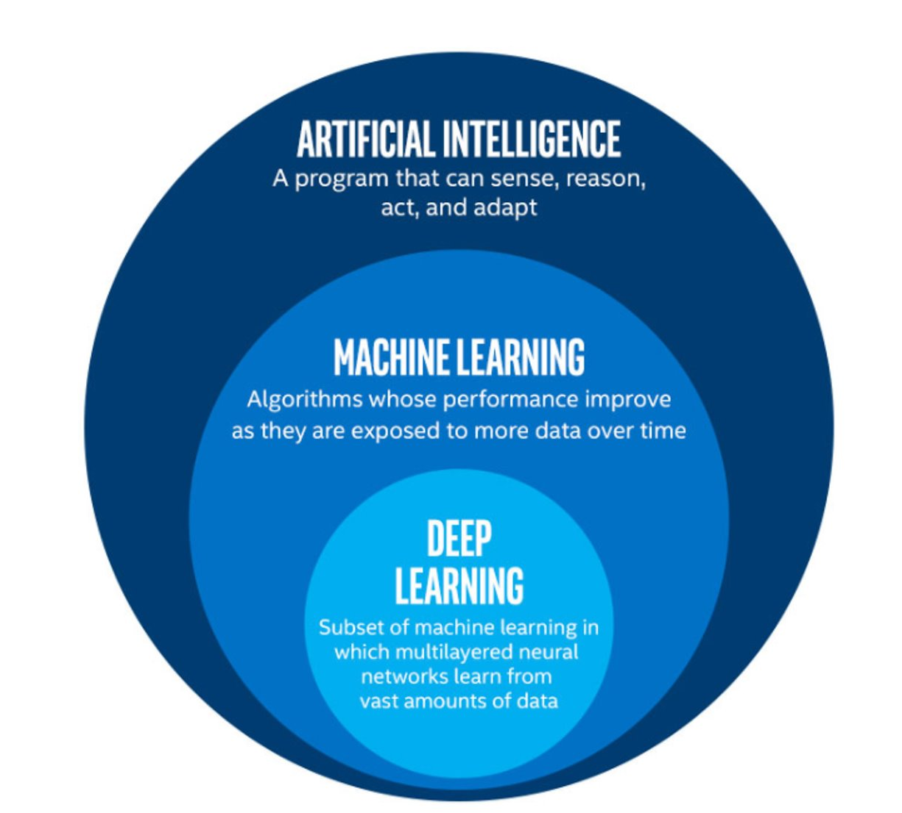
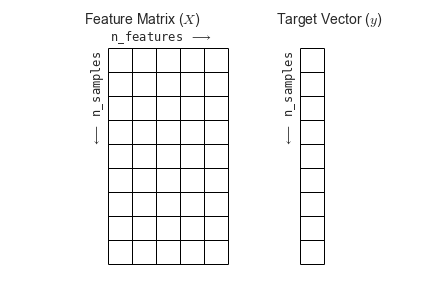
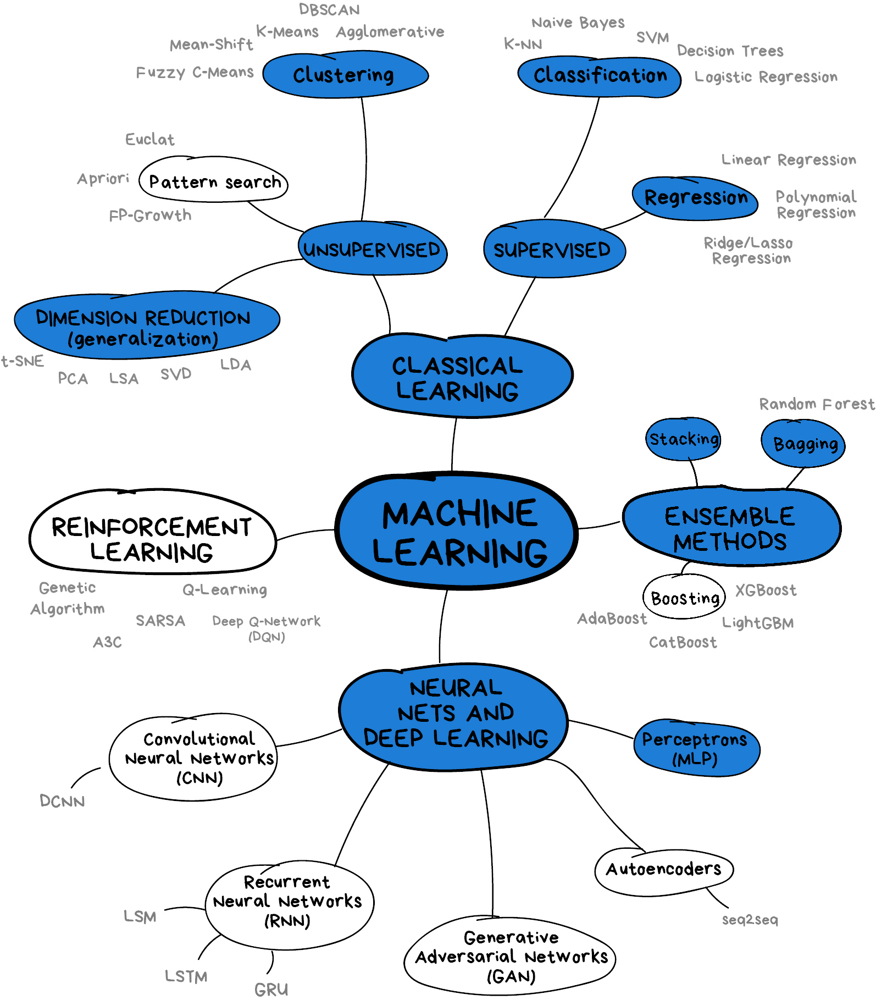

# What is machine learning?

Machine learning is a set of techniques that enable computers to use data to improve their performance in a given task. This is similar in concept to how humans learn to make predictions based upon previous experience and knowledge. Machine learning encompasses a wide range of activities, but broadly speaking it can be used to: find trends in a dataset, classify data into groups or categories, make predictions based upon data, and even "learn" how to interact with an environment when provided with goals to achieve.

### Artificial intelligence vs machine learning

The term machine learning (ML) is often mentioned alongside artificial intelligence (AI) and deep learning (DL). Deep learning is a subset of machine learning, and machine learning is a subset of artificial intelligence.

AI is a broad term used to describe a system possessing a "general intelligence" that can be applied to solve a diverse range of problems, often mimicking the behaviour of intelligent biological systems. Modern attempts are getting close to fooling humans, but while there have been great advances in AI and ML research, human-like intelligence is only possible in a few specialist areas. Despite this technical definition, AI is often used to describe ML and DL systems in general.

ML refers to techniques where a computer can "learn" patterns in data, usually by being shown many training examples. While ML algorithms can learn to solve specific problems, or multiple similar problems, they are not considered to possess a general intelligence. ML algorithms often need hundreds or thousands of examples to learn a task and are confined to activities such as simple classifications. A human-like system could learn much quicker than this, and potentially learn from a single example by using it's knowledge of many other problems.

DL is a particular field of machine learning where algorithms called neural networks are used to create highly complex systems. Large collections of neural networks are able to learn from vast quantities of data. Deep learning can be used to solve a wide range of problems, but it can also require huge amounts of input data and computational resources to train. 

The image below shows the relationships between artificial intelligence, machine learning and deep learning.

The image above is by Tukijaaliwa, CC BY-SA 4.0, via Wikimedia Commons, original source

### Machine learning in our daily lives

Machine learning has quickly become an important technology and is now frequently used to perform services we encounter in our daily lives. Here are just a few examples:

* Banks look for trends in transaction data to detect outliers that may be fraudulent
* Email inboxes use text to decide whether an email is spam or not, and adjust their rules based upon how we flag emails
* Travel apps use live and historic data to estimate traffic, travel times, and journey routes
* Retail companies and streaming services use data to recommend new content we might like based upon our demographic and historical preferences
* Image, object, and pattern recognition is used to identify humans and vehicles, capture text, generate subtitles, and much more
* Self-driving cars and robots use object detection and performance feedback to improve their interaction with the world

> #### Where else have you encountered machine learning already?
> Now that we have explored machine learning in a bit more detail, discuss with the person next to you:
> 1. Where else have I seen machine learning in use?
> 2. What kind of input data does that machine learning system use to make predictions/classifications?
> 3. Is there any evidence that your interaction with the system contributes to further training?
> 4. Do you have any examples of the system failing?
{: .challenge}

### Limitations of machine learning

Like any other systems machine learning has limitations, caveats, and "gotchas" to be aware of that may impact the accuracy and performance of a machine learning system.

#### Garbage in = garbage out

There is a classic expression in computer science: "garbage in = garbage out". This means that if the input data we use is garbage then the ouput will be too. If, for example, we try to use a machine learning system to find a link between two unlinked variables then it may well manage to produce a model attempting this, but the output will be meaningless. 

#### Biases due to training data

The performance of a ML system depends on the breadth and quality of input data used to train it. If the input data contains biases or blind spots then these will be reflected in the ML system. For example, if we collect data on public transport use from only high socioeconomic areas, the resulting input data may be biased due to a range of factors that may increase the likelihood of people from those areas using private transport vs public options.

#### Extrapolation

We can only make reliable predictions about data which is in the same range as our training data. If we try to extrapolate beyond the boundaries of the training data we cannot be confident in our results. As we shall see some algorithms are better suited (or less suited) to extrapolation than others.

#### Over fitting

Sometimes ML algorithms become over-trained and subsequently don't perform well when presented with real data. It's important to consider how many rounds of training a ML system has recieved and whether or not it may have become over-trained. 

#### Inability to explain answers

Machine learning techniques will return an answer based on the input data and model parameters even if that answer is wrong. Most systems are unable to explain the logic used to arrive at that answer. This can make detecting and diagnosing problems difficult. 

# Getting started with Scikit-Learn

### About Scikit-Learn

[Scikit-Learn](http://github.com/scikit-learn/scikit-learn) is a python package designed to give access to well-known machine learning algorithms within Python code, through a clean application programming interface (API). It has been built by hundreds of contributors from around the world, and is used across industry and academia.

Scikit-Learn is built upon Python's [NumPy (Numerical Python)](http://numpy.org) and [SciPy (Scientific Python)](http://scipy.org) libraries, which enable efficient in-core numerical and scientific computation within Python. As such, Scikit-Learn is not specifically designed for extremely large datasets, though there is [some work](https://github.com/ogrisel/parallel_ml_tutorial) in this area. For this introduction to ML we are going to stick to processing small to medium datasets with Scikit-Learn, without the need for a graphical processing unit (GPU).

Like any other Python package, we can import Scikit-Learn and check the package version using the following Python commands:

~~~
import sklearn
print('scikit-learn:', sklearn.__version__)
~~~
{: .language-python}

### Representation of Data in Scikit-learn

Machine learning is about creating models from data: for that reason, we'll start by discussing how data can be represented in order to be understood by the computer.

Most machine learning algorithms implemented in scikit-learn expect data to be stored in a two-dimensional array or matrix. The arrays can be either numpy arrays, or in some cases scipy.sparse matrices. The size of the array is expected to be [n_samples, n_features]

* n_samples: The number of samples. A sample can be a document, a picture, a sound, a video, an astronomical object, a row in database or CSV file, or whatever you can describe with a fixed set of quantitative traits.
* n_features: The number of features (variables) that can be used to describe each item in a quantitative manner. Features are generally real-valued, but may be boolean or discrete-valued in some cases.

Figure from the [Python Data Science Handbook](https://github.com/jakevdp/PythonDataScienceHandbook)

If we want our ML models to make predictions or classifications, we also provide "labels" as our expected "answers/results". The model will then be trained on the input features to try and match our provided labels.

# What will we cover today?

This lesson will introduce you to some of the key concepts and sub-domains of ML such as supervised learning, unsupervised learning, and neural networks.

The figure below provides a nice overview of some of the sub-domains of ML and the techniques used within each sub-domain. We recommend checking out the Scikit-Learn [webpage](https://scikit-learn.org/stable/index.html) for additional examples of the topics we will cover in this lesson. We will cover topics highlighted in blue: classical learning techniques such as regression, classification, clustering, and dimension reduction, as well as ensemble methods and a brief introduction to neural networks using perceptrons.

[Image from Vasily Zubarev via their blog](https://vas3k.com/blog/machine_learning/) with modifications in blue to denote lesson content.


