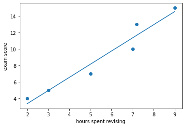
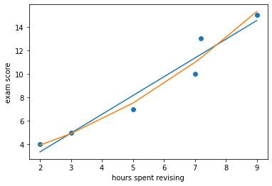
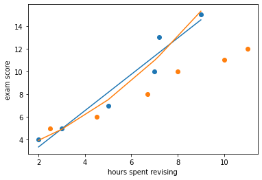

# Supervised Learning

Classical machine learning is often divided into two categories – Supervised and Unsupervised Learning. 

For the case of supervised learning we act as a "supervisor" or "teacher" for our ML-algorithms by providing the algorithm with "labelled data" that contains example answers of what we wish the algorithm to achieve. 

For instance, if we wish to train our algorithm to distinguish between images of cats and dogs, we would provide our algorithm with images that have already been labelled as "cat" or "dog" so that it can learn from these examples. If we wished to train our algorithm to predict house prices over time we would provide our algorithm with example data of datetime values that are "labelled" with house prices.

Supervised learning is split up into two further categories: classification and regression. For classification the labelled data is discrete, such as the "cat" or "dog" example, whereas for regression the labelled data is continuous, such as the house price example.

In this episode we will explore how we can use regression to build a "model" that can be used to make predictions.

## About Scikit-Learn

[Scikit-Learn](http://github.com/scikit-learn/scikit-learn) is a python package designed to give access to well-known machine learning algorithms within Python code, through a clean API. It has been built by hundreds of contributors from around the world, and is used across industry and academia.

Scikit-Learn is built upon Python's [NumPy (Numerical Python)](http://numpy.org) and [SciPy (Scientific Python)](http://scipy.org) libraries, which enable efficient in-core numerical and scientific computation within Python. As such, Scikit-Learn is not specifically designed for extremely large datasets, though there is [some work](https://github.com/ogrisel/parallel_ml_tutorial) in this area. For this introduction to ML we are going to stick to processing small to medium datasets with Scikit-Learn, without the need for a graphical processing unit (GPU).

# Regression

Regression is a statistical technique that relates a dependent variable (a label in ML terms) to one or more independent variables. A regression model attempts to describe this relation by fitting the data as closely as possible according to a mathematical criteria. This model can then be used to predict new labelled values by inputting the independent variables into it - if we create a house price model we can then input any datetime value we wish to predict a new house price value for that inputted datetime.

Regression can be as simple as drawing a "line of best fit" through data points, known as Linear regression, or more complex models such as polynomial regression, and is used routinely around the world in both industry and research. You may have already used regression in the past without knowing that it is also considered a machine learning technique!

## Linear regression using Scikit-Learn

We've had a lot of theory so time to start some actual coding! Let's create regression models for a very small dataset that will predict exam scores from hours spent revising. Exam scores is our labelled dependent variable, and hours spent revising is our independent input variable.

Let's define our dataset and visualise it:

~~~
import matplotlib.pyplot as plt 

x_data = [2, 3, 5, 7, 7.2, 9] # hours spent revising
y_data = [4, 5, 7, 10, 13, 15] # exam results

plt.scatter(x_data, y_data)
plt.xlabel('hours spent revising')
plt.ylabel('exam score')
plt.show()
~~~
{: .language-python}

Now lets import scikit-Learn and use it to create a linear regression model. The Scikit-Learn `regression` function that we will use is designed for datasets where multiple parameters are used and so it expects to be given multi-dimensional array data. To get it to accept our single dimension data, we need to convert the simple lists to numpy arrays with numpy's `reshape` function.

~~~
import sklearn.linear_model as skl_lin
import numpy as np

x_data = np.array(x_data).reshape(-1, 1)
y_data = np.array(y_data).reshape(-1, 1)

lin_regress = skl_lin.LinearRegression().fit(x_data, y_data)
~~~
{: .language-python}

The mathematical equation for a linear fit is `y = mx + c` where `y` is our output exam result values, `x` is our input revision hour values, `m` represents the gradient of the linear fit, and `c` represents the intercept with the y-axis.

As well as using our newly created `lin_regress` model to predict new values, we can also inspect the fit coefficients using `.coef_` and `.intercept_`. The Scikit-Learn code is designed to calculate multiple coefficients and intercepts at once so these return values will be arrays. Since we've just got one parameter we can just grab the first item from each of these arrays as follows:

~~~
m = lin_regress.coef_[0][0]
c = lin_regress.intercept_[0]

print(m, c)
~~~
{: .language-python}

Once we have created the model using the `regression` function we can use Scikit-Learn's `predict` function to convert input values into predictions. 

~~~
linear_data = lin_regress.predict(x_data)

plt.scatter(x_data, y_data)
plt.plot(x_data, linear_data)
plt.xlabel('hours spent revising')
plt.ylabel('exam score')
plt.show()
~~~
{: .language-python}

This looks like a reasonably good fit to the data points, but rather than rely on our own judgement lets calculate the fit error instead. Scikit-Learn doesn't provide a root mean squared error function, but it does provide a mean squared error function. We can calculate the root mean squared error simply by taking the square root of the output of this function. The `mean_squared_error` function is part of the Scikit-Learn metrics module, so we'll have to add that to our imports as well as the `math` module:

import math
import sklearn.metrics as skl_metrics

~~~
import math
import sklearn.metrics as skl_metrics

error = math.sqrt(skl_metrics.mean_squared_error(y_data, linear_data))
print("error=", error)
~~~
{: .language-python}

## Polynomial regression using Scikit-Learn

Now that we have learnt how to do a linear regression it's time look into polynomial regressions. Polynomial functions are non-linear functions that are commonly-used to model data. Mathematically they have `N` degrees of freedom and they take the following form `y = a + bx + cx^2 + dx^3 ... + mx^N`

If we have a polynomial of degree N=1 we once again return to a linear equation `y = a + bx` or as it is more commonly written `y = mx + c`. Let's create a polynomial regression using N=2. In Scikit-Learn this is done in two steps. First we pre-process our input data `x_data` into a polynomial representation using the `PolynomialFeatures` function:

~~~
import sklearn.preprocessing as skl_pre
poly_features = skl_pre.PolynomialFeatures(degree=2)
x_poly = poly_features.fit_transform(x_data)
~~~
{: .language-python}

Then we can create our polynomial regressions using the `LinearRegression().fit()` function again, but this time using the polynomial representation of our `x_data` instead. As before we can also inspect the regression coefficients and the intercept gradient, noting that the polynomial expression has multiple coefficients.

~~~
poly_regress = skl_lin.LinearRegression().fit(x_poly, y_data)

poly_m = poly_regress.coef_
poly_c = poly_regress.intercept_[0]

print(poly_m, poly_c)
~~~
{: .language-python}

We can once again use our model to convert input values into predictions. Lets plot our original data, linear model, and polynomial model together as well as compare the errors of the linear and polynomial fits.

~~~
poly_data = poly_regress.predict(x_poly)

poly_error = math.sqrt(skl_metrics.mean_squared_error(y_data, poly_data))
print("linear error=", error)
print("poly error=", poly_error)

plt.scatter(x_data, y_data)
plt.plot(x_data, linear_data)
plt.plot(x_data, poly_data)
plt.xlabel('hours spent revising')
plt.ylabel('exam score')
plt.show()
~~~
{: .language-python}

Comparing the plots and errors it seems like a polynomial regression of N=2 fits the data better than a linear regression.

> ## Exercise: Try repeating your polynomial regression with different N values
> 1. What happens when you try using a polynomial of N=1?
> 2. What happens if you try using N=3 or more? Do the errors get better or worse?
{: .challenge}

> ## Exercise: How do are models perform against new data?
> We now have some more exam score data that we can use to evaluate our existing models:
> ~~~
> x_new = [2.5, 4.5, 6.7, 8, 10, 11] # hours spent revising
> y_new = [5, 6, 8, 10, 11, 12]  # exam results
> ~~~
> {: .language-python}
>
> Try plotting this new data alongside our old data and existing regression models. Which model performs better at predicting these new values? What comments can you say about our original dataset? How could we improve our modelling attempts?
> > ## Solution
> > 
> {: .solution}
{: .challenge}

When looking at our original dataset it seems the higher the degree of polynomial the better the fit as the curve hits all the points. But as soon as we input our new dataset we see that our models fail to predict the new results, and higher degree polynomials noticible perform worse than the original linear regression. This phenomena is known as overfitting - our original models have become too specific to our original data and now lack the generality we expect from a model. You could say that our models have learnt the answers but failed to understand the assignment!

Remember: *Garbage in, Garbage out* and *correlation does not equal causation*. Just because almost every winner in the olympic games drank water, it doesn't mean that drinking heaps of water will make you an olympic winner.

