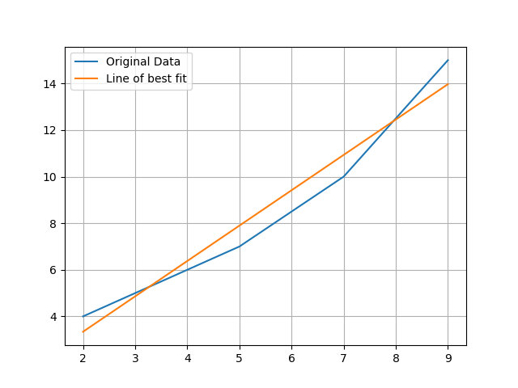

# Linear regression

If we take two variable and graph them against each other we can look for relationships between them. Once this relationship is established we can use that to produce a model which will help us predict future values of one variable given the other. 

If the two variables form a linear relationship (a straight line can be drawn to link them) then we can create a linear equation to link them. This will be of the form y = m * x + c, where x is the variable we know, y is the variable we're calculating, m is the slope of the line linking them and c is the point at which the line crosses the y axis (where x = 0). 

Using the Gapminder website we can graph all sorts of data about the development of different countries. Lets have a look at the change in [life expectancy over time in the United Kingdom](https://www.gapminder.org/tools/#$state$time$value=2018&showForecast:true&delay:100;&entities$filter$;&dim=geo;&marker$select@$geo=gbr&trailStartTime=1800;;&axis_x$which=time&domainMin:null&domainMax:null&zoomedMin=1800&zoomedMax=2018&scaleType=time&spaceRef:null;&axis_y$domainMin:null&domainMax:null&zoomedMin:1&zoomedMax:84.17&spaceRef:null;&size$domainMin:null&domainMax:null&extent@:0.022083333333333333&:0.4083333333333333;;&color$which=world_6region;;;&chart-type=bubbles).

Since around 1950 life expectancy appears to be increasing with a pretty straight line in other words a linear relationship. We can use this data to try and calculate a line of best fit that will attempt to draw a perfectly straight line through this data. One method we can use is called [linear regression or least square regression](https://www.mathsisfun.com/data/least-squares-regression.html). The linear regression will create a linear equation that minimises the average distance from the line of best fit to each point in the graph. It will calculate the values of m and c for a linear equation for us. We could do this manually, but lets use Python to do it for us. 

## Coding a linear regression with Python 
This code will calculate a least squares or linear regression for us.

~~~
def least_squares(data):
    x_sum = 0
    y_sum = 0
    x_sq_sum = 0
    xy_sum = 0

    # the list of data should have two equal length columns
    assert len(data[0]) == len(data[1])
    assert len(data) == 2

    n = len(data[0])
    # least squares regression calculation
    for i in range(0, n):
        x = int(data[0][i])
        y = data[1][i]
        x_sum = x_sum + x
        y_sum = y_sum + y
        x_sq_sum = x_sq_sum + (x**2)
        xy_sum = xy_sum + (x*y)

    m = ((n * xy_sum) - (x_sum * y_sum))
    m = m / ((n * x_sq_sum) - (x_sum ** 2))
    c = (y_sum - m * x_sum) / n

    print("Results of linear regression:")
    print("x_sum=", x_sum, "y_sum=", y_sum, "x_sq_sum=", x_sq_sum, "xy_sum=",
          xy_sum)
    print("m=", m, "c=", c)

    return m, c
~~~
{: .python}

Lets test our code by using the example data from the mathsisfun link above. 

~~~
x_data = [2,3,5,7,9]
y_data = [4,5,7,10,15]
least_squares([x_data,y_data])
~~~
{: .python}

We should get the following results:

~~~
Results of linear regression:
x_sum= 26 y_sum= 41 x_sq_sum= 168 xy_sum= 263
m= 1.5182926829268293 c= 0.30487804878048763
~~~

### Testing the accuracy of a linear regression model

We now have a simple linear model for some data. It would be useful to test how accurate that model is. We can do this by computing the y value for every x value used in our original data and comparing the model's y value with the original. We can turn this into a single overall error number by calculating the root mean square (RMS), this squares each comparison, takes the sum of all of them, divides this by the number of items and finally takes the square root of that value. By squaring and square rooting the values we prevent negative errors from cancelling out positive ones. The RMS gives us an overall error number which we can then use to measure our model's accuracy with. The following code calculates RMS in Python. 

~~~
def measure_error(data1, data2):
    assert len(data1) == len(data2)
    err_total = 0
    for i in range(0, len(data1)):
        err_total = err_total + (data1[i] - data2[i]) ** 2

    err = math.sqrt(err_total / len(data1))
    return err
~~~
{: .python}

To calculate the RMS for the test data we just used we need to calculate the y coordinate for every x coordinate (2,3,5,7,9) that we had in the original data. 

~~~
# get the m and c values from the least_squares function
m, c = least_squares([x_data,y_data])

# create an empty list for the model y data
linear_data = []

for x in x_data:
    y = m * x + c
    # add the result to the linear_data list
    linear_data.append(y)

# calculate the error
print(measure_error(y_data,linear_data))
~~~
{: .python}

This will output an error of 0.7986268703523449, which means that on average the difference between our model and the real values is 0.7986268703523449. The less linear the data is the bigger this number will be. If the model perfectly matches the data then the value will be zero.

### Graphing the data

To compare our model and data lets graph both of them using matplotlib.

~~~
import matplotlib.pyplot as plt

def make_graph(x_data, y_data, linear_data):

    plt.plot(x_data, y_data, label="Original Data")
    plt.plot(x_data, linear_data, label="Line of best fit")

    plt.grid()
    plt.legend()

    plt.show()
    
x_data = [2,3,5,7,9]
y_data = [4,5,7,10,15]]
m,c = least_squares([x_data,y_data])

linear_data = []

for x in x_data:
    y = m * x + c
    # add the result to the linear_data list
    linear_data.append(y)
    
make_graph(x_data, y_data, linear_data)
~~~
{: .python}

### Predicting life expectancy

Now lets try and model some real data with linear regression. We'll use the [Gapminder Foundation's](http://www.gapminder.org) life expectancy data for this. Click [here](../data/gapminder-life-expectancy.csv) to download it.

~~~
# put this line at the top of the file
import pandas as pd 

def process_life_expectancy_data(filename, country, min_date, max_date):

    df = pd.read_csv(filename, index_col="Life expectancy")

    # get the life expectancy for the specified country/dates
    # we have to convert the dates to strings as pandas treats them that way
    life_expectancy = df.loc[country, str(min_date):str(max_date)]

    # create a list with the numerical range of min_date to max_date
    # we could use the index of life_expectancy but it will be a string
    # we need numerical data
    x_data = list(range(min_date, max_date + 1))

    # calculate line of best fit
    m, c = least_squares([x_data, life_expectancy])

    linear_data = []
    for x in x_data:
        y = m * x + c
        linear_data.append(y)

    error = measure_error(life_expectancy, linear_data)
    print("error is ", error)

    make_graph(x_data, life_expectancy, linear_data)

process_life_expectancy_data("../data/gapminder-life-expectancy.csv",
                             "United Kingdom", 1950, 2010)
~~~
{: .python}

> # Modelling Life Expectancy
>
> Combine all the code above into a single Python file, save it into a directory called code. 
>
> In the parent directory create another directory called data
>
> Download the file https://scw-aberystwyth.github.io/machine-learning-novice/data/gapminder-life-expectancy.csv into the data directory 
>
> If you're using a Unix or Unix like environment the following commands will do this in your home directory:
>
> ~~~
> cd ~
> mkdir code
> mkdir data
> cd data
> wget https://scw-aberystwyth.github.io/machine-learning-novice/data/gapminder-life-expectancy.csv
> ~~~
> {: .bash}
>
> Adjust the program to calculate the life expectancy for Germany between 1950 and 2000. What are the values (m and c) of linear equation linking date and life expectancy?
> > ## Solution
> > ~~~
> > process_life_expectancy_data("../data/gapminder-life-expectancy.csv", "Germany", 1950, 2000)
> > ~~~ 
> > {: .python}
> > 
> > m= 0.212219909502 c= -346.784909502
> {: .solution}
{: .challenge}

> # Predicting Life Expectancy
> Use the linear equation you've just created to predict life expectancy in Germany for every year between 2001 and 2016. How accurate are your answers?
> If you worked for a pension scheme would you trust your answers to predict the future costs for paying pensioners?
> > ## Solution
> > ~~~
> > for x in range(2001,2017):
> >     print(x,0.212219909502 * x - 346.784909502)
> > ~~~
> > {: .python}
> > 
> > Predicted answers:
> > ~~~
> > 2001 77.86712941150199
> > 2002 78.07934932100403
> > 2003 78.29156923050601
> > 2004 78.503789140008
> > 2005 78.71600904951003
> > 2006 78.92822895901202
> > 2007 79.140448868514
> > 2008 79.35266877801604
> > 2009 79.56488868751802
> > 2010 79.77710859702
> > 2011 79.98932850652199
> > 2012 80.20154841602402
> > 2013 80.41376832552601
> > 2014 80.62598823502799
> > 2015 80.83820814453003
> > 2016 81.05042805403201
> > ~~~
> > Compare with the real values:
> > ~~~
> > df = pd.read_csv('../data/gapminder-life-expectancy.csv',index_col="Life expectancy")
> > for x in range(2001,2017):
> >     y = 0.215621719457 * x - 351.935837103
> >     real = df.loc['Germany', str(x)]
> >     print(x, "Predicted", y, "Real", real, "Difference", y-real)
> > ~~~
> > {: .python}
> > 
> > ~~~
> > 2001 Predicted 77.86712941150199 Real 78.4 Difference -0.532870588498
> > 2002 Predicted 78.07934932100403 Real 78.6 Difference -0.520650678996
> > 2003 Predicted 78.29156923050601 Real 78.8 Difference -0.508430769494
> > 2004 Predicted 78.503789140008 Real 79.2 Difference -0.696210859992
> > 2005 Predicted 78.71600904951003 Real 79.4 Difference -0.68399095049
> > 2006 Predicted 78.92822895901202 Real 79.7 Difference -0.771771040988
> > 2007 Predicted 79.140448868514 Real 79.9 Difference -0.759551131486
> > 2008 Predicted 79.35266877801604 Real 80.0 Difference -0.647331221984
> > 2009 Predicted 79.56488868751802 Real 80.1 Difference -0.535111312482
> > 2010 Predicted 79.77710859702 Real 80.3 Difference -0.52289140298
> > 2011 Predicted 79.98932850652199 Real 80.5 Difference -0.510671493478
> > 2012 Predicted 80.20154841602402 Real 80.6 Difference -0.398451583976
> > 2013 Predicted 80.41376832552601 Real 80.7 Difference -0.286231674474
> > 2014 Predicted 80.62598823502799 Real 80.7 Difference -0.074011764972
> > 2015 Predicted 80.83820814453003 Real 80.8 Difference 0.03820814453
> > 2016 Predicted 81.05042805403201 Real 80.9 Difference 0.150428054032
> > ~~~
> > Answers are between 0.15 years over and 0.77 years under the reality. 
> > If this was being used in a pension scheme it might lead to a slight under prediction of life expectancy and cost the pension scheme a little more than expected.
> {: .solution}
{: .challenge}

> # Predicting Historical Life Expectancy
> 
> Now change your program to measure life expectancy in Canada between 1890 and 1914. Use the resulting m and c values to predict life expectancy in 1918. How accurate is your answer?
> If your answer was inaccurate, why was it inaccurate? What does this tell you about extrapolating models like this?
> > ## Solution
> > ~~~
> > process_life_expectancy_data("../data/gapminder-life-expectancy.csv", "Canada", 1890, 1914)
> > ~~~
> > {: .python}
> > 
> > m = 0.369807692308 c = -654.215830769
> > ~~~
> > print(1918 * 0.369807692308  -654.215830769)
> > ~~~
> > {: .python}
> > predicted age: 55.0753, actual 47.17
> > Inaccurate due to WW1 and flu epedemic. Major events can produce trends that we've not seen before (or not for a long time), our models struggle to take account of things they've never seen.
> > Even if we look back to 1800, the earliest date we have data for we never see a sudden drop in life expectancy like the 1918 one.
> {: .solution}
{: .challenge}

# logarithmic Regression

We've now seen how we can use linear regression to make a simple model and use that to predict values, but what do we do when the relationship between the data isn't linear? 

As an example lets take the relationship between income (GDP per Capita) and life expectancy. The gapminder website will [graph](https://www.gapminder.org/tools/#$state$time$value=2017&showForecast:true&delay:206.4516129032258;&entities$filter$;&dim=geo;&marker$axis_x$which=life_expectancy_years&domainMin:null&domainMax:null&zoomedMin:45&zoomedMax:84.17&scaleType=linear&spaceRef:null;&axis_y$which=gdppercapita_us_inflation_adjusted&domainMin:null&domainMax:null&zoomedMin:115.79&zoomedMax:144246.37&spaceRef:null;&size$domainMin:null&domainMax:null&extent@:0.022083333333333333&:0.4083333333333333;;&color$which=world_6region;;;&chart-type=bubbles) this for us. 

> ## Logarithms Introduction
> Logarithms are the inverse of an exponent (raising a number by a power). 
> logb(a) = c 
> b^c = a
> For example:
> 2^5 = 32
> log2(32) = 5
> If you need more help on logarithms see the [Khan Academy's page](https://www.khanacademy.org/math/algebra2/exponential-and-logarithmic-functions/introduction-to-logarithms/a/intro-to-logarithms)
> {: .callout}

The relationship between these two variables clearly isn't linear. But there is a trick we can do to make the data appear to be linear, we can take the logarithm of the Y axis (the GDP) by clicking on the arrow on the left next to GDP/capita and choosing log. [This graph](https://www.gapminder.org/tools/#$state$time$value=2017&showForecast:true&delay:206.4516129032258;&entities$filter$;&dim=geo;&marker$axis_x$which=life_expectancy_years&domainMin:null&domainMax:null&zoomedMin:45&zoomedMax:84.17&scaleType=linear&spaceRef:null;&axis_y$which=gdppercapita_us_inflation_adjusted&domainMin:null&domainMax:null&zoomedMin:115.79&zoomedMax:144246.37&scaleType=log&spaceRef:null;&size$domainMin:null&domainMax:null&extent@:0.022083333333333333&:0.4083333333333333;;&color$which=world_6region;;;&chart-type=bubbles) now appears to be linear. 

## Coding a logarithmic regression

### Loading the data

We need to modify our code a little to work with this example. Firstly the data is now stored in two different files so we'll have to read both of them and combine them together. The two datasets don't quite have an identical list of countries, the life expectancy data is from gapminder themselves and includes French Overseas Departments and British Overseas Territories as seperate entities, it also includes Taiwan. The GDP data is from the World Bank and doesn't differentitate many of the overseas territories/departments and doesn't include Taiwan. Some countries are also lacking GDP data, life expectancy or both. When we load the data we'll have to discard any country which doesn't have valid data in both datasets. Missing data is marked as an NaN (not a number), when loading it we'll have to check for NaN's using the `math.isnan()` function. 

To match the analysis we just did on the gapminder website we only want to focus on a single year, so we'll filter the data down to a single year which the user can specify. 

Finally the data is sorted in the files by country name, but to help with graphing it later on we need to sort it by life expectancy instead. For this we can use Pandas `sort_values()` function to do this. 

~~~
def read_data(gdp_file, life_expectancy_file, year):
    df_gdp = pd.read_csv(gdp_file, index_col="Country Name")

    gdp = df_gdp.loc[:, year]

    df_life_expt = pd.read_csv(life_expectancy_file,
                               index_col="Life expectancy")

    # get the life expectancy for the specified country/dates
    # we have to convert the dates to strings as pandas treats them that way
    life_expectancy = df_life_expt.loc[:, year]

    data = []
    for country in life_expectancy.index:
        if country in gdp.index:
            # exclude any country where data is unknown
            if (math.isnan(life_expectancy[country]) is False) and \
               (math.isnan(gdp[country]) is False):
                    data.append((country, life_expectancy[country],
                                 gdp[country]))
            else:
                print("Excluding ", country, ",NaN in data (life_exp = ",
                      life_expectancy[country], "gdp=", gdp[country], ")")
        else:
            print(country, "is not in the GDP country data")

    combined = pd.DataFrame.from_records(data, columns=("Country",
                                         "Life Expectancy", "GDP"))
    combined = combined.set_index("Country")
    # we'll need sorted data for graphing properly later on
    combined = combined.sort_values("Life Expectancy")
    return combined
~~~
{: .python}

### Processing the data

Once the data is loaded we'll need to convert the GDP data to its logarithmic form by using the `math.log()` function. Pandas has a special function called `apply` which can apply an operation to every item in a column, by using the statement `data["GDP"].apply(math.log)` it will calculate the logarithmic form of every value in the GDP column and turn it into a new dataframe. We'll convert the data into two lists to simplify working with it, these can be used by the least_squares, make_graph and measure_error functions. 

Once we've calculated the line of best fit with the least_squares function we can graph it. But now we have two choices on how to do the graphing, we can either leave the data in its logarithmic form and draw a straight line of best fit. Or we could convert it back to its original form with the `math.exp()` function and graph the curved line of best fit. To allow us to do either we'll calculate both forms of the line of best fit and store them in the lists linear_data and log_data.

~~~
def process_data(gdp_file, life_expectancy_file, year):
    data = read_data(gdp_file, life_expectancy_file, year)

    gdp = data["GDP"].tolist()
    gdp_log = data["GDP"].apply(math.log).tolist()
    life_exp = data["Life Expectancy"].tolist()

    m, c = least_squares([life_exp, gdp_log])

    # list for logarithmic version
    log_data = []
    # list for raw version
    linear_data = []
    for x in life_exp:
        y_log = m * x + c
        log_data.append(y_log)

        y = math.exp(y_log)
        linear_data.append(y)

    # uncomment for log version, further changes needed in make_graph too
    # make_graph(life_exp, gdp_log, log_data)
    make_graph(life_exp, gdp, linear_data)

    err = measure_error(linear_data, gdp)
    print("error=", err)
    
~~~
{: .python}

A small change to the least_squares function is needed to handle this data. Previously we were working with dates on the x-axis and these were all strings which the least_squares function converted into integers. Now we have life expectancy on the x-axis and that data is already floats, so we need to remove the conversion to integers. Lets change the following line in our least_squares function to do this:

~~~
        x = int(data[0][i])
~~~
{: .python}

to 

~~~
        x = data[0][i]
~~~
{: .python}

Finally to run everything we need to call the process_data function, this takes three parameters, the GDP filename, the life expectancy filename and the year we want to process as a string.

~~~
process_data("../data/worldbank-gdp.csv",
             "../data/gapminder-life-expectancy.csv", "1980")
~~~
{: .python}

### Graphing the data

Previously we drew a line graph showing life expectancy over time. This made sense as a line as it was tracking a single variable over time. But now we are plotting two variables against each other and need to use a scatter graph instead, so we'll change the first `plt.plot` call to `plt.scatter`. 

~~~
def make_graph(x_data, y_data, linear_data):

    plt.scatter(x_data, y_data, label="Original Data")
    plt.plot(x_data, linear_data, color="orange", label="Line of best fit")

    plt.grid()
    plt.legend()

    plt.show()
~~~
{: .python}

The process_data function gave us a choice of plotting either the logarithmic or non-logarithmic version of the data depending on which data we pass to make_graph. If we uncomment the line `# make_graph(life_exp, gdp_log, log_data)` and comment the line `make_graph(life_exp, gdp, linear_data)` then we can switch to showing the logarithmic version. 

> # Comparing the logarithmic and non-logarithmic graphs
>
> Convert the code above to plot the logarithmic version of the graph.
> Save the graph.
> Now change back to the non-logarithmic version.
> Compare the two graphs, which one do you think is easier to read? 

> # Removing outliers from the data
> The correlation of GDP and life expectancy has a few big outliers that are probably increasing the error rate on this model. These are typically countries with very high GDP and sometimes not very high life expectancy. These tend to be either small countries with artificially high GDPs such as Monaco and Luxemborg or oil rich countries such as Qatar or Brunei. Kuwait, Qatar and Brunei have already been removed from this data set, but are available in the file worldbank-gdp-outliers.csv. Try experimenting with adding and removing some of these high income countries to see what effect it has on your model's error rate.
> Do you think its a good idea to remove these outliers from your model?
> How might you do this automatically?
