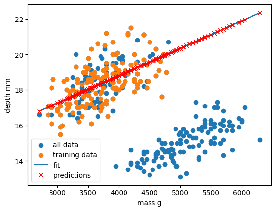

# Supervised learning

Classical machine learning is often divided into two categories – supervised and unsupervised learning.

For the case of supervised learning we act as a "supervisor" or "teacher" for our ML algorithms by providing the algorithm with "labelled data" that contains example answers of what we wish the algorithm to achieve.

For instance, if we wish to train our algorithm to distinguish between images of cats and dogs, we would provide our algorithm with images that have already been labelled as "cat" or "dog" so that it can learn from these examples. If we wished to train our algorithm to predict house prices over time we would provide our algorithm with example data of datetime values that are "labelled" with house prices.

Supervised learning is split up into two further categories: classification and regression. For classification the labelled data is discrete, such as the "cat" or "dog" example, whereas for regression the labelled data is continuous, such as the house price example.

In this episode we will explore how we can use regression to build a "model" that can be used to make predictions.

# Regression

Regression is a statistical technique that relates a dependent variable (a label in ML terms) to one or more independent variables (features in ML terms). A regression model attempts to describe this relation by fitting the data as closely as possible according to mathematical criteria. This model can then be used to predict new labelled values by inputting the independent variables into it. For example, if we create a house price model we can then feed in any datetime value we wish, and get a new house price value prediction.

Regression can be as simple as drawing a "line of best fit" through data points, known as linear regression, or more complex models such as polynomial regression, and is used routinely around the world in both industry and research. You may have already used regression in the past without knowing that it is also considered a machine learning technique!

### Linear regression using Scikit-Learn

We've had a lot of theory so time to start some actual coding! Let's create regression models for a small bundle of datasets known as [Anscombe's Quartet](https://en.wikipedia.org/wiki/Anscombe%27s_quartet). These datasets are available through the Python plotting library [Seaborn](https://seaborn.pydata.org/). Let's define our bundle of datasets, extract out the first dataset, and inspect it's contents:

~~~
import seaborn as sns

# Anscomes Quartet consists of 4 sets of data
data = sns.load_dataset("anscombe")
print(data.head())

# Split out the 1st dataset from the total
data_1 = data[data["dataset"]=="I"]
data_1 = data_1.sort_values("x")

# Inspect the data
print(data_1.head())
~~~
{: .language-python}

We see that the dataset bundle has the 3 columns `dataset`, `x`, and `y`. We have already used the `dataset` column to extract out Dataset I ready for our regression task. Let's visually inspect the data:

~~~
import matplotlib.pyplot as plt

plt.scatter(data_1["x"], data_1["y"])
plt.xlabel("x")
plt.ylabel("y")
plt.show()
~~~
{: .language-python}

In this regression example we will create a Linear Regression model that will try to predict `y` values based upon `x` values.

In machine learning terminology: we will use our `x` feature (variable) and `y` labels("answers") to train our Linear Regression model to predict `y` values when provided with `x` values.

The mathematical equation for a linear fit is `y = mx + c` where `y` is our label data, `x` is our input feature(s), `m` represents the gradient of the linear fit, and `c` represents the intercept with the y-axis.

A typical ML workflow is as following:
* Define the model (also known as an estimator)
* Tweak your data into the required format for your model
* Train your model on the input data
* Predict some values using the trained model
* Check the accuracy of the prediction, and visualise the result

We'll define functions for each of these steps so that we can quickly perform linear regressions on our data. First we'll define a function to pre-process our data into a format that Scikit-Learn can use.
~~~
import numpy as np
def pre_process_linear(x, y):
    # sklearn requires a 2D array, so lets reshape our 1D arrays.
    x_data = np.array(x).reshape(-1, 1)
    y_data = np.array(y).reshape(-1, 1)

    return x_data, y_data
~~~
{: .language-python}

Next we'll define a model, and train it on the pre-processed data. We'll also inspect the trained model parameters `m` and `c`:
~~~
from sklearn.linear_model import LinearRegression

def fit_a_linear_model(x_data, y_data):
    # Define our estimator/model
    model = LinearRegression(fit_intercept=True)

    # train our estimator/model using our data
    lin_regress = model.fit(x_data,y_data)

    # inspect the trained estimator/model parameters
    m = lin_regress.coef_
    c = lin_regress.intercept_
    print("linear coefs=",m, c)

    return lin_regress
~~~
{: .language-python}

Then we'll define a function to make predictions using our trained model, and calculate the Root Mean Squared Error (RMSE) of our predictions:
~~~
import math
from sklearn.metrics import mean_squared_error

def predict_linear_model(lin_regress, x_data, y_data):
    # predict some values using our trained estimator/model
    # (in this case we predict our input data!)
    linear_data = lin_regress.predict(x_data)

    # calculated a RMS error as a quality of fit metric
    error = math.sqrt(mean_squared_error(y_data, linear_data))
    print("linear error=",error)

    # return our trained model so that we can use it later
    return linear_data
~~~
{: .language-python}

Finally, we'll define a function to plot our input data, our linear fit, and our predictions:
~~~
def plot_linear_model(x_data, y_data, predicted_data):
    # visualise!
    # Don't call .show() here so that we can add extra stuff to the figure later
    plt.scatter(x_data, y_data, label="input")
    plt.plot(x_data, predicted_data, "-", label="fit")
    plt.plot(x_data, predicted_data, "rx", label="predictions")
    plt.xlabel("x")
    plt.ylabel("y")
    plt.legend()
~~~
{: .language-python}

We will be training a few Linear Regression models in this episode, so let's define a handy function to combine input data processing, model creation, training our model, inspecting the trained model parameters `m` and `c`, make some predictions, and finally visualise our data.
~~~
def fit_predict_plot_linear(x, y):
    x_data, y_data = pre_process_linear(x, y)
    lin_regress = fit_a_linear_model(x_data, y_data)
    linear_data = predict_linear_model(lin_regress, x_data, y_data)
    plot_linear_model(x_data, y_data, linear_data)

    return lin_regress
~~~
{: .language-python}

Now we have defined our generic function to fit a linear regression we can call the function to train it on some data, and show the plot that was generated:
~~~
# just call the function here rather than assign.
# We don't need to reuse the trained model yet
fit_predict_plot_linear(data_1["x"], data_1["y"])

plt.show()
~~~
{: .language-python}

This looks like a reasonable linear fit to our first dataset. Thanks to our function we can quickly perform more linear regressions on other datasets.

Let's quickly perform a new linear fit on the 2nd Anscombe dataset:

~~~
data_2 = data[data["dataset"]=="II"]
fit_predict_plot_linear(data_2["x"],data_2["y"])

plt.show()
~~~
{: .language-python}

It looks like our linear fit on Dataset II produces a nearly identical fit to the linear fit on Dataset I. Although our errors look to be almost identical our visual inspection tells us that Dataset II is probably not a linear correllation and we should try to make a different model.

> ## Exercise: Repeat the linear regression excercise for Datasets III and IV.
> Adjust your code to repeat the linear regression for the other datasets. What can you say about the similarities and/or differences between the linear regressions on the 4 datasets?
> > ## Solution
> > ~~~
> > # Repeat the following and adjust for dataset IV
> > data_3 = data[data["dataset"]=="III"]
> >
> > fit_predict_plot_linear(data_3["x"],data_3["y"])
> >
> > plt.show()
> > ~~~
> > {: .language-python}
> >
> > 
> > 
> > The 4 datasets all produce very similar linear regression fit parameters (`m` and `c`) and RMSEs despite visual differences in the 4 datasets.
> >
> > This is intentional as the Anscombe Quartet is designed to produce near identical basic statistical values such as means and standard deviations.
> >
> > While the trained model parameters and errors are near identical, our visual inspection tells us that a linear fit might not be the best way of modelling all of these datasets.
> {: .solution}
{: .challenge}

## Polynomial regression using Scikit-Learn

Now that we have learnt how to do a linear regression it's time look into polynomial regressions. Polynomial functions are non-linear functions that are commonly-used to model data. Mathematically they have `N` degrees of freedom and they take the following form `y = a + bx + cx^2 + dx^3 ... + mx^N`

If we have a polynomial of degree N=1 we once again return to a linear equation `y = a + bx` or as it is more commonly written `y = mx + c`. Let's create a polynomial regression using N=2.

In Scikit-Learn this is done in two steps. First we pre-process our input data `x_data` into a polynomial representation using the `PolynomialFeatures` function. Then we can create our polynomial regressions using the `LinearRegression().fit()` function, but this time using the polynomial representation of our `x_data`.

~~~
from sklearn.preprocessing import PolynomialFeatures

def pre_process_poly(x, y):
    # sklearn requires a 2D array, so lets reshape our 1D arrays.
    x_data = np.array(x).reshape(-1, 1)
    y_data = np.array(y).reshape(-1, 1)

    # create a polynomial representation of our data
    poly_features = PolynomialFeatures(degree=2)
    x_poly = poly_features.fit_transform(x_data)

    return x_poly, x_data, y_data

def fit_poly_model(x_poly, y_data):
    # Define our estimator/model(s)
    poly_regress = LinearRegression()

    # define and train our model
    poly_regress.fit(x_poly,y_data)

    # inspect trained model parameters
    poly_m = poly_regress.coef_
    poly_c = poly_regress.intercept_
    print("poly_coefs",poly_m, poly_c)

    return poly_regress

def predict_poly_model(poly_regress, x_poly, y_data):
    # predict some values using our trained estimator/model
    # (in this case - our input data)
    poly_data = poly_regress.predict(x_poly)

    poly_error = math.sqrt(mean_squared_error(y_data, poly_data))
    print("poly error=", poly_error)

    return poly_data

def plot_poly_model(x_data, poly_data):
    # visualise!
    plt.plot(x_data, poly_data, label="poly fit")
    plt.legend()

def fit_predict_plot_poly(x, y):
    # Combine all of the steps
    x_poly, x_data, y_data = pre_process_poly(x, y)
    poly_regress = fit_poly_model(x_poly, y_data)
    poly_data = predict_poly_model(poly_regress, x_poly, y_data)
    plot_poly_model(x_data, poly_data)

    return poly_regress
~~~
{: .language-python}

Lets plot our input dataset II, linear model, and polynomial model together, as well as compare the errors of the linear and polynomial fits.

~~~
# Sort our data in order of our x (feature) values
data_2 = data[data["dataset"]=="II"]
data_2 = data_2.sort_values("x")

fit_predict_plot_linear(data_2["x"],data_2["y"])
fit_predict_plot_poly(data_2["x"],data_2["y"])

plt.show()
~~~
{: .language-python}

Comparing the plots and errors it seems like a polynomial regression of N=2 is a far superior fit to Dataset II than a linear fit. In fact, it looks like our polynomial fit almost perfectly fits Dataset II... which is because Dataset II is created from a N=2 polynomial equation!

> ## Exercise: Perform and compare linear and polynomial fits for Datasets I, III, and IV.
> Which performs better for each dataset? Modify your polynomial regression function to take `N` as an input parameter to your regression model. How does changing the degree of polynomial fit affect each dataset?
> > ## Solution
> > ~~~
> > for ds in ["I","II","III","IV"]:
> >     # Sort our data in order of our x (feature) values
> >     data_ds = data[data["dataset"]==ds]
> >     data_ds = data_ds.sort_values("x")
> >     fit_predict_plot_linear(data_ds["x"],data_ds["y"])
> >     fit_predict_plot_poly(data_ds["x"],data_ds["y"])
> >
> >     plt.show()
> > ~~~
> > {: .language-python}
> >
> > The `N=2` polynomial fit is far better for Dataset II. According to the RMSE the polynomial is a slightly better fit for Datasets I and III, however it could be argued that a linear fit is good enough.
> > Dataset III looks like a linear relation that has a single outlier, rather than a truly non-linear relation. The polynomial and linear fits perform just as well (or poorly) on Dataset IV.
> > For Dataset IV it looks like `y` may be a better estimator of `x`, than `x` is at estimating `y`.
> > ~~~
> > def fit_poly_model(x_poly, y_data, N):
> >     # Define our estimator/model(s)
> >     poly_features = PolynomialFeatures(degree=N)
> >     # ...
> > ~~~
> > {: .language-python}
> >
> > and
> > ~~~
> > for ds in ["I","II","III","IV"]:
> >     # Sort our data in order of our x (feature) values
> >     data_ds = data[data["dataset"]==ds]
> >     data_ds = data_ds.sort_values("x")
> >     fit_predict_plot_linear(data_ds["x"],data_ds["y"])
> >     for N in range(2,11):
> >         print("Polynomial degree =",N)
> >         fit_predict_plot_poly(data_ds["x"],data_ds["y"],N)
> >     plt.show()
> > ~~~
> > {: .language-python}
> >
> > With a large enough polynomial you can fit through every point with a unique `x` value.
> > Datasets II and IV remain unchanged beyond `N=2` as the polynomial has converged (dataset II) or cannot model the data (Dataset IV).
> > Datasets I and III slowly decrease their RMSE and N is increased, but it is likely that these more complex models are overfitting the data. Overfitting is discussed later in the lesson.
> {: .solution}
{: .challenge}

## Let's explore a more realistic scenario

Now that we have some convenient Python functions to perform quick regressions on data it's time to explore a more realistic regression modelling scenario.

Let's start by loading in and examining a new dataset from Seaborn: a penguin dataset containing a few hundred samples and a number of features and labels.

~~~
dataset = sns.load_dataset("penguins")
dataset.head()
~~~
{: .language-python}

We can see that we have seven columns in total: 4 continuous (numerical) columns named `bill_length_mm`, `bill_depth_mm`, `flipper_length_mm`, and `body_mass_g`; and 3 discrete (categorical) columns named `species`, `island`, and `sex`. We can also see from a quick inspection of the first 5 samples that we have some missing data in the form of `NaN` values. Let's go ahead and remove any rows that contain `NaN` values:

~~~
dataset.dropna(inplace=True)
dataset.head()
~~~
{: .language-python}

Now that we have cleaned our data we can try and predict a penguins bill depth using their body mass. In this scenario we will train a linear regression model using `body_mass_g` as our feature data and `bill_depth_mm` as our label data. We will train our model on a subset of the data by slicing the first 146 samples of our cleaned data. We will then use our regression function to train and plot our model.

~~~
dataset_1 = dataset[:146]

x_data = dataset_1["body_mass_g"]
y_data = dataset_1["bill_depth_mm"]

trained_model = fit_predict_plot_linear(x_data, y_data)

plt.xlabel("mass g")
plt.ylabel("depth mm")
plt.show()
~~~
{: .language-python}

Congratulations! We've taken our linear regression function and quickly created and trained a new linear regression model on a brand new dataset. Note that this time we have returned our model from the regression function and assigned it to the variable `trained_model`. We can now use this model to predict `bill_depth_mm` values for any given `body_mass_g` values that we pass it.

Let's provide the model with all of the penguin samples and visually inspect how the linear regression model performs.

~~~
x_data_all, y_data_all = pre_process_linear(dataset["body_mass_g"], dataset["bill_depth_mm"])

y_predictions = predict_linear_model(trained_model, x_data_all, y_data_all)

plt.scatter(x_data_all, y_data_all, label="all data")
plt.scatter(x_data, y_data, label="training data")

plt.plot(x_data_all, y_predictions, label="fit")
plt.plot(x_data_all, y_predictions, "rx", label="predictions")

plt.xlabel("mass g")
plt.ylabel("depth mm")
plt.legend()
plt.show()
~~~
{: .language-python}

Oh dear. It looks like our linear regression fits okay for our subset of the penguin data, and a few additional samples, but there appears to be a cluster of points that are poorly predicted by our model.

> ## This is a classic Machine Learning scenario known as over-fitting
> We have trained our model on a specific set of data, and our model has learnt to reproduce those specific answers at the expense of creating a more generally-applicable model.
> Over fitting is the ML equivalent of learning an exam papers mark scheme off by heart, rather than understanding and answering the questions.
{: .callout}

Perhaps our model is too simple? Perhaps our data is more complex than we thought? Perhaps our question/goal needs adjusting? Let's explore the penguin dataset in more depth in the next section!


