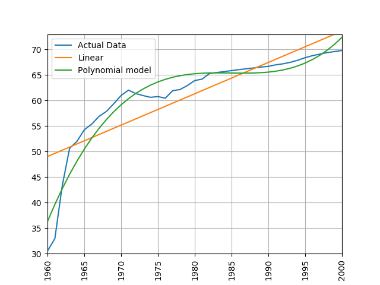
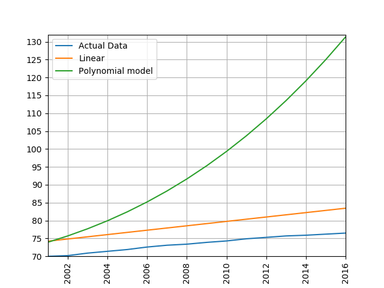

SciKit Learn (also known as sklearn) is an open source machine learning library for Python which has a very wide range of machine learning algorithms. It makes it very easy for a Python programmer to use machine learning techniques without having to implement them.

## Linear Regression with scikit-learn

Lets adapt our linear regression program to use scikit-learn instead of our own regression function. We can go and remove the least_squares and measure_error functions from our code. We'll save this under a different filename to the original linear regression code so that we can compare the answers of the two, they should be identical.

First lets add the import for sklearn, we're also going to need the numpy library so we'll import that too:

~~~
import numpy as np
import sklearn.linear_model as skl_lin
~~~
{: .python}

Now lets replace the calculation with our own least_squares function with the one from scikit-learn. The scikit-learn regression function is much more capable than the simple one we wrote earlier and is designed for datasets where multiple parameters are used, its expecting to be given multidemnsional arrays data. To get it to accept single dimension data such as we have we need to convert the array to a numpy one and use numpy's reshape function. The resulting data is also designed to show us multiple coefficients and intercepts, so these values will be arrays, since we've just got one parameter we can just grab the first item from each of these arrays. 

Lets go ahead and change 
~~~
m, c = least_squares([x_data, life_expectancy])
~~~
{: .python}

to

~~~
    x_data_arr = np.array(x_data).reshape(-1, 1)
    life_exp_arr = np.array(life_expectancy).reshape(-1, 1)

    regression = skl_lin.LinearRegression().fit(x_data_arr, life_exp_arr)

    m = regression.coef_[0][0]
    c = regression.intercept_[0]
~~~
{: .python}

Now we can use scikit-learn's predict function to predict values in our model instead of having to work them out ourselves by computing y = mx+c. We can change

~~~
    linear_data = []
    
    for x in x_data:
        y = m * x + c
        linear_data.append(y)
~~~
{: .python}

to just one line:

~~~
    linear_data = regression.predict(x_data_arr)
~~~
{: .python}

This line will populate the list linear_data with the predicted values for every item in x_data_arr. Finally lets calculate the error. scikit-learn doesn't provide a root mean squared error function, but it does provide a mean squared error function. We can calcuate the root mean squared error simply by taking the square root of the output of this function. The mean_squared_error function is part of the scikit-learn metrics module, so we'll have to add that to our imports at the top of the file:

~~~
import sklearn.metrics as skl_metrics
~~~
{: .python}

Now lets replace

~~~
    error = measure_error(life_expectancy, linear_data)
~~~

with

~~~
    error = math.sqrt(skl_metrics.mean_squared_error(life_exp_arr, linear_data))
~~~
{: .python}

Now if we go ahead and run the new program we should get the same answers and same graph as before.

Here is the new function in full:

~~~
def process_life_expectancy_data(filename, country, min_date, max_date):
    df = pd.read_csv(filename, index_col="Life expectancy")

    life_expectancy = df.loc[country, str(min_date):str(max_date)]

    x_data = list(range(min_date, max_date + 1))

    # convert x_data and life_expectancy to numpy arrays
    x_data_arr = np.array(x_data).reshape(-1, 1)
    life_exp_arr = np.array(life_expectancy).reshape(-1, 1)

    regression = skl_lin.LinearRegression().fit(x_data_arr, life_exp_arr)

    m = regression.coef_[0][0]
    c = regression.intercept_[0]

    print("m =", m, "c=", c)

    linear_data = regression.predict(x_data_arr)

    error = math.sqrt(skl_metrics.mean_squared_error(life_exp_arr, linear_data))
    print("error is ", error)

    make_graph(x_data, life_expectancy, linear_data)
~~~
{: .python}

> Lets repeat the calculations we previously did with the linear regression and compare them. Adjust both the original program and the sklearn version to calculate the life expectancy for Germany between 1950 and 2000. What are the values (m and c) of linear equation linking date and life expectancy? Are they the same in both?
> > ## Solution
> > ~~~
> > process_life_expectancy_data("../data/gapminder-life-expectancy.csv", "Germany", 1950, 2000)
> > ~~~ 
> > {: .python}
> > 
> > m= 0.212219909502 c= -346.784909502
> > They should be identical
> {: .solution}
{: .challenge}

> # Predicting Life Expectancy
> Use the linear equation you've just created to predict life expectancy in Germany for every year between 2001 and 2016. How accurate are your answers?
> If you worked for a pension scheme would you trust your answers to predict the future costs for paying pensioners?
> > ## Solution
> > ~~~
> > for x in range(2001,2017):
> >     print(x,0.212219909502 * x - 346.784909502)
> > ~~~
> > {: .python}
> > 
> > Predicted answers:
> > ~~~
> > 2001 77.86712941150199
> > 2002 78.07934932100403
> > 2003 78.29156923050601
> > 2004 78.503789140008
> > 2005 78.71600904951003
> > 2006 78.92822895901202
> > 2007 79.140448868514
> > 2008 79.35266877801604
> > 2009 79.56488868751802
> > 2010 79.77710859702
> > 2011 79.98932850652199
> > 2012 80.20154841602402
> > 2013 80.41376832552601
> > 2014 80.62598823502799
> > 2015 80.83820814453003
> > 2016 81.05042805403201
> > ~~~
> > Compare with the real values:
> > ~~~
> > df = pd.read_csv('../data/gapminder-life-expectancy.csv',index_col="Life expectancy")
> > for x in range(2001,2017):
> >     y = 0.215621719457 * x - 351.935837103
> >     real = df.loc['Germany', str(x)]
> >     print(x, "Predicted", y, "Real", real, "Difference", y-real)
> > ~~~
> > {: .python}
> > 
> > ~~~
> > 2001 Predicted 77.86712941150199 Real 78.4 Difference -0.532870588498
> > 2002 Predicted 78.07934932100403 Real 78.6 Difference -0.520650678996
> > 2003 Predicted 78.29156923050601 Real 78.8 Difference -0.508430769494
> > 2004 Predicted 78.503789140008 Real 79.2 Difference -0.696210859992
> > 2005 Predicted 78.71600904951003 Real 79.4 Difference -0.68399095049
> > 2006 Predicted 78.92822895901202 Real 79.7 Difference -0.771771040988
> > 2007 Predicted 79.140448868514 Real 79.9 Difference -0.759551131486
> > 2008 Predicted 79.35266877801604 Real 80.0 Difference -0.647331221984
> > 2009 Predicted 79.56488868751802 Real 80.1 Difference -0.535111312482
> > 2010 Predicted 79.77710859702 Real 80.3 Difference -0.52289140298
> > 2011 Predicted 79.98932850652199 Real 80.5 Difference -0.510671493478
> > 2012 Predicted 80.20154841602402 Real 80.6 Difference -0.398451583976
> > 2013 Predicted 80.41376832552601 Real 80.7 Difference -0.286231674474
> > 2014 Predicted 80.62598823502799 Real 80.7 Difference -0.074011764972
> > 2015 Predicted 80.83820814453003 Real 80.8 Difference 0.03820814453
> > 2016 Predicted 81.05042805403201 Real 80.9 Difference 0.150428054032
> > ~~~

## Other types of regression 

Linear regression obviously has its limits for working with data that isn't linear. Scikit-learn has a number of other regression techniques 
which can be used on non-linear data. Some of these (such as isotonic regression) will only interpolate data in the range of the training
data and can't extrapolate beyond it. One non-linear technique that works with many types of data is polynomial regression. This creates a polynomial 
equation of the form y = a + bx + cx^2 + dx^3 etc. The more terms we add to the polynomial the more accurately we can model a system.

Scikit-learn includes a polynomial modelling tool as part of its pre-processing library which we'll need to add to our list of imports.

~~~
import sklearn.preprocessing as skl_pre
~~~
{: .python}

Now lets modify the `process_life_expectancy_data` function to calculate the polynomial. This takes two parts, the first is to pre-process the data into polynomial form. We first call the PolynomialFeatures function with the parameter degree. The degree parameter controls how many components the polynomial will have, a polynomial of the form y = a + bx + cx^2 + dx^3 has 4 degrees. Typically a value between 5 and 10 is sufficient. We must then process the numpy array that we used for the X axis in the linear regression to convert it into a set of polynomial features.

~~~
    polynomial_features = skl_pre.PolynomialFeatures(degree=5)
    x_poly = polynomial_features.fit_transform(x_data_arr)
~~~
{: .python}

This only gets us halfway to being able to create a model that we can use for predictions. To form the complete model we actually have to perform a linear regression on the polynomial model, but we'll use the polynomial features
as the X axis instead of the numpy array. The Y axis will still be the life expectancy numpy array that we used before. The resulting model can now be used to make some predictions like we did before using the predict function.

If we want to draw the line of best fit we can pass the polynomial features in as a parameter to predict() and this will generate the y values for the full range of our data. This can be plotted by passing it to make_graph in place of the linear data. 

~~~
    polynomial_model = skl_lin.LinearRegression().fit(x_poly, life_exp_arr)
    polynomial_data = polynomial_model.predict(x_poly)
    
    make_graph(x_data, life_expectancy, polynomial_data)

~~~
{: .python}

Finally we can make some predictions of future data. Lets create a list containing the date range we'd like to predict, as with other lists/arrays we've used we'll have to reshape it to make scikit-learn work with it.
Now lets use this list of dates to predict life expectancy using both our linear and polynomial models. 

~~~
    predictions_x = np.array(list(range(2001,2017))).reshape(-1, 1)
    
    predictions_polynomial = polynomial_model.predict(polynomial_features.fit_transform(predictions_x))
                             
    predictions_linear = regression.predict(predictions_x)
~~~
{: .python}

To measure the error lets calculate the RMS error on both the linear and polynomial data. 

~~~
    # calcualte the root mean squared error
    linear_error = math.sqrt(skl_metrics.mean_squared_error(life_exp_arr, linear_data))
    print("linear error is ", linear_error)

    polynomial_error = math.sqrt(
            skl_metrics.mean_squared_error(life_exp_arr, polynomial_data))
    print("polynomial error is", polynomial_error)
~~~
{:. python}

> Train a linear and polynomial model on life expectancy data from China between 1960 and 2000. Then predict life expectancy from 2001 to 2016 using both methods. Compare their root mean squared errors, which is more accurate? Why do you think this model is the more accurate one?
> > ## Solution
> > modify the call to the process_life_expectancy_data
> > ~~~
> > process_life_expectancy_data("../data/gapminder-life-expectancy.csv", "China", 1960, 2000)
> > ~~~ 
> > {: .python}
> > 
> > linear prediction error is  5.385162846665607
> > polynomial prediction error is 28.169167771983528
> > The linear model is more accurate, polynomial models often become wildly inaccurate beyond the range they were trained on. Look at the predicted life expectancies, the polynomial model predicts a life expectancy of 131 by 2016!
> > 
> > 
> {: .solution}
{: .challenge}
