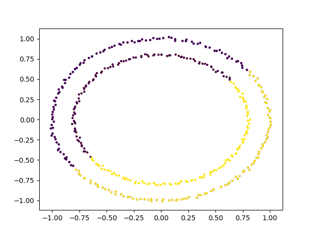
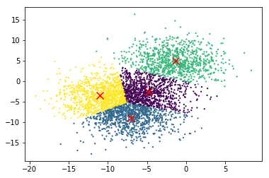
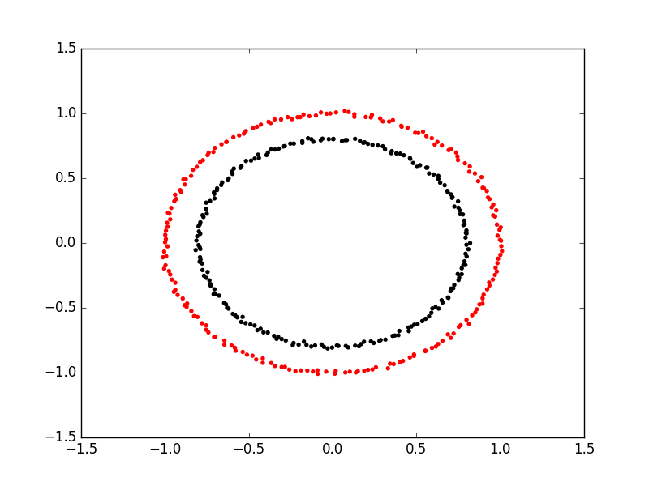
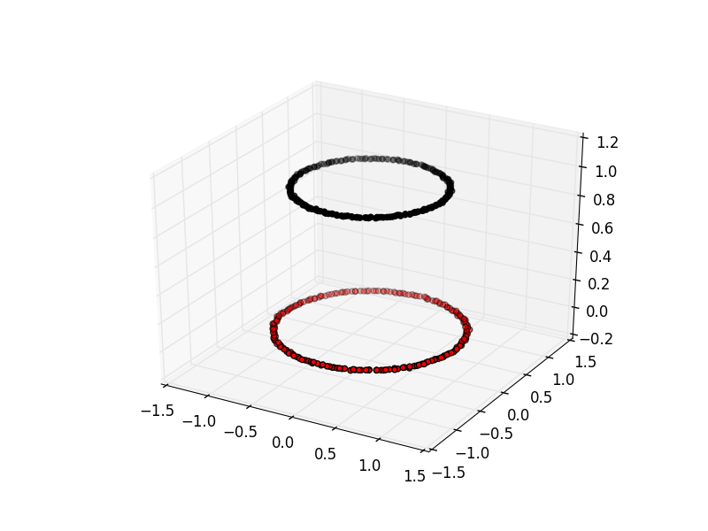

# Clustering

Clustering is the grouping of data points which are similar to each other. It can be a powerful technique for identifying patterns in data.
Clustering analysis does not usually require any training and is known as an unsupervised learning technique. The lack of a need for training
means it can be applied quickly.

## Applications of Clustering
* Looking for trends in data
* Data compression, all data clustering around a point can be reduced to just that point. For example, reducing colour depth of an image.
* Pattern recognition

## K-means Clustering

The K-means clustering algorithm is a simple clustering algorithm that tries to identify the centre of each cluster.
It does this by searching for a point which minimises the distance between the centre and all the points in the cluster.
The algorithm needs to be told how many clusters to look for, but a common technique is to try different numbers of clusters and combine
it with other tests to decide on the best combination.

### K-means with Scikit Learn

For this example, we're going to use scikit learn's built in random data blob generator instead of using an external dataset. For this we'll also need the `sklearn.datasets.samples_generator` module.

We can then create some random blobs using the make_blobs function. The `n_samples` argument sets how many points we want to use in all of our blobs. `cluster_std` sets the standard deviation of the points, the smaller this value the closer together they will be. `centers` sets how many clusters we'd like. `random_state` is the initial state of the random number generator, by specifying this we'll get the same results every time we run the program. If we don't specify a random state then we'll get different points every time we run. This function returns two things, an array of data points and a list of which cluster each point belongs to.

~~~
import sklearn.datasets as skl_datasets
data, cluster_ids = skl_datasets.make_blobs(n_samples=800, cluster_std=0.5, centers=4, random_state=1)

~~~
{: .language-python}

Check the data's shape and contents
~~~
import numpy as np
print(np.shape(data)) # x and y positions for 800 datapoints generated from 4 cluster centers
print(cluster_ids) # each datapoint belongs to 1 of 4 clusters. Each cluster has 100 datapoints
~~~
{: .language-python}

Plot the data
~~~
import matplotlib.pyplot as plt
plt.scatter(data[:, 0], data[:, 1], s=5, linewidth=0)
plt.show()
~~~

Now that we have some data we can go ahead and try to identify the clusters using K-means. 
1. To perform a k-means clustering with Scikit learn we first need to import the sklearn.cluster module. 
2. Then, we need to initialise the KMeans module and tell it how many clusters to look for. 
3. Next, we supply it some data via the fit function, in much the same we did with the regression functions earlier on. 
4. Finally, we run the predict function to find the clusters.

~~~
import sklearn.cluster as skl_cluster
Kmean = skl_cluster.KMeans(n_clusters=4, random_state=0)
Kmean.fit(data)
model_preds = Kmean.predict(data)
print(model_preds)
~~~
{: .language-python}

The data can now be plotted according to cluster assignment. To make it clearer which cluster points have been classified to we can set the colours (the c parameter) to use the `clusters` list that was returned
by the predict function. The Kmeans algorithm also lets us know where it identified the centre of each cluster as. These are stored as a list called `cluster_centers_` inside the `Kmean` object. Let's go ahead and plot the points from the clusters, colouring them by the output from the K-means algorithm, and also plot the centres of each cluster as a red X.

~~~
plt.scatter(data[:, 0], data[:, 1], s=5, linewidth=0, c=model_preds)
for cluster_x, cluster_y in Kmean.cluster_centers_:
    plt.scatter(cluster_x, cluster_y, s=100, c='r', marker='x')
~~~
{: .language-python}

### Advantages of Kmeans
- Simple algorithm, fast to compute. A good choice as the first thing to try when attempting to cluster data.
- Suitable for large datasets due to its low memory and computing requirements.

### Key limitation of K-Means by itself
- Requires number of clusters to be known in advance. In practice, we often don't know the true number of clusters. How can we assess the quality of different clustering results?

~~~
import sklearn.cluster as skl_cluster
import sklearn.datasets as skl_datasets
import matplotlib.pyplot as plt

data, cluster_id = skl_datasets.make_blobs(n_samples=400, cluster_std=0.75, centers=4, random_state=1)

Kmean = skl_cluster.KMeans(n_clusters=4)
Kmean.fit(data)
clusters = Kmean.predict(data)

plt.scatter(data[:, 0], data[:, 1], s=5, linewidth=0, c=clusters)
for cluster_x, cluster_y in Kmean.cluster_centers_:
    plt.scatter(cluster_x, cluster_y, s=100, c='r', marker='x')
plt.show()
~~~
{: .language-python}

> ## Working in multiple dimensions
> Although this example shows two dimensions the kmeans algorithm can work in more than two, it just becomes very difficult to show this visually
> once we get beyond 3 dimensions. Its very common in machine learning to be working with multiple variables and so our classifiers are working in
> multi-dimensional spaces.
{: .callout}

#### Limitations of K-Means

* Requires number of clusters to be known in advance
* Struggles when clusters have irregular shapes
* Will always produce an answer finding the required number of clusters even if the data isn't clustered (or clustered in that many clusters).
* Requires linear cluster boundaries

#### Advantages of K-Means

* Simple algorithm, fast to compute. A good choice as the first thing to try when attempting to cluster data.
* Suitable for large datasets due to its low memory and computing requirements.

### Cluster Quality Metrics
1. Run below code and explain review the plots generated
2. Review meas_plot_silhouette_scores() script noting sections to calculate silhouette score

~~~
from clustering_helper_functions import meas_plot_silhouette_scores
meas_plot_silhouette_scores(data, cluster_ids)
~~~
{: .language-python}

> ## Exercise: Generate new blobs and review cluster quality
> Using the make_blobs function, generate a new dataset containing four clusters and a cluster_std equal to 1. Can we still determine the correct number of clusters using the silhouette score? What happens if you increase the std even further (e.g., 3.5)?
> > ## Solution
> > ~~~
> > data, cluster_ids = skl_datasets.make_blobs(n_samples=800, cluster_std=1, centers=4, random_state=1)
> > meas_plot_silhouette_scores(data, cluster_ids)
> > ~~~
> > {: .language-python}
> > 
> > Wither a higher standard deviation, the silhouette score tells us to select N=2 as the number of clusters. When clustering real-world datasets, this is a common problem. Oftentimes, researchers have to come up with clever evaluation metrics that are customized for their research application (e.g., using background knowledge to determine the likely number of clusters, deciding if each cluster should be of a certain size, etc.). Alternatively, new features can be measured in hopes that those features will produce separable clusters. Sometimes, we have to accept the harsh reality that clustering may not be a viable option for our data or research questions.
> > 
> {: .solution}
{: .challenge}

> ## Exercise: K-Means with overlapping clusters
> Adjust the program above to increase the standard deviation of the blobs (the cluster_std parameter to make_blobs) and increase the number of samples (n_samples) to 4000.
> You should start to see the clusters overlapping.
> Do the clusters that are identified make sense?
> Is there any strange behaviour from this?
>
> > ## Solution
> > The resulting image from increasing n_samples to 4000 and cluster_std to 3.0 looks like this:
> > 
> > The straight line boundaries between clusters look a bit strange.
> {: .solution}
{: .challenge}

> ## Exercise: How many clusters should we look for?
> As K-Means requires us to specify the number of clusters to expect a common strategy to get around this is to vary the number of clusters we are looking for.
> Modify the program to loop through searching for between 2 and 10 clusters. Which (if any) of the results look more sensible? What criteria might you use to select the best one?
> > ## Solution
> > ~~~
> > for cluster_count in range(2,11):
> >     Kmean = skl_cluster.KMeans(n_clusters=cluster_count)
> >     Kmean.fit(data)
> >     clusters = Kmean.predict(data)
> >     plt.scatter(data[:, 0], data[:, 1], s=5, linewidth=0,c=clusters)
> >     for cluster_x, cluster_y in Kmean.cluster_centers_:
> >         plt.scatter(cluster_x, cluster_y, s=100, c='r', marker='x')
> >         # give the graph a title with the number of clusters
> >         plt.title(str(cluster_count)+" Clusters")
> >     plt.show()
> > ~~~
> > {: .language-python}
> >
> > None of these look very sensible clusterings because all the points really form one large cluster.
> > We might look at a measure of similarity of the cluster to test if its really multiple clusters. A simple standard deviation or interquartile range might be a good starting point.
> {: .solution}
{: .challenge}

## Spectral Clustering

The key limitation of K-means is that it requires clusters be linearly separable. Not all data will take this form. Spectral clustering is a technique that attempts to overcome the linear boundary problem of k-means clustering.
It works by treating clustering as a graph partitioning problem, its looking for nodes in a graph with a small distance between them. See [this](http://www.cvl.isy.liu.se:82/education/graduate/spectral-clustering/SC_course_part1.pdf) introduction to Spectral Clustering if you are interested in more details about how spectral clustering works.

Here is an example of using spectral clustering on two concentric circles

Spectral clustering uses something called a kernel trick to introduce additional dimensions to the data.
A common example of this is trying to cluster one circle within another (concentric circles).
A K-means classifier will fail to do this and will end up effectively drawing a line which crosses the circles.
Spectral clustering will introduce an additional dimension that effectively moves one of the circles away from the other in the
additional dimension. This has the downside of being more computationally expensive than k-means clustering.

### Spectral Clustering with Scikit Learn

Lets try out using Scikit Learn's spectral clustering. To make the concentric circles in the above example we need to use the make_circles function in the sklearn.datasets module. This works in a very similar way to the make_blobs function we used earlier on.

~~~
# create two clusters; a larger circle surrounding a smaller circle in 2d.
circles, circles_clusters = skl_datasets.make_circles(n_samples=400, noise=.01, random_state=0)

# plot the data, colouring it by cluster
plt.scatter(circles[:, 0], circles[:, 1], s=15, linewidth=0.1, c=circles_clusters,cmap='flag')
plt.title('True Clusters')
plt.show()
~~~
{: .language-python}

The code for calculating the SpectralClustering is very similar to the kmeans clustering, instead of using the sklearn.cluster.KMeans class we use the sklearn.cluster.SpectralClustering class.
~~~
model = skl_cluster.SpectralClustering(n_clusters=2, affinity='nearest_neighbors', assign_labels='kmeans')
~~~
{: .language-python}

The SpectralClustering class combines the fit and predict functions into a single function called fit_predict.

~~~
labels = model.fit_predict(circles)
plt.scatter(circles[:, 0], circles[:, 1], s=15, linewidth=0, c=labels, cmap='flag')
plt.title('Spectral Clustering')
plt.show()
~~~
{: .language-python}

Let's see how KMeans compares on this dataset.

~~~
# cluster with kmeans
Kmean = skl_cluster.KMeans(n_clusters=2)
Kmean.fit(circles)
clusters = Kmean.predict(circles)

# plot the data, colouring it by cluster
plt.scatter(circles[:, 0], circles[:, 1], s=15, linewidth=0.1, c=clusters,cmap='flag')
plt.title('KMeans')
plt.show()
~~~
{: .language-python}

#### Runtime comparison of KMeans vs spectral clustering
~~~
from clustering_helper_functions import compare_KMeans_SpectralClustering
num_clusters = 4
data, cluster_ids = skl_datasets.make_blobs(n_samples=15000, cluster_std=1.5, centers=num_clusters, random_state=1)
compare_KMeans_SpectralClustering(data, cluster_ids, num_clusters)
~~~
{: .language-python}

Observe: spectral clustering becomes much slower for larger datasets. Its time complexity is O(n^3), where n is the number of input data points.

> ## Comparing k-means and spectral clustering performance
> Modify the program we wrote in the previous exercise to use spectral clustering instead of k-means, save it as a new file.
> Time how long both programs take to run. Add the line `import time` at the top of both files, as the first line in the file get the start time with `start_time = time.time()`.
> End the program by getting the time again and subtracting the start time from it to get the total run time. Add `end_time = time.time()` and `print("Elapsed time:",end_time-start_time,"seconds")` to the end of both files.
> Compare how long both programs take to run generating 4,000 samples and testing them for between 2 and 10 clusters.
> How much did your run times differ?
> How much do they differ if you increase the number of samples to 8,000?
> How long do you think it would take to compute 800,000 samples (estimate this, it might take a while to run for real)?
> > ## Solution
> > KMeans version, runtime around 4 seconds (your computer might be faster/slower)
> > ~~~
> > import matplotlib.pyplot as plt
> > import sklearn.cluster as skl_cluster
> > from sklearn.datasets import make_blobs 
> > import time
> >
> > start_time = time.time()
> > data, cluster_id = make_blobs(n_samples=4000, cluster_std=3,
> >                                        centers=4, random_state=1)
> >
> > for cluster_count in range(2,11):
> >     Kmean = skl_cluster.KMeans(n_clusters=cluster_count)
> >     Kmean.fit(data)
> >     clusters = Kmean.predict(data)
> >
> >     plt.scatter(data[:, 0], data[:, 1], s=15, linewidth=0, c=clusters)
> >     plt.title(str(cluster_count)+" Clusters")
> > 
> > plt.show()
> >
> > end_time = time.time()
> > print("Elapsed time = ", end_time-start_time, "seconds")
> > ~~~
> > {: .language-python}
> >
> > Spectral version, runtime around 9 seconds (your computer might be faster/slower)
> > ~~~
> > import matplotlib.pyplot as plt
> > import sklearn.cluster as skl_cluster
> > from sklearn.datasets import make_blobs 
> > import time
> > 
> > start_time = time.time()
> > data, cluster_id = make_blobs(n_samples=4000, cluster_std=3,
> >                                        centers=4, random_state=1)
> >
> > for cluster_count in range(2,11):
> >     model = skl_cluster.SpectralClustering(n_clusters=cluster_count,
> >                                        affinity='nearest_neighbors',
> >                                        assign_labels='kmeans')
> >     labels = model.fit_predict(data)
> >     
> >     plt.scatter(data[:, 0], data[:, 1], s=15, linewidth=0, c=labels)
> >     plt.title(str(cluster_count)+" Clusters")
> > plt.show()
> > end_time = time.time()
> > print("Elapsed time = ", end_time-start_time, "seconds")
> > ~~~
> > {: .language-python}
> >
> > When the number of points increases to 8000 the runtimes are 24 seconds for the spectral version and 5.6 seconds for kmeans.
> > The runtime numbers will differ depending on the speed of your computer, but the relative different should be similar.
> > For 4000 points kmeans took 4 seconds, spectral 9 seconds, 2.25 fold difference.
> > For 8000 points kmeans took 5.6 seconds, spectral took 24 seconds. 4.28 fold difference. Kmeans 1.4 times slower for double the data, spectral 2.6 times slower.
> > The realative difference is diverging. Its double by doubling the amount of data. If we use 100 times more data we might expect a 100 fold divergence in execution times.
> > Kmeans might take a few minutes, spectral will take hours.
> {: .solution}
{: .challenge}


