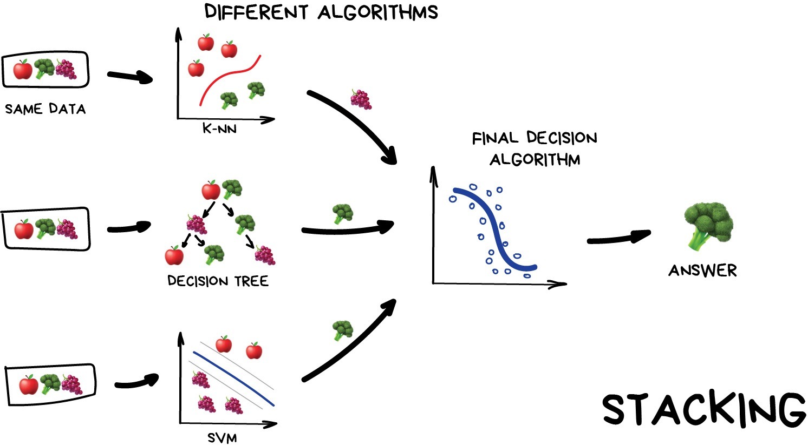
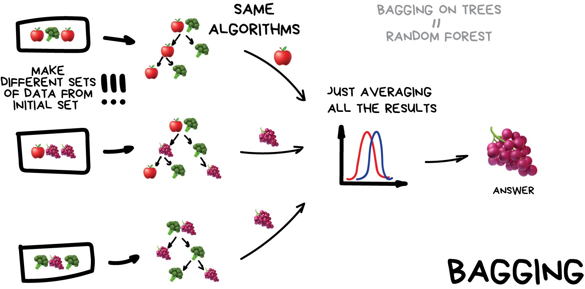
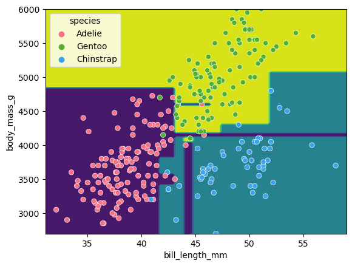
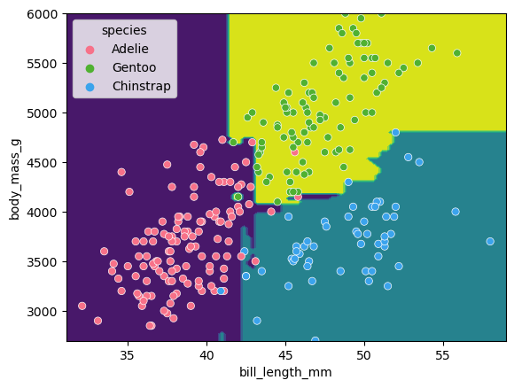
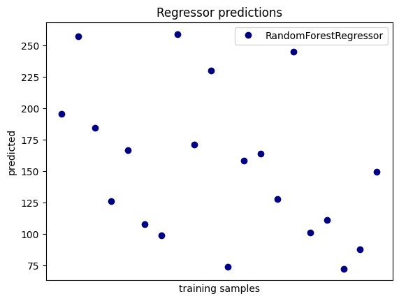
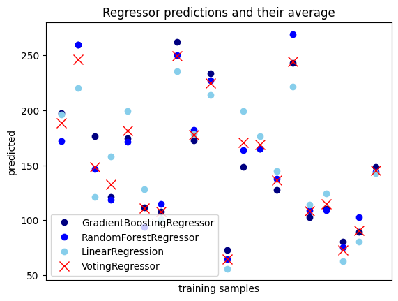

# Ensemble methods

What's better than one decision tree, perhaps two, or three? How about enough trees to make up a forest? If we think back to classification with decision trees we stumbled into the problem of overfitting our training data. Ensemble methods are based on the mantra that the whole is greater than the sum of the parts. If we combine predictions from a series of over/under fitting estimators by averaging the the results from all of them, we can produce a better final prediction. 

Ensemble methods are used for a variety of applciations including, but not limited to, search systems and object detection. We can use any model/estimator available in sci-kit learn to create an ensemble. There are three main methods to create ensembles approaches: 

* Stacking - Train a series of different models/estimators and pass them to a final one that makes the prediction. 



[Image from Vasily Zubarev via their blog](https://vas3k.com/blog/machine_learning/)

* Bagging - Use the same model/estimator fitted on different sub samples of training data, averaging the results for a final prediction. Sub samples can be random. The most common example is Random Forests, which we'll take a look at later on.  



[Image from Vasily Zubarev via their blog](https://vas3k.com/blog/machine_learning/)

* Boosting - Model/estimator is trained one-by-one in order. Each new model pays most attention to data that were incorrectly predicted by the last one. We use sub samples of the data, same as in bagging, but these samples are not randomly generated. 


[Image from Vasily Zubarev via their blog](https://vas3k.com/blog/machine_learning/)

In this session we'll take another look at the penguins data and applying one of the most common bagging approaches, random forests, to this classification problem. First we'll load in the dataset and define a train and test split. 

~~~
# import libraries
import seaborn as sns
import pandas as pd
import numpy as np

# load penguins data
penguins = sns.load_dataset('penguins')

feature_names = ['bill_length_mm', 'bill_depth_mm', 'flipper_length_mm', 'body_mass_g']
penguins.dropna(subset=feature_names, inplace=True)

species_names = penguins['species'].unique()

# Define data and targets
X = penguins[feature_names]

y = penguins.species

# Split data in training and test set
from sklearn.model_selection import train_test_split

X_train, X_test, y_train, y_test = train_test_split(X, y, test_size=0.2, random_state=5)

print(f'train size: {X_train.shape}')
print(f'test size: {X_test.shape}')
~~~
{: .language-python}

For comparison, we'll create a decision tree estimator, find out the score and visualise the classification space. 

~~~
from sklearn.tree import DecisionTreeClassifier


clf = DecisionTreeClassifier()

clf.fit(X_train, y_train)

clf.predict(X_test)

print(clf.score(X_test, y_test))
~~~
{: .language-python}

If we think back to the classification session, the decision tree trained using two parameters overfitted the data. Visualising classification space for body mass and bill length this is apparent where we can observe regions with single points. 

~~~
from sklearn.inspection import DecisionBoundaryDisplay
f1 = feature_names[0]
f2 = feature_names[3]


clf = DecisionTreeClassifier()
clf.fit(X_train[[f1, f2]], y_train)

d = DecisionBoundaryDisplay.from_estimator(clf, X_train[[f1, f2]])

sns.scatterplot(X_train, x=f1, y=f2, hue=y_train, palette="husl")
plt.show()
~~~
{: .language-python}



## Using Random Forests for classification 

We'll now take a look how we can use ensemble methods to perform a classification task such as identifying penguin species! We're going to use a Random forest classifier available in scikit-learn which is a widely used example of a bagging approach. Random forests are built on decision trees and can provide another way to address over-fitting. Rather than classifying based on one single decision tree (which could overfit the data), an average of results of many trees can be derived for more robust/accurate estimates compared against single trees used in the ensemble.

 

[Image from Venkatak Jagannath](https://commons.wikimedia.org/wiki/File:Random_forest_diagram_complete.png)

We can now define a random forest estimator and train it using the penguin training data. We have a similar set of attritbutes to the DecisionTreeClassifier but with an extra parameter called n_estimators which is the number of trees in the forest.

~~~
from sklearn.ensemble import RandomForestClassifier
from sklearn.tree import plot_tree

clf = RandomForestClassifier(n_estimators=100, max_depth=7, min_samples_leaf=1) #extra parameter called n_estimators which is number of trees in the forest

clf.fit(X_train, y_train)

clf.score(X_test, y_test)
~~~
{: . language-python}

You might notice that we have a different value (hopefully increased) compared with the decision tree classifier used above on the same training data. Lets plot the first 5 trees in the forest to get an idea of how this model differs from a single decision tree. 

~~~
import matplotlib.pyplot as plt

fig, axes = plt.subplots(nrows=1, ncols=5 ,figsize=(12,6))

# plot first 5 trees in forest
for index in range(0, 5):
    plot_tree(clf.estimators_[index], 
        class_names=species_names,
        feature_names=feature_names, 
        filled=True, 
        ax=axes[index])

    axes[index].set_title(f'Tree: {index}')
    
plt.show()
~~~
{: . language-python}


We can see the first 5 (of 100) trees that were fitted as part of the forest. 

If we train the random forest estimator using the same two parameters used to plot the classification space for the decision tree classifier what do we think the plot will look like?

~~~
# plot classification space for body mass and bill length with random forest
clf = RandomForestClassifier(n_estimators=100, max_depth=7, min_samples_leaf=1, random_state=5)
clf.fit(X_train[[f1, f2]], y_train)

d = DecisionBoundaryDisplay.from_estimator(clf, X_train[[f1, f2]])

sns.scatterplot(X_train, x=f1, y=f2, hue=y_train, palette="husl")
plt.show()
~~~
{: . language-python}



There is still some overfitting indicated by the regions that contain only single points but using the same hyper-parameter settings used to fit the decision tree classifier, we can see that overfitting is reduced. 

## Stacking up some regression problems 

We've have a look at a bagging approach but we'll now take a look at a stacking approach and apply it to a regression problem and introduce a new dataset to play around with. 

### The diabetes dataset 
The diabetes dataset, contains 10 baseline variables for 442 diabetes patients where the target attribute is quantitative measure of disease progression one year after baseline. For more information please see [Efron et al., (2004)](https://web.stanford.edu/~hastie/Papers/LARS/LeastAngle_2002.pdf). The useful thing about this data it is available as part of the sci-kit learn library. We'll start by loading the dataset to explore the attributes.   

~~~
from sklearn.datasets import load_diabetes

print(load_diabetes())
~~~
{: . language-python}

Printing the dataset to the console, we can have a look at the attributes that make up the features of the dataset. How does this differ from a classification problem?

Lets start by splitting the dataset into test and train portions

~~~
X, y = load_diabetes(return_X_y=True)

X_train, X_test, y_train, y_test = train_test_split(X, y, test_size=0.2, random_state=5)

print(f'train size: {X_train.shape}')
print(f'test size: {X_test.shape}')
~~~
{: . language-python}

Now we'll train a single estimator, a random forest regressor estimator

~~~
# define classifier  
from sklearn.ensemble import RandomForestRegressor

clf = RandomForestRegressor()

clf.fit(X_train, y_train)

pred = clf.predict(X_test)

clf.score(X_test, y_test) 
~~~
{: . language-python}

Lets plot the first 20 predictions to see what that looks like. 

~~~
plt.figure()

plt.plot(pred[:20], "gd", label="RandomForestRegressor") # plot first 20 predictions to make figure clearer.

plt.tick_params(axis="x", which="both", bottom=False, top=False, labelbottom=False)
plt.ylabel("predicted")
plt.xlabel("training samples")
plt.legend(loc="best")
plt.title("Regressor predictions")
~~~
{: . language-python}
 


Lets take this step further and stack a series of regression estimators. In the same way the RandomForest classifier derives a results from a series of trees we will combine the results from a series of different estimators in our stack. This is done using whats called an ensemble meta-estimator called VotingRegressor. We'll apply a Voting regressor to a random forest, gradient boosting and linear regressor. VotingRegressor can fit several base estimators, on the whole dataset, then will take the average of the individual predictions to form a final prediction.

~~~
from sklearn.ensemble import (
    GradientBoostingRegressor,
    RandomForestRegressor,
    VotingRegressor,
)
from sklearn.linear_model import LinearRegression

# training estimators 
rf_reg = RandomForestRegressor(random_state=5)
gb_reg = GradientBoostingRegressor(random_state=5)
linear_reg = LinearRegression()

# fit estimators
rf_reg.fit(X_train, y_train)
gb_reg.fit(X_train, y_train)
linear_reg.fit(X_train, y_train)

voting_reg = VotingRegressor([("gb", rf_reg), ("rf", gb_reg), ("lr", linear_reg)])
voting_reg.fit(X_train, y_train)
~~~
{: . language-python}

We fit the voting regressor the same way we would fit a single estimator. When the voting regressor is instantiated we pass it a parameter containing a list of tuples that contain the estimators we wish to stack, in this case the random forest, gradient boosting and linear regressors. To get a sense of what this is doing lets predict the first 20 samples in the test portion of the data and plot the results. 

~~~
# make predictions
X_test_20 = X_test[:20] # first 20 for visualisation

rf_pred = rf_reg.predict(X_test_20)
gb_pred = gb_reg.predict(X_test_20)
linear_pred = linear_reg.predict(X_test_20)
voting_pred = voting_reg.predict(X_test_20)
~~~
{: . language-python}


~~~
plt.figure()
plt.plot(rf_pred, "gd", label="GradientBoostingRegressor")
plt.plot(gb_pred, "b^", label="RandomForestRegressor")
plt.plot(linear_pred, "ys", label="LinearRegression")
plt.plot(voting_pred, "r*", ms=10, label="VotingRegressor")

plt.tick_params(axis="x", which="both", bottom=False, top=False, labelbottom=False)
plt.ylabel("predicted")
plt.xlabel("training samples")
plt.legend(loc="best")
plt.title("Regressor predictions and their average")

plt.show()
~~~
{: . language-python}



How does the average compare against a single estimator in the stack? 

~~~
print(f'random forest: {rf_reg.score(X_test, y_test)}')

print(f'gradient boost: {gb_reg.score(X_test, y_test)}')

print(f'linear regression: {linear_reg.score(X_test, y_test)}')

print(f'voting regressor: {voting_reg.score(X_test, y_test)}')
~~~

The stacked result generated by the voting regressor produces a greater score than all three models/estimators singularly. The whole is greater than the some of the parts!


## Exercise

Sci-kit learn also has method for stacking ensemble classifiers ```sklearn.ensemble.VotingClassifier``` do you think you could apply a stack to the penguins dataset using a random forest, SVM and decision tree classifier, or a selection of any other classifier estimators available in sci-kit learn? 

~~~
penguins = sns.load_dataset('penguins')

feature_names = ['bill_length_mm', 'bill_depth_mm', 'flipper_length_mm', 'body_mass_g']
penguins.dropna(subset=feature_names, inplace=True)

species_names = penguins['species'].unique()

# Define data and targets
X = penguins[feature_names]

y = penguins.species

# Split data in training and test set
from sklearn.model_selection import train_test_split

X_train, X_test, y_train, y_test = train_test_split(X, y, test_size=0.2, random_state=5)

print(f'train size: {X_train.shape}')
print(f'test size: {X_test.shape}')
~~~
{: . language.python} 

The code above loads the penguins data and splits it into test and training portions. Have a play around with stacking some classifiers using the ```sklearn.ensemble.VotingClassifier``` with the comments below as a guide. 

~~~
# import classifiers 

# instantiate classifiers 

# fit classifiers

# instantiate voting classifier and fit data

# make predictions

# compare scores
~~~
{: . language.python}

