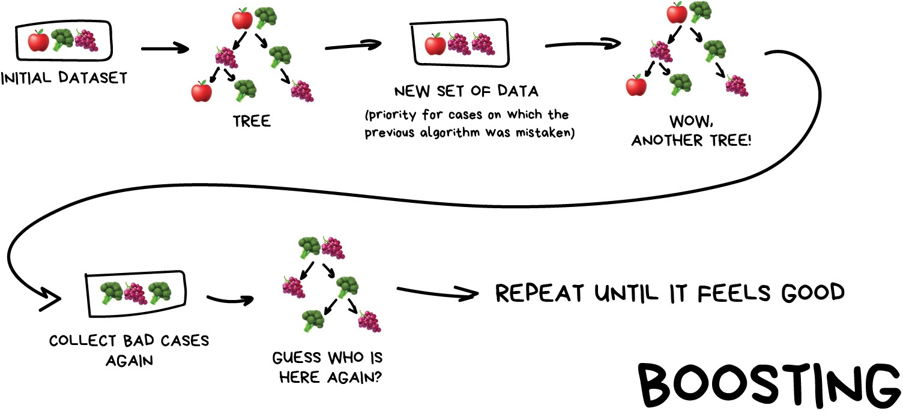
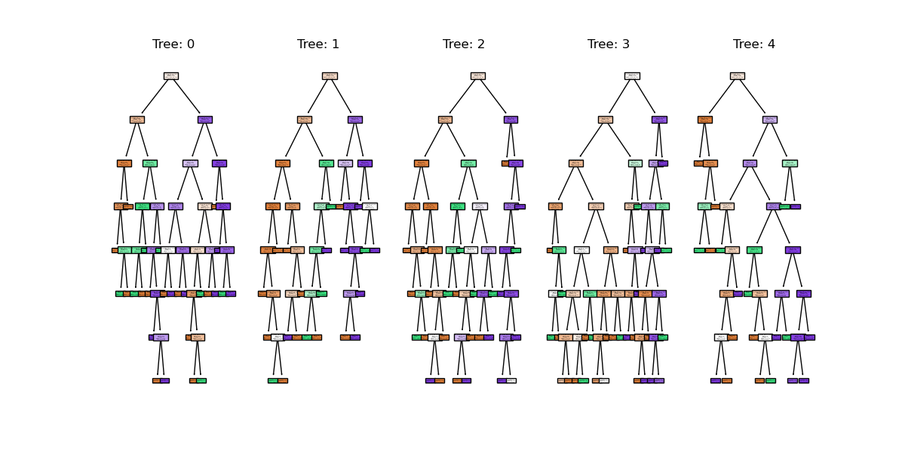

# Ensemble methods

What's better than one decision tree? Perhaps two? or three? How about enough trees to make up a forest? 
Ensemble methods bundle individual models together and use each of their outputs to contribute towards a final consensus for a given problem. Ensemble methods are based on the mantra that the whole is greater than the sum of the parts. 

Thinking back to the classification episode with decision trees we quickly stumbled into the problem of overfitting our training data. If we combine predictions from a series of over/under fitting estimators then we can often produce a better final prediction than using a single reliable model - in the same way that humans often hear multiple opinions on a scenario before deciding a final outcome. Decision trees and regressions are often very sensitive to training outliers and so are well suited to be a part of an ensemble.

Ensemble methods are used for a variety of applciations including, but not limited to, search systems and object detection. We can use any model/estimator available in sci-kit learn to create an ensemble. There are three main methods to create ensembles approaches: 

* Stacking
* Bagging
* Boosting

Let's explore them in a bit more depth.

### Stacking

This is where we train a series of different models/estimators on the same input data in parallel. We then take the output of each model and pass them into a final decision algorithm/model that makes the final prediction. 

If we trained the same model multiple times on the same data we would expect very similar answers, and so the emphasis with stacking is to choose different models that can be used to build up a reliable concensus. Regression is then typically a good choice for the final decision-making model.


[Image from Vasily Zubarev via their blog](https://vas3k.com/blog/machine_learning/)

### Bagging (a.k.a [Bootstrap AGGregatING](https://en.wikipedia.org/wiki/Bootstrap_aggregating) )

This is where we use the same model/estimator and fit it on different subsets of the training data. We can then average the results from each model to produce a final prediction. The subsets are random and may even repeat themselves. 

The most common example is known as the Random Forest algorithm, which we'll take a look at later on. Random Forests are typically used as a faster, computationally cheaper alternative to Neural Networks, which is ideal for real-time applications like camera face detection prompts.


[Image from Vasily Zubarev via their blog](https://vas3k.com/blog/machine_learning/)

### Boosting

This is where we train a single type of Model/estimator on an initial dataset, test it's accuracy, and then subsequently train the same type of models on poorly predicted samples i.e. each new model pays most attention to data that were incorrectly predicted by the last one.

Just like for bagging, boosting is trained mostly on subsets, however in this case these subsets are not randomly generated but are instead built using poorly estimated predictions. Boosting can produce some very high accuracies by learning from it's mistakes, but due to the iterative nature of these improvements it doesn't parallelize well unlike the other ensemble methods. Despite this it can still be a faster, and computationally cheaper alternative to Neural Networks.



[Image from Vasily Zubarev via their blog](https://vas3k.com/blog/machine_learning/)

### Ensemble summary

Machine learning jargon can often be hard to remember, so here is a quick summary of the 3 ensemble methods:

* Stacking - same dataset, different models, trained in parallel
* Bagging - different subsets, same models, trained in parallel
* Boosting - subsets of bad estimates, same models, trained in series

## Using Bagging (Random Forests) for a classification problem

In this session we'll take another look at the penguins data and applying one of the most common bagging approaches, random forests, to try and solve our species classification problem. First we'll load in the dataset and define a train and test split. 

~~~
# import libraries
import numpy as np
import pandas as pd
import seaborn as sns
from sklearn.model_selection import train_test_split

# load penguins data
penguins = sns.load_dataset('penguins')

# prepare and define our data and targets
feature_names = ['bill_length_mm', 'bill_depth_mm', 'flipper_length_mm', 'body_mass_g']
penguins.dropna(subset=feature_names, inplace=True)

species_names = penguins['species'].unique()

X = penguins[feature_names]
y = penguins.species

# Split data in training and test set
X_train, X_test, y_train, y_test = train_test_split(X, y, test_size=0.2, random_state=5)

print("train size:", X_train.shape)
print("test size", X_test.shape)
~~~
{: .language-python}

For comparison with our Random Forest example we'll also create a single decision tree estimator, like we did previously, then find out the score and visualise the classification space using this decision tree. 

~~~
from sklearn.tree import DecisionTreeClassifier

# define our model
tree = DecisionTreeClassifier()

# train our model
tree.fit(X_train, y_train)

# test our model
tree.predict(X_test)
print(tree.score(X_test, y_test))
~~~
{: .language-python}

If we think back to the classification session, the decision tree trained using two parameters overfitted the data. By visualising the classification space for body mass and bill length we can easily see regions that are overfitting to single points. 

~~~
from sklearn.inspection import DecisionBoundaryDisplay
import matplotlib.pyplot as plt

# define two features to visualise
f1 = feature_names[0]
f2 = feature_names[3]

# redifine 
tree_2d = DecisionTreeClassifier()
tree_2d.fit(X_train[[f1, f2]], y_train)

d = DecisionBoundaryDisplay.from_estimator(tree_2d, X_train[[f1, f2]])

sns.scatterplot(X_train, x=f1, y=f2, hue=y_train, palette="husl")
plt.show()
~~~
{: .language-python}


We'll now take a look how we can use ensemble methods to perform a classification task such as identifying penguin species! We're going to use a Random forest classifier available in scikit-learn which is a widely used example of a bagging approach.

Random forests are built on decision trees and can provide another way to address over-fitting. Rather than classifying based on one single decision tree (which could overfit the data), an average of results of many trees can be derived for more robust/accurate estimates compared against single trees used in the ensemble.

 

[Image from Venkatak Jagannath](https://commons.wikimedia.org/wiki/File:Random_forest_diagram_complete.png)

We can now define a random forest estimator and train it using the penguin training data. We have a similar set of attritbutes to the DecisionTreeClassifier but with an extra parameter called n_estimators which is the number of trees in the forest.

~~~
from sklearn.ensemble import RandomForestClassifier
from sklearn.tree import plot_tree

# Define our model
# extra parameter called n_estimators which is number of trees in the forest
# a leaf is a class label at the end of the decision tree
forest = RandomForestClassifier(n_estimators=100, max_depth=7, min_samples_leaf=1) 

# train our model
forest.fit(X_train, y_train)

# compare our models
print(tree.score(X_test, y_test))
print(forest.score(X_test, y_test))
~~~
{: .language-python}

You might notice that we have a different value (hopefully increased) compared with the decision tree classifier used above on the same training data. Lets plot the first 5 trees in the forest to get an idea of how this model differs from a single decision tree. 

~~~
import matplotlib.pyplot as plt

fig, axes = plt.subplots(nrows=1, ncols=5 ,figsize=(12,6))

# plot first 5 trees in forest
for index in range(0, 5):
    plot_tree(forest.estimators_[index], 
        class_names=species_names,
        feature_names=feature_names, 
        filled=True, 
        ax=axes[index])

    axes[index].set_title(f'Tree: {index}')
    
plt.show()
~~~
{: .language-python}



We can see the first 5 (of 100) trees that were fitted as part of the forest. 

If we train the random forest estimator using the same two parameters used to plot the classification space for the decision tree classifier what do we think the plot will look like?

~~~
# plot classification space for body mass and bill length with random forest
forest_2d = RandomForestClassifier(n_estimators=100, max_depth=7, min_samples_leaf=1, random_state=5)
forest_2d.fit(X_train[[f1, f2]], y_train)

d = DecisionBoundaryDisplay.from_estimator(forest_2d, X_train[[f1, f2]])

sns.scatterplot(X_train, x=f1, y=f2, hue=y_train, palette="husl")
plt.show()
~~~
{: .language-python}


There is still some overfitting indicated by the regions that contain only single points but using the same hyper-parameter settings used to fit the decision tree classifier, we can see that overfitting is reduced. 

## Stacking a regression problem

We've had a look at a bagging approach but we'll now take a look at a stacking approach and apply it to a regression problem. We'll also introduce a new dataset to play around with. 

### The diabetes dataset 
The diabetes dataset, contains 10 baseline variables for 442 diabetes patients where the target attribute is quantitative measure of disease progression one year after baseline. For more information see [Efron et al., (2004)](https://web.stanford.edu/~hastie/Papers/LARS/LeastAngle_2002.pdf). The useful thing about this data it is available as part of the [sci-kit learn library](https://scikit-learn.org/stable/datasets/toy_dataset.html#diabetes-dataset). We'll start by loading the dataset to very briefly inspect the attributes by printing them out.

~~~
from sklearn.datasets import load_diabetes

print(load_diabetes())
~~~
{: .language-python}

For more details on this SKLearn dataset see [this link for details.](https://scikit-learn.org/stable/datasets/toy_dataset.html#diabetes-dataset)

For the the purposes of learning how to create and use ensemble methods we are about to commit a cardinal sin of machine learning and blindly use this dataset without inspecting it any further.

> ## Exercise: Investigate and visualise the dataset
> For this episode we simply want to learn how to build and use an Ensemble rather than actually solve a regression problem. To build u your skills as an ML practitioner, investigate and visualise this dataset. What can you say about the dataset itself, and what can you summarise about about any potential relationships or prediction problems?
{: .challenge}

Lets start by splitting the dataset into training and testing subsets:

~~~
from sklearn.model_selection import train_test_split

# load in data
X, y = load_diabetes(return_X_y=True)

# split into train and test sets
X_train, X_test, y_train, y_test = train_test_split(X, y, test_size=0.2, random_state=5)

print(f'train size: {X_train.shape}')
print(f'test size: {X_test.shape}')
~~~
{: .language-python}

Lets stack a series of regression models. In the same way the RandomForest classifier derives a results from a series of trees, we will combine the results from a series of different models in our stack. This is done using what's called an ensemble meta-estimator called a VotingRegressor. 

We'll apply a Voting regressor to a random forest, gradient boosting and linear regressor.

> ## But wait, aren't random forests/decision tree for classification problems?
> Yes they are, but quite often in machine learning various models can be used to solve both regression and classification problems. 
> 
> Decision trees in particular can be used to "predict" specific numerical values instead of categories, essentially by binning a group of values into a single value. 
> 
> This works well for periodic/repeating numerical data. These trees are extremely sensitive to the data they are trained on, which makes them a very good model to use as a Random Forest. 
{: .callout}

> ## But wait again, isn't a random forest (and a gradient boosting model) an ensemble method instead of a regression model?
> Yes they are, but they can be thought of as one big complex model used like any other model. The awesome thing about ensemble methods, and the generalisation of Scikit-Learn models, is that you can put an ensemble in an ensemble!
{: .callout}

A VotingRegressor can train several base estimators on the whole dataset, and it can take the average of the individual predictions to form a final prediction.

~~~
from sklearn.ensemble import (
    GradientBoostingRegressor,
    RandomForestRegressor,
    VotingRegressor,
)
from sklearn.linear_model import LinearRegression

# training estimators 
rf_reg = RandomForestRegressor(random_state=5)
gb_reg = GradientBoostingRegressor(random_state=5)
linear_reg = LinearRegression()

# fit estimators
rf_reg.fit(X_train, y_train)
gb_reg.fit(X_train, y_train)
linear_reg.fit(X_train, y_train)

voting_reg = VotingRegressor([("gb", rf_reg), ("rf", gb_reg), ("lr", linear_reg)])
voting_reg.fit(X_train, y_train)
~~~
{: .language-python}

We fit the voting regressor in the same way we would fit a single model. When the voting regressor is instantiated we pass it a parameter containing a list of tuples that contain the estimators we wish to stack: in this case the random forest, gradient boosting and linear regressors. To get a sense of what this is doing lets predict the first 20 samples in the test portion of the data and plot the results. 

~~~
import matplotlib.pyplot as plt

# make predictions
X_test_20 = X_test[:20] # first 20 for visualisation

rf_pred = rf_reg.predict(X_test_20)
gb_pred = gb_reg.predict(X_test_20)
linear_pred = linear_reg.predict(X_test_20)
voting_pred = voting_reg.predict(X_test_20)

plt.figure()
plt.plot(rf_pred,  "o", color="navy", label="GradientBoostingRegressor")
plt.plot(gb_pred,  "o", color="blue", label="RandomForestRegressor")
plt.plot(linear_pred,  "o", color="skyblue", label="LinearRegression")
plt.plot(voting_pred,  "x", color="red", ms=10, label="VotingRegressor")

plt.tick_params(axis="x", which="both", bottom=False, top=False, labelbottom=False)
plt.ylabel("predicted")
plt.xlabel("training samples")
plt.legend(loc="best")
plt.title("Regressor predictions and their average")

plt.show()
~~~
{: .language-python}


FInally, lets see how the average compares against each single estimator in the stack? 

~~~
print(f'random forest: {rf_reg.score(X_test, y_test)}')

print(f'gradient boost: {gb_reg.score(X_test, y_test)}')

print(f'linear regression: {linear_reg.score(X_test, y_test)}')

print(f'voting regressor: {voting_reg.score(X_test, y_test)}')
~~~
{: .language-python}

Each of our models score a pretty poor 0.52-0.53, which is barely better than a coin flip. However what we can see is that the stacked result generated by the voting regressor produces a slightly improved score of 0.55, which is better than any of the three models/estimators taken individually. The whole model is greater than the sum of the individual parts. And of course, we could try and improve our accuracy score by tweaking with our indivdual model hyperparameters, or adjusting our training data features and train-test-split data.


> ## Exercise: Stacking a classification problem.
> Sci-kit learn also has method for stacking ensemble classifiers ```sklearn.ensemble.VotingClassifier``` do you think you could apply a stack to the penguins dataset using a random forest, SVM and decision tree classifier, or a selection of any other classifier estimators available in sci-kit learn? 
> 
> ~~~
> penguins = sns.load_dataset('penguins')
> 
> feature_names = ['bill_length_mm', 'bill_depth_mm', 'flipper_length_mm', 'body_mass_g']
> penguins.dropna(subset=feature_names, inplace=True)
> 
> species_names = penguins['species'].unique()
> 
> # Define data and targets
> X = penguins[feature_names]
> 
> y = penguins.species
> 
> # Split data in training and test set
> from sklearn.model_selection import train_test_split
> 
> X_train, X_test, y_train, y_test = train_test_split(X, y, test_size=0.2, random_state=5)
> 
> print(f'train size: {X_train.shape}')
> print(f'test size: {X_test.shape}')
> ~~~
> {: .language.python} 
> 
> The code above loads the penguins data and splits it into test and training portions. Have a play around with stacking some classifiers using the ```sklearn.ensemble.VotingClassifier``` using the code comments below as a guide. 
> 
> ~~~
> # import classifiers 
> 
> # instantiate classifiers 
> 
> # fit classifiers
> 
> # instantiate voting classifier and fit data
> 
> # make predictions
> 
> # compare scores
> ~~~
> {: .language.python}
> 
{: .challenge}
