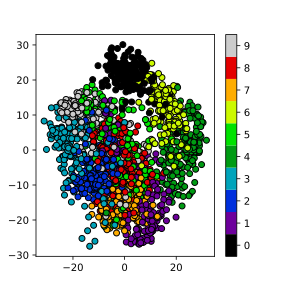
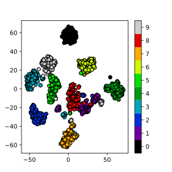
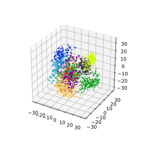
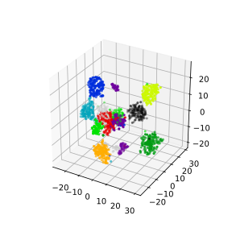

# Dimensionality Reduction
Dimensionality reduction techniques involve the selection or transformation of input features to create a more concise representation of the data, thus enabling the capture of essential patterns and variations while reducing noise and redundancy. They are applied to "high-dimensional" datasets, or data containing many features/predictors.

Dimensionality reduction techniques are useful in the context of machine learning problems for several reasons:

1. **Avoids overfitting effects**: It can be difficult to find general trends in data when fitting a model to high-dimensional dataset. As the number of model coefficients begins to approach the number of observations used to train the model, we greatly increase our risk of simply memorizing the training data.
2. **Pattern discovery**: They can reveal hidden patterns, clusters, or structures that might not be evident in the original high-dimensional space
3. **Data visualization**: High-dimensional data can be challenging to visualize and interpret directly. Dimensionality reduction methods, such as Principal Component Analysis (PCA) or t-Distributed Stochastic Neighbor Embedding (t-SNE), project data onto a lower-dimensional space while preserving important patterns and relationships. This allows you to create 2D or 3D visualizations that can provide insights into the data's structure.

The potential downsides of using dimensionality reduction techniques include:
1. **Oversimplifications**: When we reduce dimensionality of our data, we are removing some information from the data. The goal is to remove only noise or uninteresting patterns of variation. If we remove too much, we may remove signal from the data and miss important/interesting relationships.
2. **Complexity and Parameter Tuning**: Some dimensionality reduction techniques, such as t-SNE or autoencoders, can be complex to implement and require careful parameter tuning. Selecting the right parameters can be challenging and may not always lead to optimal results.
3. **Interpretability**: Reduced-dimensional representations may be less interpretable than the original features. Understanding the meaning or significance of the new components or dimensions can be challenging, especially when dealing with complex models like neural networks.

## Dimensionality Reduction with Scikit-learn

First setup our environment and load the MNIST digits dataset which will be used 
as our initial example.

~~~
from sklearn import datasets

digits = datasets.load_digits()

# Examine the dataset
print(digits.data)
print(digits.target)

X = digits.data
y = digits.target
~~~
{: .language-python}

Check data type of X and y.
~~~
print(type(X))
print(type(y))
~~~
{: .language-python}

~~~
<class 'numpy.ndarray'>
<class 'numpy.ndarray'>
~~~
{: .output}

The range of pixel values in this dataset is indeed between 0 and 16, representing different shades of gray
~~~
print(X.min())
X.max()
~~~
{: .language-python}

Check shape of X and y.
~~~
import numpy as np
print(np.shape(X)) # 1797 observations, 64 features/pixels
print(np.shape(y))
~~~
{: .language-python}
~~~
(1797, 64)
(1797,)
~~~
{: .output}
~~~
# create a quick histogram to show number of observations per class
import matplotlib.pyplot as plt
plt.hist(y)
plt.ylabel('Count')
plt.xlabel('Digit')
plt.show()
~~~
{: .language-python}

Preview the data
~~~
# Number of digits to plot
digits_to_plot = 10

# Number of versions of each digit to plot
n_versions = 3

# Create a figure with subplots
fig, axs = plt.subplots(n_versions, digits_to_plot, figsize=(12, 6))

# Loop through a small sample of digits and plot their raw images
for digit_idx in range(digits_to_plot):
    # Find up to n_versions occurrences of the current digit in the dataset
    indices = np.where(y == digit_idx)[0][:n_versions]

    for version_idx, index in enumerate(indices):
        # Reshape the 1D data into a 2D array (8x8 image)
        digit_image = X[index].reshape(8, 8)
        
        # Plot the raw image of the digit in the corresponding subplot
        axs[version_idx, digit_idx].imshow(digit_image, cmap='gray')
        axs[version_idx, digit_idx].set_title(f"Digit {digit_idx}")
        axs[version_idx, digit_idx].axis('off')

plt.tight_layout()
plt.show()
~~~
{: .language-python}

Calculate the percentage of variance accounted for by each variable in this dataset.
~~~
var_per_feat = np.var(X,0) # variance of each feature
sum_var = np.sum(var_per_feat) # total variability summed across all features
var_ratio_per_feat = var_per_feat/sum_var # 
sum(var_ratio_per_feat) # should sum to 1.0
~~~
{: .language-python}

Sort the variance ratios in descending order
~~~
sorted_var_ratio_per_feat = np.sort(var_ratio_per_feat)[::-1]
sorted_var_ratio_per_feat*100
~~~
{: .language-python}

Plot the cumulative variance ratios ordered from largest to smallest
~~~
cumulative_var_ratio = np.cumsum(sorted_var_ratio_per_feat) * 100

# Plot the cumulative variance ratios ordered from largest to smallest
plt.plot(cumulative_var_ratio)
plt.xlabel("Pixel (Ordered by Variance)")
plt.ylabel("Cumulative % of Total Variance")
plt.title("Cumulative Explained Variance vs. Pixel ID (Ordered by Variance)")
plt.grid(True)
plt.show()
~~~
{: .language-python}

This data has 64 pixels or features that can be fed into a model to predict digit classes. Features or pixels with more variability will often be more predictive of the target class because those pixels will tend to vary more with digit assignments. Unfortunately, each pixel/feature contributes just a small percentage of the total variance found in this dataset. This means that a machine learning model will likley require many training examples to learn how the features interact to predict a specific digit.

#### Train/test split
Perform a train/test split in preparation of training a classifier. We will artificially decrease our amount of training data such that we are modeling in a high-dimensional context (where number of observations approaches number of predictors)
~~~
from sklearn.model_selection import train_test_split
# Split the dataset into training and test sets
test_size = .98
X_train, X_test, y_train, y_test = train_test_split(X, y, test_size=test_size, random_state=42, stratify=y)
print(X_train.shape)
~~~
{: .language-python}

### Train a classifier
Train a classifier. Here, we will use something called a multilayer perceptron (MLP) which is a type of artificial neural network. We'll dive more into the details behind this model in the next episode. For now, just know that this model has thousands of coefficients/weights that must be estimated from the data. The total number of coefs is calculated below:
~~~
n_features = X_train.shape[1]
hidden_layer1_neurons = 64
hidden_layer2_neurons = 64
n_output_neurons = 10
total_coefficients = n_features * (hidden_layer1_neurons + 1) * (hidden_layer2_neurons + 1) * n_output_neurons
total_coefficients
~~~
{: .language-python}
~~~
from sklearn.neural_network import MLPClassifier
from sklearn.metrics import accuracy_score, confusion_matrix
import seaborn as sns

def train_and_evaluate_mlp(X_train, X_test, y_train, y_test):
    # Create an MLP classifier
    mlp = MLPClassifier(hidden_layer_sizes=(64, 64), max_iter=5000, random_state=42)

    # Fit the MLP model to the training data
    mlp.fit(X_train, y_train)

    # Make predictions on the training and test sets
    y_train_pred = mlp.predict(X_train)
    y_test_pred = mlp.predict(X_test)

    # Calculate the accuracy on the training and test sets
    train_accuracy = accuracy_score(y_train, y_train_pred)
    test_accuracy = accuracy_score(y_test, y_test_pred)

    print(f"Training Accuracy: {train_accuracy:.2f}")
    print(f"Test Accuracy: {test_accuracy:.2f}")

    # Calculate and plot the confusion matrix
    cm = confusion_matrix(y_test, y_test_pred)
    plt.figure(figsize=(8, 6))
    sns.heatmap(cm, annot=True, fmt='d', cmap='Blues', cbar=False)
    plt.xlabel('Predicted')
    plt.ylabel('True')
    plt.title('Confusion Matrix')
    plt.show()
    
    return train_accuracy, test_accuracy
    
train_and_evaluate_mlp(X_train, X_test, y_train, y_test);
~~~
{: .language-python}

### Principle Component Analysis (PCA)
PCA is a data transformation technique that allows you to represent variance across variables more efficiently. Specifically, PCA does rotations of data matrix (N observations x C features) in a two dimensional array to decompose the array into vectors that are orthogonal and can be ordered according to the amount of information/variance they carry. After transforming the data with PCA, each new variable (or pricipal component) can be thought of as a linear combination of several of the original variables. 

	1. PCA, at its core, is a data transformation technique
	2. Allows us to more efficiently represent the variability present in the data
	3. It does this by linearly combining variables into new variables called principal component scores
	4. The new transformed variables are all "orthogonal" to one another, meaning there is no redundancy or correlation between variables.

Use the below code to run PCA on the MNIST dataset. This code will also plot the percentage of variance explained by each  principal component in the transformed dataset. Note how the percentage of variance explained is quite high for the first 10 or so principal components. Compare this plot with the one we made previously.

~~~
from sklearn.decomposition import PCA

# Create a PCA instance 
pca = PCA()

pca.fit(X)  # in-place operation that stores the new basis dimensions (principal components) that will be used to transform X

# Calculate the cumulative sum of explained variance ratios
explained_variance_ratio_cumsum = pca.explained_variance_ratio_.cumsum() * 100

# Plot the cumulative explained variance ratio
plt.plot(explained_variance_ratio_cumsum, marker='o', linestyle='-')
plt.xlabel("Number of Principal Components")
plt.ylabel("Cumulative Explained Variance (%)")
plt.title("Cumulative Explained Variance vs. Number of Principal Components")
plt.grid(True)
plt.show()
~~~
{: .language-python}

#### How many principal components (dimensions) should we keep?
Our data is now more compactly/efficiently represented. We can now try to re-classify our data using a smaller number of principal components. 

When making this decision, it's important to take into consideration how much of the total variability is represented the number of principal components you choose to keep. A few common approaches/considerations include:
* Keeping as many as are needed to reach some reasonably high variance threshold (e.g., 50-99%). This method ensures you don't remove any important signal from the data.
* Look for the inflection point in the cumulative variance plot where the slope drops off significantly (sometimes called the "elbow" or "scree" method)
* Use data-driven methods to assess overfitting effects with different numbers of components. In a high-dimensional context, tossing out a little information can yield much better model performance.
~~~
var_thresh = 50
n_components = np.argmax(explained_variance_ratio_cumsum >= var_thresh) + 1
n_components
~~~
{: .language-python}

Transform X and keep just the first `n_components` new variables known as "PCA scores", though often sloppily referred to as principal components.
~~~
X_pca = pca.transform(X) # transform X
X_pca = X_pca[:, :n_components]
X_pca.shape
~~~
{: .language-python}

We can plot the data for the first two pricipal directions of variation — color coded according to digit class. Notice how the data separates rather nicely into different clusters representative of different digits.
~~~
# PCA
pca = decomposition.PCA(n_components=2)
pca.fit(X)
X_pca = pca.transform(X)

fig = plt.figure(1, figsize=(4, 4))
plt.clf()
plt.scatter(X_pca[:, 0], X_pca[:, 1], c=y, cmap=plt.cm.nipy_spectral, 
        edgecolor='k',label=y)
plt.colorbar(boundaries=np.arange(11)-0.5).set_ticks(np.arange(10))
plt.savefig("pca.svg")
~~~
{: .language-python}

Plot in 3D instead
~~~
from mpl_toolkits.mplot3d import Axes3D
fig = plt.figure(1, figsize=(4, 4))
ax = fig.add_subplot(projection='3d')
ax.scatter(X_pca[:, 0], X_pca[:, 1], X_pca[:, 2], c=y,
          cmap=plt.cm.nipy_spectral, s=9, lw=0);
~~~
{: .language-python}

Repeat classification task

### PCA and Modeling
In general (with some [notable exceptions](https://openai.com/blog/deep-double-descent/)), as you increase the number of predictor variables used by a model, additional data is needed to fit a good model (i.e., one that doesn't overfit the training data). Overfitting refers to when a model fits the training data *too well*, resulting in a model that fails to generalize to unseen test data. 

A common solution to overfitting is to simply collect more data. However, data can be expensive to collect and label. When additional data isn't an option, a good choice is often dimensionality reduction techniques.

Let's see how much better our classifier can do when using PCA to reduce dimensionality.
~~~
X_train_pca, X_test_pca, y_train_pca, y_test_pca = train_test_split(X_pca, y, test_size=test_size, random_state=42)
X_train_pca.shape
~~~
{: .language-python}

~~~
train_and_evaluate_mlp(X_train_pca, X_test_pca, y_train_pca, y_test_pca)
~~~
{: .language-python}

### Exploring different variance thresholds
Run the for loop below to experiment with different variance thresholds.

What do you notice about the result? Which variance threshold works best for this data?

~~~
var_thresh_list = [10, 20, 50, 60, 75, 90, 100]
print(var_thresh_list)
for var_thresh in var_thresh_list:
    print(f'var_thresh = {var_thresh}%')
    n_components = np.argmax(explained_variance_ratio_cumsum >= var_thresh) + 1
    print(f'n_components = {n_components}')
    X_pca = pca.transform(X) # transform X
    X_pca = X_pca[:, :n_components]
    X_train_pca, X_test_pca, y_train_pca, y_test_pca = train_test_split(X_pca, y, test_size=test_size, random_state=42)
    train_accuracy, test_accuracy = train_and_evaluate_mlp(X_train_pca, X_test_pca, y_train_pca, y_test_pca)
~~~
{: .language-python}

### PCA when more data is available
Scroll to where we originally set the test_size variable in this episode (near the beginning). Adjust this value to 0.1. How does this change affect model performance with and without PCA?

### t-distributed Stochastic Neighbor Embedding (t-SNE)
The t-SNE algorithm is a nonlinear dimensionality reduction technique. It is primarily used for visualizing high-dimensional data in lower-dimensional space. 

~~~
# t-SNE embedding
tsne = manifold.TSNE(n_components=2, init='pca',
        random_state = 0)
X_tsne = tsne.fit_transform(X)
fig = plt.figure(1, figsize=(4, 4))
plt.clf()
plt.scatter(X_tsne[:, 0], X_tsne[:, 1], c=y, cmap=plt.cm.nipy_spectral,
        edgecolor='k',label=y)
plt.colorbar(boundaries=np.arange(11)-0.5).set_ticks(np.arange(10))
plt.savefig("tsne.svg")
~~~
{: .language-python}

Experimenting with the perpexlity hyperparameter. Default value is 30.

Low Perplexity: When you set a low perplexity value, t-SNE prioritizes preserving local structure, and data points that are close to each other in the high-dimensional space will tend to remain close in the low-dimensional embedding. This can reveal fine-grained patterns and clusters in the data.

High Perplexity: On the other hand, a high perplexity value places more emphasis on preserving global structure. It allows data points that are farther apart in the high-dimensional space to influence each other in the low-dimensional embedding. This can help uncover broader, more global patterns and relationships.

~~~
# List of perplexity values to visualize
perplexities = [5, 30, 50, 100]

# Create subplots
fig, axes = plt.subplots(2, 2, figsize=(10, 10))
fig.subplots_adjust(wspace=0.5, hspace=0.5)

for i, perplexity in enumerate(perplexities):
    # t-SNE embedding
    tsne = manifold.TSNE(n_components=2, init='pca', random_state=0, perplexity=perplexity)
    X_tsne = tsne.fit_transform(X)

    # Plot in the corresponding subplot
    ax = axes[i // 2, i % 2]
    scatter = ax.scatter(X_tsne[:, 0], X_tsne[:, 1], c=y, cmap=plt.cm.nipy_spectral, edgecolor='k', label=y)
    ax.set_title(f'Perplexity = {perplexity}')
    
    # Create a colorbar for the scatter plot
    cbar = fig.colorbar(scatter, ax=ax, boundaries=np.arange(11) - 0.5)
    cbar.set_ticks(np.arange(10))

plt.tight_layout()
plt.show()
~~~
{: .language-python}

> ## Exercise: Working in three dimensions
> The above example has considered only two dimensions since humans
> can visualize two dimensions very well. However, there can be cases
> where a dataset requires more than two dimensions to be appropriately
> decomposed. Modify the above programs to use three dimensions and 
> create appropriate plots.
> Do three dimensions allow one to better distinguish between the digits?
>
> > ## Solution
> > ~~~
> > from mpl_toolkits.mplot3d import Axes3D
> > # PCA
> > pca = decomposition.PCA(n_components=3)
> > pca.fit(X)
> > X_pca = pca.transform(X)
> > fig = plt.figure(1, figsize=(4, 4))
> > plt.clf()
> > ax = fig.add_subplot(projection='3d')
> > ax.scatter(X_pca[:, 0], X_pca[:, 1], X_pca[:, 2], c=y,
> >           cmap=plt.cm.nipy_spectral, s=9, lw=0)
> > plt.savefig("pca_3d.svg")
> > ~~~
> > {: .language-python}
> >
> > 
> >
> > ~~~
> > # t-SNE embedding
> > tsne = manifold.TSNE(n_components=3, init='pca',
> >         random_state = 0)
> > X_tsne = tsne.fit_transform(X)
> > fig = plt.figure(1, figsize=(4, 4))
> > plt.clf()
> > ax = fig.add_subplot(projection='3d')
> > ax.scatter(X_tsne[:, 0], X_tsne[:, 1], X_tsne[:, 2], c=y,
> >           cmap=plt.cm.nipy_spectral, s=9, lw=0)
> > plt.savefig("tsne_3d.svg")
> > ~~~
> > {: .language-python}
> >
> > 
> >
> >
> {: .solution}
{: .challenge}

> ## Exercise: Parameters
>
> Look up parameters that can be changed in PCA and t-SNE,
> and experiment with these. How do they change your resulting
> plots?  Might the choice of parameters lead you to make different
> conclusions about your data?
{: .challenge}

> ## Exercise: Other Algorithms
>
> There are other algorithms that can be used for doing dimensionality
> reduction, for example the Higher Order Singular Value Decomposition (HOSVD)
> Do an internet search for some of these and
> examine the example data that they are used on. Are there cases where they do 
> poorly? What level of care might you need to use before applying such methods
> for automation in critical scenarios?  What about for interactive data 
> exploration?
{: .challenge}



