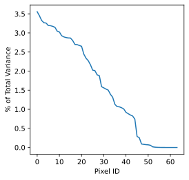
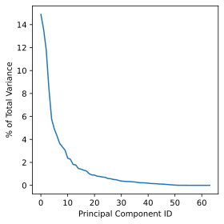

# Dimensionality Reduction

Dimensionality reduction is the process of using a subset of the coordinates, 
which may be transformed, of the dataset to capture the variation in features 
of the data set.  It can be a helpful pre-processing step before doing other 
operations on the data, such as classification, regression or visualization.

## Dimensionality Reduction with Scikit-learn

First setup our environment and load the MNIST digits dataset which will be used 
as our initial example.

~~~
import numpy as np
import matplotlib.pyplot as plt

from sklearn import decomposition
from sklearn import datasets
from sklearn import manifold

digits = datasets.load_digits()

# Examine the dataset
print(digits.data)
print(digits.target)

X = digits.data
y = digits.target
~~~
{: .language-python}

Check data type of X and y.
~~~
print(type(X))
print(type(y))
~~~
{: .language-python}
~~~
<class 'numpy.ndarray'>
<class 'numpy.ndarray'>
~~~
{: .output}
Check shape of X and y.
~~~
print(np.shape(X)) # 1797 observations, 64 features/pixels
print(np.shape(y))
~~~
{: .language-python}
~~~
(1797, 64)
(1797,)
~~~
{: .output}
~~~
# create a quick histogram to show number of observations per class
plt.hist(y)
plt.ylabel('Count')
plt.xlabel('Digit')
plt.show()
~~~
{: .language-python}

Calculate the percentage of variance accounted for by each variable in this dataset.
~~~
var_per_feat = np.var(X,0) # variance of each feature
sum_var = np.sum(var_per_feat) # total variability summed across all features
var_ratio_per_feat = var_per_feat/sum_var # 
print(sum(var_ratio_per_feat)) # should sum to 1.0

# Plot the variance ratios ordered from largest to smallest
plt.plot(np.sort(var_ratio_per_feat)[::-1]*100)
plt.xlabel("Pixel ID")
plt.ylabel("% of Total Variance")
plt.show()
~~~
{: .language-python}

This data has 64 pixels or features that can be fed into a model to predict digit classes. Features or pixels with more variability will often be more predictive of the target class because those pixels will tend to vary more with digit assignments. Unfortunately, each pixel/feature contributes just a small percentage of the total variance found in this dataset. This means that a machine learning model will likley require many training examples to learn how the features interact to predict a specific digit.

### Principle Component Analysis (PCA)

PCA is a data transformation technique that allows you to represent variance across variables more efficiently. Specifically, PCA does rotations of data matrix (N observations x C features) in a two dimensional array to decompose the array into vectors that are orthogonal and can be ordered according to the amount of information/variance they carry. After transforming the data with PCA, each new variable (or pricipal component) can be thought of as a linear combination of several of the original variables. 

Use the below code to run PCA on the MNIST dataset. This code will also plot the percentage of variance explained by each  principal component in the transformed dataset. Note how the percentage of variance explained is quite high for the first 10 or so principal components. Compare this plot with the one we made previously.

~~~
pca = decomposition.PCA()
pca.fit(X) # run PCA on X
plt.plot(pca.explained_variance_ratio_*100)
X_pca = pca.transform(X)
plt.xlabel("Principal Component ID")
plt.ylabel("% of Total Variance")
plt.show()
~~~
{: .language-python}

We can plot the data for the first two pricipal directions of variation — color coded according to digit class. Notice how the data separates rather nicely into different clusters representative of different digits.
~~~
# PCA
pca = decomposition.PCA(n_components=2)
pca.fit(X)
X_pca = pca.transform(X)

fig = plt.figure(1, figsize=(4, 4))
plt.clf()
plt.scatter(X_pca[:, 0], X_pca[:, 1], c=y, cmap=plt.cm.nipy_spectral, 
        edgecolor='k',label=y)
plt.colorbar(boundaries=np.arange(11)-0.5).set_ticks(np.arange(10))
plt.savefig("pca.svg")
~~~
{: .language-python}

### PCA and Modeling
In general (with some [notable exceptions](https://openai.com/blog/deep-double-descent/)), as you increase the number of predictor variables used by a model, additional data is needed to fit a good model (i.e., one that doesn't overfit the training data). Overfitting refers to when a model fits the training data *too well*, resulting in a model that fails to generalize to unseen test data. 

A common solution to overfitting is to simply collect more data. However, data can be expensive to collect and label. When additional data isn't an option, a good choice is often dimensionality reduction techniques.

To observe the benefits of dimensionality reduction in the context of modeling, let's fit a decision tree model to a small subset of our original MNIST dataset.

~~~
# fit model using just 5% for training data
from sklearn.model_selection import train_test_split
X_train , X_test ,y_train, y_test = train_test_split(X, y, test_size =0.95, shuffle = True, random_state = 0, stratify=y)
print('(#obs, #feats)=', X_train.shape)

from sklearn.tree import DecisionTreeClassifier 
clf = DecisionTreeClassifier(random_state=0)
clf.fit(X_train , y_train)

from sklearn.metrics import confusion_matrix
y_pred = clf.predict(X_test)

conf_mat = confusion_matrix(y_test,y_pred)
print(conf_mat)
test_accuracy = clf.score(X_test , y_test) # Returns the mean accuracy on the given test data and labels.
print('Test accuracy:', test_accuracy)
train_accuracy = clf.score(X_train , y_train) # Returns the mean accuracy on the given test data and labels.
print('Train accuracy:', train_accuracy)
~~~
{: .language-python}

This model has a low accuracy score on the test dataset because we trained our model using only 89 observations. With few observations to learn from, the model appears to overfit the training data. If training set accuracy is high and test set accuracy is low, this is good evidence that you have an overfit model.

To improve model performance and avoid overfitting, we can try to model the data using just the first ten principal components as input features to the model. With a smaller number of highly informative features to use in the decision tree, we should see an improvement in test accuracy.

~~~
# How much of the data's variance is explained by just the first 10 principal components?
sum(pca.explained_variance_ratio_[0:10]*100)
~~~
{: .language-python}

Even though we are using just 10 features to predict digit class, those 10 features (or principal components) account for a whopping 73.82% of the variance in our data. Let's see if these informative features will allow us to fit a decision tree model using a small dataset.

~~~
X_train , X_test ,y_train, y_test = train_test_split(X_pca[:,:10], y, test_size =0.95, shuffle = True, random_state = 0, stratify=y) # model just the first 10 principal components
print(X_train.shape)

clf = DecisionTreeClassifier(random_state=0)
clf.fit(X_train , y_train)

from sklearn.metrics import confusion_matrix
y_pred = clf.predict(X_test)

conf_mat = confusion_matrix(y_test,y_pred)
print(conf_mat)

test_accuracy = clf.score(X_test , y_test) # Returns the mean accuracy on the given test data and labels.
print('Test accuracy:', test_accuracy)
train_accuracy = clf.score(X_train , y_train) # Returns the mean accuracy on the given test data and labels.
print('Train accuracy:', train_accuracy)
~~~
{: .language-python}

> ## PCA when more data is available
> Try changing the test_size argument to 0.2 in the two previous train_test_split() calls, and retrain the two decision tree models (one for X, one for X_pca[:,:10]). Does the model that uses only 10 principal components outperform (i.e., in terms of test accuracy) the model that uses untransformed data? Explain your observations.
> > ## Solution
> > When we increase the size of the training set, the larger model (trained on X) appears to outperform the model trained on only 10 principal components. With abundant data, additional features typically lead to enhanced predictive power. When we only consider 10 principal components, we ignore ~26% of the remaining variance in the data. By tossing out some of this variance, we reduce our likelihood of overfitting, but also reduce our ability to detect more complex mappings between additional features and our target class. 
> > 
> > ~~~
> > X_train , X_test ,y_train, y_test = train_test_split(X, y, test_size =0.2, shuffle = True, random_state = 0, stratify=y)
> > print('(#obs, #feats)=', X_train.shape)
> >
> > clf = DecisionTreeClassifier(random_state=0)
> > clf.fit(X_train , y_train)
> >
> > y_pred = clf.predict(X_test)
> > conf_mat = confusion_matrix(y_test,y_pred)
> > print(conf_mat)
> > test_accuracy = clf.score(X_test , y_test) # Returns the mean accuracy on the given test data and labels.
> > print('Test accuracy:', test_accuracy)
> > train_accuracy = clf.score(X_train , y_train) # Returns the mean accuracy on the given test data and labels.
> > print('Train accuracy:', train_accuracy)
> > ~~~
> > {: .language-python}
> > ~~~
> > (#obs, #feats)= (1437, 64)
> > [[33  0  1  0  1  0  0  0  1  0]
> >  [ 0 30  1  0  1  0  0  1  2  1]
> >  [ 1  1 30  0  0  0  0  1  1  1]
> >  [ 0  1  2 30  0  1  0  1  2  0]
> >  [ 0  0  0  0 33  1  0  1  0  1]
> >  [ 0  0  0  3  0 34  0  0  0  0]
> >  [ 0  0  0  0  2  1 32  1  0  0]
> >  [ 0  0  0  0  0  0  0 35  0  1]
> >  [ 0  1  0  0  2  1  1  1 28  1]
> >  [ 0  2  0  1  1  1  0  0  0 31]]
> > Test accuracy: 0.8777777777777778
> > Train accuracy: 1.0
> > ~~~
> > {: .output}
> > ~~~
> > X_train , X_test ,y_train, y_test = train_test_split(X_pca[:,:10], y, test_size =0.2, shuffle = True, random_state = 0, stratify=y) # model just the first 10 principal components
> > print('(#obs, #feats)=', X_train.shape)
> >
> > clf = DecisionTreeClassifier(random_state=0)
> > clf.fit(X_train , y_train)
> >
> > y_pred = clf.predict(X_test)
> >
> > conf_mat = confusion_matrix(y_test,y_pred)
> > print(conf_mat)
> >
> > test_accuracy = clf.score(X_test , y_test) # Returns the mean accuracy on the given test data and labels.
> > print('Test accuracy:', test_accuracy)
> > train_accuracy = clf.score(X_train , y_train) # Returns the mean accuracy on the given test data and labels.
> > print('Train accuracy:', train_accuracy)
> > ~~~
> > {: .language-python}
> > ~~~
> > (#obs, #feats)= (1437, 10)
> > [[34  0  0  0  0  0  0  0  1  1]
> >  [ 0 31  1  0  0  0  1  0  2  1]
> >  [ 0  2 30  2  0  0  0  0  1  0]
> >  [ 0  0  0 30  0  0  0  1  5  1]
> >  [ 0  1  0  0 34  0  0  0  1  0]
> >  [ 0  1  1  2  0 30  1  0  1  1]
> >  [ 0  1  0  0  0  0 33  0  1  1]
> >  [ 0  0  0  0  0  0  0 33  0  3]
> >  [ 1  4  2  0  0  0  0  1 25  2]
> >  [ 0  2  0  3  0  3  0  2  0 26]]
> > Test accuracy: 0.85
> > Train accuracy: 1.0
> > ~~~
> > {: .output}
> {: .solution}
{: .challenge}

### t-distributed Stochastic Neighbor Embedding (t-SNE)

~~~
# t-SNE embedding
tsne = manifold.TSNE(n_components=2, init='pca',
        random_state = 0)
X_tsne = tsne.fit_transform(X)
fig = plt.figure(1, figsize=(4, 4))
plt.clf()
plt.scatter(X_tsne[:, 0], X_tsne[:, 1], c=y, cmap=plt.cm.nipy_spectral,
        edgecolor='k',label=y)
plt.colorbar(boundaries=np.arange(11)-0.5).set_ticks(np.arange(10))
plt.savefig("tsne.svg")
~~~
{: .language-python}

> ## Exercise: Working in three dimensions
> The above example has considered only two dimensions since humans
> can visualize two dimensions very well. However, there can be cases
> where a dataset requires more than two dimensions to be appropriately
> decomposed. Modify the above programs to use three dimensions and 
> create appropriate plots.
> Do three dimensions allow one to better distinguish between the digits?
>
> > ## Solution
> > ~~~
> > from mpl_toolkits.mplot3d import Axes3D
> > # PCA
> > pca = decomposition.PCA(n_components=3)
> > pca.fit(X)
> > X_pca = pca.transform(X)
> > fig = plt.figure(1, figsize=(4, 4))
> > plt.clf()
> > ax = fig.add_subplot(projection='3d')
> > ax.scatter(X_pca[:, 0], X_pca[:, 1], X_pca[:, 2], c=y,
> >           cmap=plt.cm.nipy_spectral, s=9, lw=0)
> > plt.savefig("pca_3d.svg")
> > ~~~
> > {: .language-python}
> >
> > 
> >
> > ~~~
> > # t-SNE embedding
> > tsne = manifold.TSNE(n_components=3, init='pca',
> >         random_state = 0)
> > X_tsne = tsne.fit_transform(X)
> > fig = plt.figure(1, figsize=(4, 4))
> > plt.clf()
> > ax = fig.add_subplot(projection='3d')
> > ax.scatter(X_tsne[:, 0], X_tsne[:, 1], X_tsne[:, 2], c=y,
> >           cmap=plt.cm.nipy_spectral, s=9, lw=0)
> > plt.savefig("tsne_3d.svg")
> > ~~~
> > {: .language-python}
> >
> > 
> >
> >
> {: .solution}
{: .challenge}

> ## Exercise: Parameters
>
> Look up parameters that can be changed in PCA and t-SNE,
> and experiment with these. How do they change your resulting
> plots?  Might the choice of parameters lead you to make different
> conclusions about your data?
{: .challenge}

> ## Exercise: Other Algorithms
>
> There are other algorithms that can be used for doing dimensionality
> reduction, for example the Higher Order Singular Value Decomposition (HOSVD)
> Do an internet search for some of these and
> examine the example data that they are used on. Are there cases where they do 
> poorly? What level of care might you need to use before applying such methods
> for automation in critical scenarios?  What about for interactive data 
> exploration?
{: .challenge}



