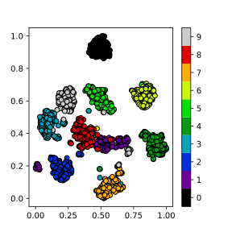

# Dimensionality Reduction

Dimensionality reduction is the process of using a subset of the coordinates, 
which may be transformed, of the dataset to capture the variation in features 
of the data set.  It can be a helpful pre-processing step before doing other 
operations on the data, such as classification, regression or visualization.

## Dimensionality Reduction with Scikit-learn

First setup our environment and load the MNIST digits dataset which will be used 
as our initial example.

~~~
import numpy as np
import matplotlib.pyplot as plt

from sklearn import decomposition
from sklearn import datasets
from sklearn import manifold

digits = datasets.load_digits()

# Examine the dataset
print(digits.data)
print(digits.target)

X = digits.data
y = digits.target
~~~
{: .language-python}

Check data type of X and y.
~~~
print(type(X))
print(type(y))
~~~
{: .language-python}
~~~
<class 'numpy.ndarray'>
<class 'numpy.ndarray'>
~~~
{: .output}
~~~
print(np.shape(X)) # 1797 observations, 64 features/pixels
print(np.shape(y))
~~~
{: .language-python}
~~~
(1797, 64)
(1797,)
~~~
{: .output}

Calculate the percentage of variance accounted for by each variable in this dataset.
~~~
var_per_feat = np.var(X,0) # variance of each feature
sum_var = np.sum(var_per_feat) # total variability summed across all features
var_ratio_per_feat = var_per_feat/sum_var # 
print(sum(var_ratio_per_feat)) # should sum to 1.0

# Plot the variance ratios ordered from largest to smallest
plt.plot(np.sort(var_ratio_per_feat)[::-1]*100)
plt.xlabel("Pixel ID")
plt.ylabel("% of Total Variance")
plt.show()
~~~
{: .language-python}

This data has 64 pixels or features that can be fed into a model to predict digit classes. Features or pixels with more variability will often be more predictive of the target class because those pixels will tend to vary more with digit assignments. Unfortunately, each pixel/feature contributes just a small percentage of the total variance found in this dataset. This means that a machine learning model will likley require many training examples to learn how the features interact to predict a specific digit.

As a general rule of thumb (with some [notable exceptions](https://openai.com/blog/deep-double-descent/)), as you increase the number of predictor variables used by a model, additional data is needed to fit a good model (i.e., one that isn't extremely overfit). When additional data isn't an option, a good choice is often dimensionality reduction techniques.

### Principle Component Analysis (PCA)

PCA is a technique that does rotations of data in a two dimensional
array to decompose the array into combinations vectors that are orthogonal
and can be ordered according to the amount of information they carry.

~~~
pca = decomposition.PCA()
pca.fit(X) # run PCA on X
plt.plot(pca.explained_variance_ratio_*100)
X_pca = pca.transform(X)
plt.xlabel("Principal Component ID")
plt.ylabel("% of Total Variance")
plt.show()
~~~
{: .language-python}

~~~
# PCA
pca = decomposition.PCA(n_components=2)
pca.fit(X)
X_pca = pca.transform(X)

fig = plt.figure(1, figsize=(4, 4))
plt.clf()
plt.scatter(X_pca[:, 0], X_pca[:, 1], c=y, cmap=plt.cm.nipy_spectral, 
        edgecolor='k',label=y)
plt.colorbar(boundaries=np.arange(11)-0.5).set_ticks(np.arange(10))
plt.savefig("pca.svg")
~~~
{: .language-python}

### t-distributed Stochastic Neighbor Embedding (t-SNE)

~~~
# t-SNE embedding
tsne = manifold.TSNE(n_components=2, init='pca',
        random_state = 0)
X_tsne = tsne.fit_transform(X)
fig = plt.figure(1, figsize=(4, 4))
plt.clf()
plt.scatter(X_tsne[:, 0], X_tsne[:, 1], c=y, cmap=plt.cm.nipy_spectral,
        edgecolor='k',label=y)
plt.colorbar(boundaries=np.arange(11)-0.5).set_ticks(np.arange(10))
plt.savefig("tsne.svg")
~~~
{: .language-python}

> ## Exercise: Working in three dimensions
> The above example has considered only two dimensions since humans
> can visualize two dimensions very well. However, there can be cases
> where a dataset requires more than two dimensions to be appropriately
> decomposed. Modify the above programs to use three dimensions and 
> create appropriate plots.
> Do three dimensions allow one to better distinguish between the digits?
>
> > ## Solution
> > ~~~
> > from mpl_toolkits.mplot3d import Axes3D
> > # PCA
> > pca = decomposition.PCA(n_components=3)
> > pca.fit(X)
> > X_pca = pca.transform(X)
> > fig = plt.figure(1, figsize=(4, 4))
> > plt.clf()
> > ax = fig.add_subplot(projection='3d')
> > ax.scatter(X_pca[:, 0], X_pca[:, 1], X_pca[:, 2], c=y,
> >           cmap=plt.cm.nipy_spectral, s=9, lw=0)
> > plt.savefig("pca_3d.svg")
> > ~~~
> > {: .language-python}
> >
> > 
> >
> > ~~~
> > # t-SNE embedding
> > tsne = manifold.TSNE(n_components=3, init='pca',
> >         random_state = 0)
> > X_tsne = tsne.fit_transform(X)
> > fig = plt.figure(1, figsize=(4, 4))
> > plt.clf()
> > ax = fig.add_subplot(projection='3d')
> > ax.scatter(X_tsne[:, 0], X_tsne[:, 1], X_tsne[:, 2], c=y,
> >           cmap=plt.cm.nipy_spectral, s=9, lw=0)
> > plt.savefig("tsne_3d.svg")
> > ~~~
> > {: .language-python}
> >
> > 
> >
> >
> {: .solution}
{: .challenge}

> ## Exercise: Parameters
>
> Look up parameters that can be changed in PCA and t-SNE,
> and experiment with these. How do they change your resulting
> plots?  Might the choice of parameters lead you to make different
> conclusions about your data?
{: .challenge}

> ## Exercise: Other Algorithms
>
> There are other algorithms that can be used for doing dimensionality
> reduction, for example the Higher Order Singular Value Decomposition (HOSVD)
> Do an internet search for some of these and
> examine the example data that they are used on. Are there cases where they do 
> poorly? What level of care might you need to use before applying such methods
> for automation in critical scenarios?  What about for interactive data 
> exploration?
{: .challenge}



