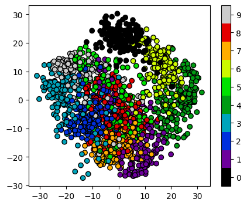

# Dimensionality reduction

As seen in the last episode, general clustering algorithms work well with low-dimensional data. In this episode we see how higher-dimensional data, such as images of handwritten text or numbers, can be processed with dimensionality reduction techniques to make the datasets more accessible for other modelling techniques. The dataset we will be using is the Scikit-Learn subset of the Modified National Institute of Standards and Technology (MNIST) dataset.

The MNIST dataset contains 70,000 images of handwritten numbers, and are labelled from 0-9 with the number that each image contains. Each image is a greyscale and 28x28 pixels in size for a total of 784 pixels per image. Each pixel can take a value between 0-255 (8bits). When dealing with a series of images in machine learning we consider each pixel to be a feature that varies according to each of the sample images. Our previous penguin dataset only had no more than 7 features to train with, however even a small 28x28 MNIST image has as much as 784 features (pixels) to work with.

To make this episode a bit less computationally intensive, the Scikit-Learn example that we will work with is a smaller sample of 1797 images. Each image is 8x8 in size for a total of 64 pixels per image, resulting in 64 features for us to work with. The pixels can take a value between 0-15 (4bits). Let's retrieve and inspect the Scikit-Learn dataset with the following code:

~~~
from sklearn import datasets

# load in dataset as a Pandas Dataframe, return X and Y
features, labels = datasets.load_digits(return_X_y=True, as_frame=True)

print(features.shape, labels.shape)
print(labels)
features.head()
~~~
{: .language-python}

## Our goal: using dimensionality-reduction to help with machine learning

As humans we are pretty good at object and pattern recognition. We can look at the images above, inspect the intensity and position pixels relative to other pixels, and pretty quickly make an accurate guess at what the image shows. As humans we spends much of our younger lives learning these spatial relations, and so it stands to reason that computers can also extract these relations. Let's see if it is possible to use unsupervised clustering techniques to pull out relations in our MNIST dataset of number images.

As we did for previous datasets, let's have a quick glance at relationships between our features/pixels. We'll inspect the relationships between a few pixel features to look for any correlations:

~~~
import matplotlib.pyplot as plt
import numpy as np

print(features.iloc[0])
image_1D = features.iloc[0]
image_2D = np.array(image_1D).reshape(-1,8)

plt.imshow(image_2D,cmap="gray_r")
# these points are the pixels we will investigate
# pixels 0,1,2,3 of row 4 of the image
plt.plot([0,1,2,3],[4,4,4,4],"rx")
plt.show()
~~~
{: .language-python}

~~~
import seaborn as sns

# make a temporary copy of data for plotting here only
seaborn_data = features

# add labels for pairplot color coding
seaborn_data["labels"] = labels

# make a short list of N features for plotting N*N figures
# 4**2 = 16 plots, whereas 64**2 is over 4000!
feature_subset = []
for i in range(4):
    feature_subset.append("pixel_"+str(i)+"_4")

sns.pairplot(seaborn_data, vars=feature_subset, hue="labels", 
             palette=sns.mpl_palette("Spectral", n_colors=10))
~~~
{: .language-python}

As we can see the dataset relations are far more complex than our previous examples. The histograms show that some numbers appear in those pixel positions more than others, but the `feature_vs_feature` plots are quite messy to try and decipher. There are gaps and patches of colour suggesting that there is some kind of structure there, but it's far harder to inspect than the penguin data. We can't easily see definitive clusters in our 2D representations, and we know our clustering algorithms will take a long time to try and crunch 64 dimensions at once, so let's see if we can represent our 64D data in fewer dimensions.

# Dimensionality reduction with Scikit-Learn
We will look at two commonly used techniques for dimensionality reduction: Principal Component Analysis (PCA) and t-distributed Stochastic Neighbor Embedding (t-SNE). Both of these techniques are supported by Scikit-Learn.

### Principal Component Analysis (PCA)

PCA works by rotating our original set of vectors/axes/features into their principal components i.e. the rotations, around the dataset mean value, that produces the largest variance for our data. There are as many components as there are dimensions, and each principal component is orthoganal to the others.

The example below shows how the principal components are determined for a 2D dataset. The largest principal component is along the diagonal of the dataset, meaning the remaining principal is orthoganal to this one. Essentially, this is just a rotation of our axis until variance is maximised for that axis rotation. If we have more than 2 dimensions, then we order the principal components in descending variance order. 

For more in depth explanations of PCA please see the following links:
* [https://builtin.com/data-science/step-step-explanation-principal-component-analysis](https://builtin.com/data-science/step-step-explanation-principal-component-analysis)
* [https://scikit-learn.org/stable/modules/decomposition.html#pca](https://scikit-learn.org/stable/modules/decomposition.html#pca)

PCA allows us to replace our 64 features with a smaller number of dimensional representations that retain the majority of our variance/relational data. Using Scikit-Learn lets apply PCA in a relatively simple way. Let's apply PCA to the MNIST dataset and retain the two most-major components: 

~~~
from sklearn import decomposition

# PCA with 2 components
pca = decomposition.PCA(n_components=2)
pca.fit(features)
x_pca = pca.transform(features)

print(x_pca.shape)
~~~
{: .language-python}

This returns us an array of 1797x2 where the 2 remaining columns(our new "features" or "dimensions") contain vector representations of the first principle components (column 0) and second principle components (column 1) for each of the images. We can plot these two new features against each other:

~~~
import numpy as np
import matplotlib.pyplot as plt

tx = x_pca[:, 0]
ty = x_pca[:, 1]

# without labels
fig = plt.figure(1, figsize=(4, 4))
plt.scatter(tx, ty, edgecolor='k',label=labels)
plt.show()
~~~
{: .language-python}

We now have a 2D representation of our 64D dataset that we can work with instead. Let's try some quick K-means clustering on our 2D representation of the data. Because we already have some knowledge about our data we can set `k=10` for the 10 digits present in the dataset.

~~~
import sklearn.cluster as skl_cluster

Kmean = skl_cluster.KMeans(n_clusters=10)

Kmean.fit(x_pca)
clusters = Kmean.predict(x_pca,labels)

fig = plt.figure(1, figsize=(4, 4))
plt.scatter(tx, ty, s=5, linewidth=0, c=clusters)
for cluster_x, cluster_y in Kmean.cluster_centers_:
    plt.scatter(cluster_x, cluster_y, s=100, c='r', marker='x')
plt.show()
~~~
{: .language-python}

And now we can compare how these clusters look against our actual image labels by colour coding our first scatter plot:

~~~
fig = plt.figure(1, figsize=(5, 4))
plt.scatter(tx, ty, c=labels, cmap="nipy_spectral", 
        edgecolor='k',label=labels)
plt.colorbar(boundaries=np.arange(11)-0.5).set_ticks(np.arange(10))
plt.show()
~~~
{: .language-python}

PCA has done a valiant effort to reduce the dimensionality of our problem from 64D to 2D while still retaining some of our key structural information. We can see that the digits `0`,`1`,`4`, and `6` cluster up reasonably well even using a simple k-means test. However it does look like there is still quite a bit of overlap between the remaining digits, especially for the digits `5` and `8`. The clustering is from perfect in the largest "blob", but not a bad effort from PCA given the substantial dimensionality reduction.

It's worth noting that PCA does not handle outlier data well primarily due to global preservation of structural information, and so we will now look at a more complex form of learning that we can apply to this problem.

### t-distributed Stochastic Neighbor Embedding (t-SNE)

t-SNE is a powerful example of manifold learning - a non-deterministic non-linear approach to dimensionality reduction. Manifold learning tasks are based on the idea that the dimension of many datasets is artificially high. This is likely the case for our MNIST dataset, as many of the corner pixels are unlikely to contain digit data and thus unlikely to contribute meaningful information to our dataset.

The versatility of the algorithm in transforming the underlying structural information into lower-order projections makes t-SNE applicable to a wide range of research domains.  

For more in depth explanations of t-SNE and manifold learning please see the following links which also contain som very nice visual examples of manifold learning in action:
* [https://thedatafrog.com/en/articles/visualizing-datasets/](https://thedatafrog.com/en/articles/visualizing-datasets/)
* [https://scikit-learn.org/stable/modules/manifold.html](https://scikit-learn.org/stable/modules/manifold.html)

Scikit-Learn allows us to apply t-SNE in a relatively simple way. Lets code and apply t-SNE to the MNIST dataset in the same manner that we did for the PCA example, and reduce the data down from 64D to 2D again:

~~~
from sklearn import manifold

# t-SNE embedding
tsne = manifold.TSNE(n_components=2, init='pca', random_state = 0)
x_tsne = tsne.fit_transform(features)

fig = plt.figure(1, figsize=(4, 4))
plt.scatter(x_tsne[:, 0], x_tsne[:, 1], edgecolor='k')
plt.show()
~~~
{: .language-python}

It looks like t-SNE has done a much better job of splitting our data up into clusters using only a 2D representation of the data. Once again, let's run a simple k-means clustering on this new 2D representation, and compare with the actual color-labelled data:

~~~
import sklearn.cluster as skl_cluster

Kmean = skl_cluster.KMeans(n_clusters=10)

Kmean.fit(x_tsne)
clusters = Kmean.predict(x_tsne,labels)

fig = plt.figure(1, figsize=(4, 4))
plt.scatter(x_tsne[:,0], x_tsne[:,1], s=5, linewidth=0, c=clusters)
for cluster_x, cluster_y in Kmean.cluster_centers_:
    plt.scatter(cluster_x, cluster_y, s=100, c='r', marker='x')
plt.show()

# with labels
fig = plt.figure(1, figsize=(5, 4))
plt.scatter(x_tsne[:, 0], x_tsne[:, 1], c=labels, cmap="nipy_spectral", 
        edgecolor='k',label=labels)
plt.colorbar(boundaries=np.arange(11)-0.5).set_ticks(np.arange(10))
plt.show()
~~~
{: .language-python}

It looks like t-SNE has successfully separated out our digits into accurate clusters using as little as a 2D representation and a simple k-means clustering algorithm. It has worked so well that you can clearly see several clusters which can be modelled, whereas for our PCA representation we needed to rely heavily on the knowledge that we had 10 types of digits to cluster.

Additionally, if we had run k-means on all 64 dimensions this would likely still be computing away, whereas we have already broken down our dataset into accurate clusters, with only a handful of outliers and potential misidentifications (remember, a good ML model isn't a perfect model!)

The major drawback of applying t-SNE to datasets is the large computational requirement. Furthermore, hyper-parameter tuning of t-SNE usually requires some trial and error to perfect. 

Our example here is still a relatively simple example of 8x8 images and not very typical of the modern problems that can now be solved in the field of ML and DL. To account for even higher-order input data, neural networks were developed to more accurately extract feature information.

> ## Exercise: Working in three dimensions
> The above example has considered only two dimensions since humans
> can visualize two dimensions very well. However, there can be cases
> where a dataset requires more than two dimensions to be appropriately
> decomposed. Modify the above programs to use three dimensions and 
> create appropriate plots.
> Do three dimensions allow one to better distinguish between the digits?
>
> > ## Solution
> > ~~~
> > from mpl_toolkits.mplot3d import Axes3D
> > # PCA
> > pca = decomposition.PCA(n_components=3)
> > pca.fit(x)
> > x_pca = pca.transform(x)
> > fig = plt.figure(1, figsize=(4, 4))
> > ax = fig.add_subplot(projection='3d')
> > ax.scatter(x_pca[:, 0], x_pca[:, 1], x_pca[:, 2], c=y,
> >           cmap=plt.cm.nipy_spectral, s=9, lw=0)
> > plt.show()
> > ~~~
> > {: .language-python}
> >
> > 
> >
> > ~~~
> > # t-SNE embedding
> > tsne = manifold.TSNE(n_components=3, init='pca',
> >         random_state = 0)
> > x_tsne = tsne.fit_transform(x)
> > fig = plt.figure(1, figsize=(4, 4))
> > ax = fig.add_subplot(projection='3d')
> > ax.scatter(x_tsne[:, 0], x_tsne[:, 1], x_tsne[:, 2], c=y,
> >           cmap=plt.cm.nipy_spectral, s=9, lw=0)
> > plt.show()
> > ~~~
> > {: .language-python}
> >
> > 
> >
> >
> {: .solution}
{: .challenge}

> ## Exercise: Parameters
>
> Look up parameters that can be changed in PCA and t-SNE,
> and experiment with these. How do they change your resulting
> plots?  Might the choice of parameters lead you to make different
> conclusions about your data?
{: .challenge}

> ## Exercise: Other algorithms
>
> There are other algorithms that can be used for doing dimensionality
> reduction (for example the Higher Order Singular Value Decomposition (HOSVD)).
> Do an internet search for some of these and
> examine the example data that they are used on. Are there cases where they do 
> poorly? What level of care might you need to use before applying such methods
> for automation in critical scenarios?  What about for interactive data 
> exploration?
{: .challenge}



