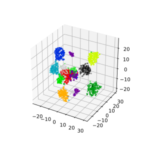

# Dimensionality reduction

As seen in the last episode, general clustering algorithms work well with low-dimensional data. In this episode we see how higher-dimensional data, such as images of handwritten text or numbers, can be processed with dimensionality reduction techniques to make the datasets more accessible for other modelling techniques. The dataset we will be using is the Scikit-Learn subset of the Modified National Institute of Standards and Technology (MNIST) dataset.

The MNIST dataset contains 70,000 images of handwritten numbers, and are labelled from 0-9 with the number that each image contains. Each image is a greyscale and 28x28 pixels in size for a total of 784 pixels per image. Each pixel can take a value between 0-255 (8bits). When dealing with a series of images in machine learning we consider each pixel to be a feature that varies according to each of the sample images. Our previous penguin dataset only had no more than 7 features to train with, however even a small 28x28 MNIST image has as much as 784 features (pixels) to work with.

To make this episode a bit less computationally intensive, the Scikit-Learn example that we will work with is a smaller sample of 1797 images. Each image is 8x8 in size for a total of 64 pixels per image, resulting in 64 features for us to work with. The pixels can take a value between 0-15 (4bits). Let's retrieve and inspect the Scikit-Learn dataset with the following code:

~~~
from sklearn import datasets

# load in dataset as a Pandas Dataframe, return X and Y
features, labels = datasets.load_digits(return_X_y=True, as_frame=True)

print(features.shape, labels.shape)
print(labels)
features.head()
~~~
{: .language-python}

## Our goal: using dimensionality-reduction to help with clustering and classification

As humans we are pretty good at object and pattern recognition. We can look at the images above, inspect the intensity and position of each pixel relative to all other pixels in the image, and pretty quickly make an accurate guess at what the image shows. As humans we spends much of our younger lives learning these spatial relations, and so it stands to reason that we can teach computers to recognise these patterns and relations too.

As we did for previous datasets, let's have a quick glance at relationships between our features/pixels. We'll inspect the following pixels:

~~~
import matplotlib.pyplot as plt
import numpy as np

print(features.iloc[0])
image_1D = features.iloc[0]
image_2D = np.array(image_1D).reshape(-1,8)

plt.imshow(image_2D,cmap="gray_r")
# these points are the pixels we will investigate
plt.plot([0,1,2,3],[4,4,4,4],"rx")
plt.show()
~~~
{: .language-python}

~~~
import seaborn as sns

# make a temporary copy of data for plotting here only
seaborn_data = features

# add labels to the dataset for pairplot color coding
seaborn_data["labels"] = labels

# make a short list of N features for plotting N*N figures
feature_subset = []

# in this case let's extract 4 pixels (out of 64) and plot their relations
for i in range(4):
    feature_subset.append("pixel_"+str(i)+"_4")

sns.pairplot(seaborn_data, vars=feature_subset, hue="labels")
~~~
{: .language-python}

As we can see the dataset relations are far more complex than our previous examples. The histograms show that some numbers appear in those pixel positions more than others (note that 2,5 and 8 do not appear in our 4 pixels at all!), but the structure is quite messy to try and decipher. It seems like there is some underlying structure that has patches of colour and also gaps. We can't obviously see any structures in our 2D representations, and we know our clustering algorithms will take a long time to try and crunch 64 dimensions. so let's see if we can represent our 64D data in fewer dimensions.

# Dimensionality reduction with Scikit-Learn
We will look at two commonly used techniques for dimensionality reduction: Principal Component Analysis (PCA) and t-distributed Stochastic Neighbor Embedding (t-SNE). Both of these techniques are supported by Scikit-Learn.

### Principal Component Analysis (PCA)

PCA uses feature extraction, i.e., it combines our input variables in a specific way so we can drop the least important or least significant variables while still retaining the fundamental attributes of our old variables. 

PCA takes the variance(or spread) of the data into account to reduce the dimensions.  Dimensions or variables having high variance have high information. Therefore, variables having very low variance can be removed or skipped. 

When the variance of both the dimensions is comparable, i.e., there is no significant difference in the variance of the dimensions we are trying to compare, PCA projects the data from the two dimensions into a single vector which is the direction of the maximum variance. Let's understand this with an example.

More complicated explanation: PCA is an important technique for visualizing high-dimensional data. PCA is a deterministic linear technique which projects n-dimensional data into k-dimensions, where `n < k`, while preserving the global structure of the input data. Dimension reduction in PCA involves transforming highly-correlated data by rotating the original set of vectors into their principal components. The variance between the transformation can be inferred by computing their eigen values.

The process of reducing dimensionality in PCA is as follows,
1. calculate the mean of each column
2. center the value in each column by subtracting the mean column value
3. calculate covariance matrix of centered matrix
4. calculate eigendecomposition of the covariance (eigenvectors represent the magnitude of directions or components of the subspace reduction)

Minimizing the eigen values closer to zero implies that the dataset has been successfully decomposed into it's respective principal components. 

Scikit-Learn lets us apply PCA in a relatively simple way. Lets code and apply PCA to the MNIST dataset. 

~~~
from sklearn import decomposition

# PCA
pca = decomposition.PCA(n_components=2)
pca.fit(x)
x_pca = pca.transform(x)

print(x_pca.shape)
~~~
{: .language-python}

This returns us an array of 1797x2 where the 2 remaining columns(our new "features" or "dimensions") contain vector representations of the First principle components (column 0) and Second Principle components (column 1) for each of the images. We can plot these two new features against each other:

~~~
import numpy as np
import matplotlib.pyplot as plt

fig = plt.figure(1, figsize=(4, 4))

tx = x_pca[:, 0]
ty = x_pca[:, 1]

plt.scatter(tx, ty, c=y, cmap=plt.cm.nipy_spectral, 
        edgecolor='k',label=y)
plt.colorbar(boundaries=np.arange(11)-0.5).set_ticks(np.arange(10))
plt.show()
~~~
{: .language-python}

As illustrated in the figure above, PCA does not handle outlier data well, primarily due to global preservation of structural information. Pre-determining the principal components also has some of the same drawbacks as k-means clustering approaches. 

### t-distributed Stochastic Neighbor Embedding (t-SNE)
t-SNE is a non-deterministic non-linear technique which involves several optional hyper-parameters such as perplexity, learning rate, and number of steps. While the t-SNE algorithm is complex to explain, it works on the principle of preserving local similarities by minimizing the pairwise gaussian distance between two or more points in high-dimensional space. The versatility of the algorithm in transforming the underlying structural information into lower-order projections makes t-SNE applicable to a wide range of research domains.

Scikit-Learn allows us to apply t-SNE in a relatively simple way. Lets code and apply t-SNE to the MNIST dataset.

~~~
from sklearn import manifold

# t-SNE embedding
tsne = manifold.TSNE(n_components=2, init='pca', random_state = 0)
x_tsne = tsne.fit_transform(x)
fig = plt.figure(1, figsize=(4, 4))
plt.clf()
plt.scatter(x_tsne[:, 0], x_tsne[:, 1], c=y, cmap=plt.cm.nipy_spectral,
        edgecolor='k',label=y)
plt.colorbar(boundaries=np.arange(11)-0.5).set_ticks(np.arange(10))
plt.show()
~~~
{: .language-python}

The major drawback of applying t-SNE to datasets is the large computational requirement. Furthermore, hyper-parameter tuning of t-SNE usually requires some trial and error to perfect. In the above figure, the algorithm still has trouble separating all the classes perfectly. To account for even higher-order input data, neural networks were developed to more accurately extract feature information.

> ## Exercise: Working in three dimensions
> The above example has considered only two dimensions since humans
> can visualize two dimensions very well. However, there can be cases
> where a dataset requires more than two dimensions to be appropriately
> decomposed. Modify the above programs to use three dimensions and 
> create appropriate plots.
> Do three dimensions allow one to better distinguish between the digits?
>
> > ## Solution
> > ~~~
> > from mpl_toolkits.mplot3d import Axes3D
> > # PCA
> > pca = decomposition.PCA(n_components=3)
> > pca.fit(x)
> > x_pca = pca.transform(x)
> > fig = plt.figure(1, figsize=(4, 4))
> > ax = fig.add_subplot(projection='3d')
> > ax.scatter(x_pca[:, 0], x_pca[:, 1], x_pca[:, 2], c=y,
> >           cmap=plt.cm.nipy_spectral, s=9, lw=0)
> > plt.show()
> > ~~~
> > {: .language-python}
> >
> > 
> >
> > ~~~
> > # t-SNE embedding
> > tsne = manifold.TSNE(n_components=3, init='pca',
> >         random_state = 0)
> > x_tsne = tsne.fit_transform(x)
> > fig = plt.figure(1, figsize=(4, 4))
> > ax = fig.add_subplot(projection='3d')
> > ax.scatter(x_tsne[:, 0], x_tsne[:, 1], x_tsne[:, 2], c=y,
> >           cmap=plt.cm.nipy_spectral, s=9, lw=0)
> > plt.show()
> > ~~~
> > {: .language-python}
> >
> > 
> >
> >
> {: .solution}
{: .challenge}

> ## Exercise: Parameters
>
> Look up parameters that can be changed in PCA and t-SNE,
> and experiment with these. How do they change your resulting
> plots?  Might the choice of parameters lead you to make different
> conclusions about your data?
{: .challenge}

> ## Exercise: Other algorithms
>
> There are other algorithms that can be used for doing dimensionality
> reduction (for example the Higher Order Singular Value Decomposition (HOSVD)).
> Do an internet search for some of these and
> examine the example data that they are used on. Are there cases where they do 
> poorly? What level of care might you need to use before applying such methods
> for automation in critical scenarios?  What about for interactive data 
> exploration?
{: .challenge}



