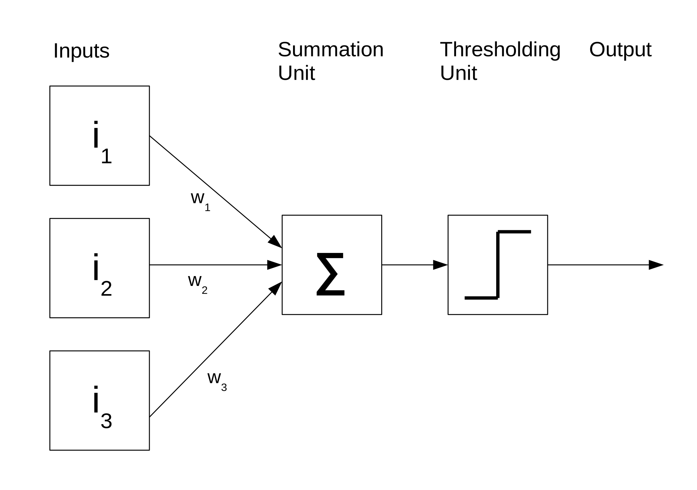
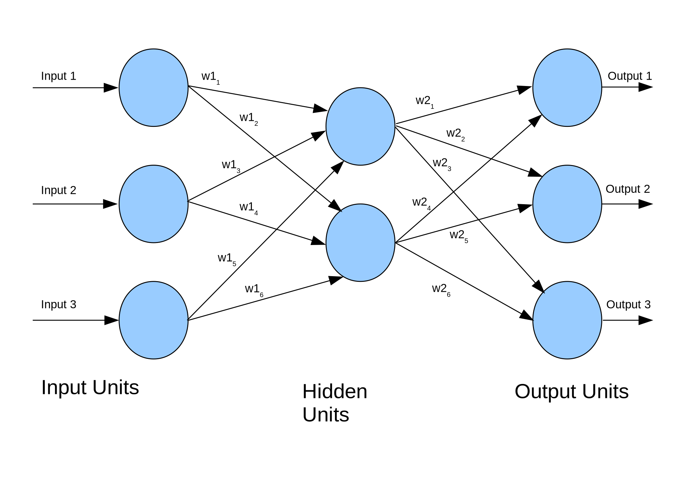

# Neural networks

Neural networks are a machine learning method inspired by how the human brain works. They are particularly good at doing pattern recognition and classification tasks, often using images as inputs. They are a well-established machine learning technique, having been around since the 1950s, but they've gone through several iterations to overcome limitations in previous generations. Using state-of-the-art neural networks is often referred to as 'deep learning'.

## Perceptrons

Perceptrons are the building blocks of neural networks. They are an artificial version of a single neuron in the brain. They typically have one or more inputs and a single output. Each input will be multiplied by a weight and the value of all the weighted inputs are then summed together. Finally, the summed value is put through an activation function which decides if the neuron "fires" a signal. In some cases, this activation function is simply a threshold step function which outputs zero below a certain input and one above it. Other designs of neurons use other activation functions, but typically they have an output between zero and one and are still step-like in their nature.

### Coding a perceptron

Below is an example of a perceptron written as a Python function. The function takes three parameters: `Inputs` is a list of input values, `Weights` is a list of weight values and `Threshold` is the activation threshold.

First let us multiply each input by the corresponding weight. To do this quickly and concisely, we will use the numpy multiply function which can multiply each item in a list by a corresponding item in another list.

We then take the sum of all the inputs multiplied by their weights. Finally, if this value is less than the activation threshold, we output zero, otherwise we output a one.

~~~
import numpy as np
def perceptron(inputs, weights, threshold):

    assert len(inputs) == len(weights)

    # multiply the inputs and weights
    values = np.multiply(inputs,weights)

    # sum the results
    total = sum(values)

    # decide if we should activate the perceptron
    if total < threshold:
        return 0
    else:
        return 1
~~~
{: .language-python}

### Computing with a perceptron

A single perceptron can perform basic linear classification problems such as computing the logical AND, OR, and NOT functions.

OR

| Input 1 | Input 2 | Output |
| --------|---------|--------|
| 0       |0        |0       |
| 0       |1        |1       |
| 1       |0        |1       |
| 1       |1        |1       |

AND

| Input 1 | Input 2 | Output |
| --------|---------|--------|
| 0       |0        |0       |
| 0       |1        |0       |
| 1       |0        |0       |
| 1       |1        |1       |

NOT

| Input 1 |Output |
| --------|--------|
| 0       |1       |
| 1       |0       |

We can get a single perceptron to compute each of these functions

OR:
~~~
inputs = [[0.0,0.0],[1.0,0.0],[0.0,1.0],[1.0,1.0]]
for input in inputs:
    print(input,perceptron(input, [0.5,0.5], 0.5))
~~~
{: .language-python}

AND:
~~~
inputs = [[0.0,0.0],[1.0,0.0],[0.0,1.0],[1.0,1.0]]
for input in inputs:
    print(input,perceptron(input, [0.5,0.5], 1.0))
~~~
{: .language-python}

NOT:

The NOT function only has a single input. To make it work in the perceptron we need to introduce a bias term which is always the same value. In this example it is the second input. It has a weight of 1.0 while the weight on the real input is -1.0.
~~~
inputs = [[0.0,1.0],[1.0,1.0]]
for input in inputs:
    print(input,perceptron(input, [-1.0,1.0], 1.0))
~~~
{: .language-python}

A perceptron can be trained to compute any function which has linear separability. A simple training algorithm called the perceptron learning algorithm can be used to do this and Scikit-Learn has its own implementation of it. We are going to skip over the perceptron learning algorithm and move straight onto more powerful techniques. If you want to learn more about it see [this page](https://computing.dcu.ie/~humphrys/Notes/Neural/single.neural.html) from Dublin City University.

### Perceptron limitations

A single perceptron cannot solve any function that is not linearly separable, meaning that we need to be able to divide the classes of inputs and outputs with a straight line. A common example of this is the XOR function shown below:

| Input 1 | Input 2 | Output |
| --------|---------|--------|
| 0       |0        |0       |
| 0       |1        |1       |
| 1       |0        |1       |
| 1       |1        |0       |

(Make a graph of this)

This function outputs a zero when all its inputs are one or zero and its not possible to separate with a straight line. This is known as linear separability. When this limitation was discovered in the 1960s it effectively halted development of neural networks for over a decade in a period known as the "AI Winter".

## Multi-layer perceptrons

A single perceptron cannot be used to solve a non-linearly separable function. For that, we need to use multiple perceptrons and typically multiple layers of perceptrons. They are formed of networks of artificial neurons which each take one or more inputs and typically have a single output. The neurons are connected together in networks of 10s to 1000s of neurons. Typically, networks are connected in layers with an input layer, middle or hidden layer (or layers), and finally an output layer.

### Training multi-layer perceptrons

Multi-layer perceptrons need to be trained by showing them a set of training data and measuring the error between the network's predicted output and the true value. Training takes an iterative approach that improves the network a little each time a new training example is presented. There are a number of training algorithms available for a neural network today, but we are going to use one of the best established and well known, the backpropagation algorithm. This algorithm is called back propagation because it takes the error calculated between an output of the network and the true value and takes it back through the network to update the weights. If you want to read more about back propagation, please see [this chapter](http://page.mi.fu-berlin.de/rojas/neural/chapter/K7.pdf) from the book "Neural Networks - A Systematic Introduction".

### Multi-layer perceptrons in scikit-learn

We are going to build a multi-layer perceptron for recognising handwriting from images. Scikit-Learn includes some example handwriting data from the [MNIST data set](http://yann.lecun.com/exdb/mnist/), which is a dataset containing 70,000 images of hand-written digits. Each image is 28x28 pixels in size (784 pixels in total) and is represented in grayscale with values between zero for fully black and 255 for fully white. This means we will need 784 perceptrons in our input layer, each taking the input of one pixel and 10 perceptrons in our output layer to represent each digit we might classify. If trained correctly, only the perceptron in the output layer will "fire" to represent the contents of the image (but this is a massive oversimplification!).

We can import this dataset from `sklearn.datasets` then load it into memory by calling the `fetch_openml` function.

~~~
import sklearn.datasets as skl_data
data, labels = skl_data.fetch_openml('mnist_784', version=1, return_X_y=True)
~~~
{: .language-python}

This creates two arrays of data, one called `data` which contains the image data and the other `labels` that contains the labels for those images which will tell us which digit is in the image. A common convention is to call the data `X` and the labels `y`.

As neural networks typically want to work with data that ranges between 0 and 1.0 we need to normalise our data to this range. Python has a shortcut which lets us divide the entire data array by 255 and store the result, we can simply do:

~~~
data = data / 255.0
~~~
{: .language-python}

This is instead of writing a loop ourselves to divide every pixel by 255. Although the final result is the same and will take about the same amount of computation (possibly a little less, it might do some clever optimisations).

Now we need to initialise a neural network. Scikit-Learn has an entire library `sklearn.neural_network` for this and the `MLPClassifier` class handles multi-layer perceptrons. This network takes a few parameters including the size of the hidden layer, the maximum number of training iterations we're going to allow, the exact algorithm to use, whether or not we'd like verbose output about what the training is doing, and the initial state of the random number generator.

In this example we specify a multi-layer perceptron with 50 hidden nodes, we allow a maximum of 50 iterations to train it, we turn on verbose output to see what's happening, and initialise the random state to 1 so that we always get the same behaviour.

~~~
import sklearn.neural_network as skl_nn
mlp = skl_nn.MLPClassifier(hidden_layer_sizes=(50,), max_iter=50, verbose=1, random_state=1)
~~~
{: .language-python}

We now have a neural network but we have not trained it yet. Before training, we will split our dataset into two parts: a training set which we will use to train the classifier and a test set which we will use to see how well the training is working. By using different data for the two, we can avoid 'over-fitting', which is the creation of models which do not "generalise" or work with data other than their training data.

Typically, 10 to 20% of the data will be used as training data. Let us see how big our dataset is to decide how many samples we want to train with. The `describe` attribute in Pandas will tell us how many rows our data has:

~~~
print(data.describe)
~~~
{: .language-python}

This tells us we have 70,000 rows in the dataset.

~~~
<bound method NDFrame.describe of        pixel1  pixel2  pixel3  pixel4  pixel5  pixel6  pixel7  pixel8  pixel9  pixel10  ...  pixel775  pixel776  pixel777  pixel778  pixel779  pixel780  pixel781  pixel782  pixel783  pixel784
0         0.0     0.0     0.0     0.0     0.0     0.0     0.0     0.0     0.0      0.0  ...       0.0       0.0       0.0       0.0       0.0       0.0       0.0       0.0       0.0       0.0
1         0.0     0.0     0.0     0.0     0.0     0.0     0.0     0.0     0.0      0.0  ...       0.0       0.0       0.0       0.0       0.0       0.0       0.0       0.0       0.0       0.0
2         0.0     0.0     0.0     0.0     0.0     0.0     0.0     0.0     0.0      0.0  ...       0.0       0.0       0.0       0.0       0.0       0.0       0.0       0.0       0.0       0.0
3         0.0     0.0     0.0     0.0     0.0     0.0     0.0     0.0     0.0      0.0  ...       0.0       0.0       0.0       0.0       0.0       0.0       0.0       0.0       0.0       0.0
4         0.0     0.0     0.0     0.0     0.0     0.0     0.0     0.0     0.0      0.0  ...       0.0       0.0       0.0       0.0       0.0       0.0       0.0       0.0       0.0       0.0
...       ...     ...     ...     ...     ...     ...     ...     ...     ...      ...  ...       ...       ...       ...       ...       ...       ...       ...       ...       ...       ...
69995     0.0     0.0     0.0     0.0     0.0     0.0     0.0     0.0     0.0      0.0  ...       0.0       0.0       0.0       0.0       0.0       0.0       0.0       0.0       0.0       0.0
69996     0.0     0.0     0.0     0.0     0.0     0.0     0.0     0.0     0.0      0.0  ...       0.0       0.0       0.0       0.0       0.0       0.0       0.0       0.0       0.0       0.0
69997     0.0     0.0     0.0     0.0     0.0     0.0     0.0     0.0     0.0      0.0  ...       0.0       0.0       0.0       0.0       0.0       0.0       0.0       0.0       0.0       0.0
69998     0.0     0.0     0.0     0.0     0.0     0.0     0.0     0.0     0.0      0.0  ...       0.0       0.0       0.0       0.0       0.0       0.0       0.0       0.0       0.0       0.0
69999     0.0     0.0     0.0     0.0     0.0     0.0     0.0     0.0     0.0      0.0  ...       0.0       0.0       0.0       0.0       0.0       0.0       0.0       0.0       0.0       0.0

[70000 rows x 784 columns]>
~~~
{: .output}

Let us take 90% of the data for training and 10% for testing, so we will use the first 63,000 samples in the dataset as the training data and the last 7,000 as the test data. We can split these using a slice operator.

~~~
data_train = data[0:63000]
labels_train = labels[0:63000]
data_test = data[63001:]
labels_test = labels[63001:]
~~~
{: .language-python}

Now lets train the network. This line will take about one minute to run. We do this by calling the `fit` function inside the `mlp` class instance. This needs two arguments: the data itself, and the labels showing what class each item should be classified to.

~~~
mlp.fit(data_train,labels_train)
~~~
{: .language-python}

Finally, let us score the accuracy of our network against both the original training data and the test data. If the training had converged to the point where each iteration of training was not improving the accuracy, then the accuracy of the training data should be 1.0 (100%).

~~~
print("Training set score", mlp.score(data_train, labels_train))
print("Testing set score", mlp.score(data_test, labels_test))
~~~
{: .language-python}

Here is the complete program:

~~~
import matplotlib.pyplot as plt
import sklearn.datasets as skl_data
import sklearn.neural_network as skl_nn

data, labels = skl_data.fetch_openml('mnist_784', version=1, return_X_y=True)
data = data / 255.0

mlp = skl_nn.MLPClassifier(hidden_layer_sizes=(50,), max_iter=50, verbose=1, random_state=1)

data_train = data[0:63000]
labels_train = labels[0:63000]

data_test = data[63001:]
labels_test = labels[63001:]

mlp.fit(data_train, labels_train)
print("Training set score", mlp.score(data_train, labels_train))
print("Testing set score", mlp.score(data_test, labels_test))
~~~
{: .language-python}

### Prediction using a multi-layer perceptron

Now that we have trained a multi-layer perceptron, we can give it some input data and ask it to perform a prediction. In this case, our input data is a 28x28 pixel image, which can also be represented as a 784-element list of data. The output will be a number between 0 and 9 telling us which digit the network thinks we have supplied. The `predict` function in the `MLPClassifier` class can be used to make a prediction. Lets use the first digit from our test set as an example.

Before we can pass it to the predictor, we need to extract one of the digits from the test set. We can use `iloc` on the dataframe to get hold of the first element in the test set. In order to present it to the predictor, we have to turn it into a numpy array which has the dimensions of 1x784 instead of 28x28. We can then call the `predict` function with this array as our parameter. This will return an array of predictions (as it could have been given multiple inputs), the first element of this will be the predicted digit. You may get a warning stating "X does not have valid feature names", this is because we didn't encode feature names into our X (digit images) data.

~~~
test_digit = data_test.iloc[0].to_numpy().reshape(1,784)
test_digit_prediciton = mlp.predict(test_digit)[0]
print("Predicted value",test_digit_prediciton)
~~~
{: .langugage-python}

We can now verify if the prediction is correct by looking at the corresponding item in the `labels_test` array.

~~~
print("Actual value",labels_test.iloc[0])
~~~
{: .language-python}

This should be the same value which is being predicted.

> ## Changing the learning parameters
> There are several parameters which control the training of the data. One of these is called the learning rate. Increasing this can reduce how many learning iterations we need. But if this is too large you can end up overshooting.
> Try tweaking this parameter by adding the parameter `learning_rate_init` with a default value of 0.001. Try increasing it to around 0.1.
{: .challenge}

> ## Using your own handwriting
> Create an image using Microsoft Paint, the GNU Image Manipulation Project (GIMP) or [jspaint](https://jspaint.app/). The image needs to be grayscale and 28 x 28 pixels.
>
> Try to draw a digit (0-9) in the image and save it into your code directory.
>
> The code below loads the image (called digit.png, change to whatever your file is called) using the OpenCV library. Some Anaconda installations need this installed either through the package manager or by running the command: `conda install -c conda-forge opencv ` from the anaconda terminal.
>
> OpenCV assumes that images are 3 channel red, green, blue and we have to convert to one channel grayscale with `cvtColor`.
>
> We also need to normalise the image by dividing each pixel by 255.
>
> To verify the image, we can plot it by using OpenCV's `imshow` function (we could also use Matplotlib's `matshow` function).
>
> To check what digit it is, we can pass it into `mlp.predict`, but we have to convert it from a 28x28 array to a one dimensional 784-byte long array with the `reshape` function.
>
> Did it correctly classify your hand(mouse) writing? Try a few images.
> If you have time try drawing images on a touch screen or taking a photo of something you have really written by hand. Remember that you will have to resize it to be 28x28 pixels.
> ~~~
> import cv2
> import matplotlib.pyplot as plt
> digit = cv2.imread("digit.png")
> digit_gray = cv2.cvtColor(digit, cv2.COLOR_BGR2GRAY)
> digit_norm = digit_gray/255.0
> cv2.imshow("Normalised Digit",digit_norm)
> print("Your digit is",mlp.predict(digit_norm.reshape(1,784)))
> ~~~
> {: .language-python}
{: .challenge}

## Measuring neural network performance

We have now trained a neural network and tested prediction on a few images. This might have given us a feel for how well our network is performing, but it would be much more useful to have a more objective measure. Since recognising digits is a classification problem, we can measure how many predictions were correct in a set of test data. As we already have a test set of data with 7,000 images we can use that and see how many predictions the neural network has gotten right. We will loop through every image in the test set, run it through our predictor and compare the result with the label for that image. We will also keep a tally of how many images we got right and see what percentage were correct.

~~~
correct=0

for row in data_test.iterrows():
    # image contains a tuple of the row number and image data
    image = row[1].to_numpy().reshape(1,784)

    prediction = mlp.predict(image)[0]
    actual = labels_test[row[0]]

    if prediction == actual:
        correct = correct + 1

print((correct/len(data_test))*100)
~~~
{: .language-python}

### Confusion matrix

We now know what percentage of images were correctly classified, but we don't know anything about the distribution of correct predictions across our different classes (the digits 0 to 9 in this case). A more powerful technique is known as a confusion matrix. Here we draw a grid with each class along both the x and y axis. The x axis is the actual number of items in each class and the y axis is the predicted number. In a perfect classifier, there will be a diagonal line of values across the grid moving from the top left to bottom right corresponding to the number in each class, and all other cells will be zero. If any cell outside of the diagonal is non-zero then it indicates a miss-classification. Scikit-Learn has a function called `confusion_matrix` in the `sklearn.metrics` class which can display a confusion matrix for us. It will need two inputs: arrays showing how many items were in each class for both the real data and the classifications. We already have the real data in the labels_test array, but we need to build it for the classifications by classifying each image (in the same order as the real data) and storing the result in another array.

~~~
from sklearn.metrics import confusion_matrix
predictions = []

for image in data_test.iterrows():
    # image contains a tuple of the row number and image data
    image = image[1].to_numpy().reshape(1,784)
    predictions.append(mlp.predict(image)[0])

confusion_matrix(labels_test,predictions)
~~~
{: .language-python}

> ## A better way to plot a confusion matrix
> The `ConfusionMatrixDisplay` class in the `sklearn.metrics` package can create a graphical representation of a confusion matrix with colour coding to highlight how many items are in each cell. This colour coding can be useful when working with very large numbers of classes.
> Try to use the `from_predictions()` method in the `ConfusionMatrixDisplay` class to display a graphical confusion matrix.
>
> > ## Solution
> > ~~~
> > from sklearn.metrics import ConfusionMatrixDisplay
> > ConfusionMatrixDisplay.from_predictions(labels_test,predictions)
> > ~~~
> > {: .language-python}
> {: .solution}
{: .challenge}

## Cross-validation

Previously we split the data into training and test sets. But what if the test set includes important features we want to train on that happen to be missing in the training set? We are throwing away part of our data to use it in the testing set.

Cross-validation runs the training/testing multiple times but splits the data in a different way each time. This means all of the data gets used both for training and testing. We can use multiple iterations of training with different data in each set to eventually include the entire dataset.

example list

[1,2,3,4,5,6,7,8]

train = 1,2,3,4,5,6
test = 7,8

train = 1,2,3,4,7,8
test = 5,6

train = 1,2,5,6,7,8
test = 3,4

train = 3,4,5,6,7,8
test = 1,2

(generate an image of this)

### Cross-validation code example

The `sklearn.model_selection` module provides support for doing k-fold cross validation in Scikit-Learn. It can automatically partition our data for cross validation.

Let us import this and call it `skl_msel`

~~~
import sklearn.model_selection as skl_msel
~~~
{: .language-python}

Now we can choose how many ways we would like to split our data (three or four are common choices).

~~~
kfold = skl_msel.KFold(4)
~~~
{: .language-python}

Now we can loop through our data and test on each combination. The `kfold.split` function returns two variables and we will have our for loop work through both of them. The train variable will contain a list of which items (by index number) we are currently using to train and the test one will contain the list of which items we are going to test on.

~~~
for (train, test) in kfold.split(data):
~~~
{: .language-python}

Now inside the loop, we can select the data with `data_train = data.iloc[train]` and `labels_train = labels.iloc[train]`. In some versions of Python/Pandas/Scikit-Learn, you might be able to use `data_train = data[train]` and `labels_train = labels[train]`. This is a useful Python shorthand which will use the list of indices from `train` to select which items from `data` and `labels` we use. We can repeat this process with the test set.

~~~
    data_train = data.iloc[train]
    labels_train = labels.iloc[train]

    data_test = data.iloc[test]
    labels_test = labels.iloc[test]
~~~
{: .language-python}

Finally, we need to train the classifier with the selected training data and then score it against the test data. The scores for each set of test data should be similar.

~~~
    mlp.fit(data_train,labels_train)
    print("Testing set score", mlp.score(data_test, labels_test))
~~~
{: .language-python}

Once we have established that the cross validation was ok, we can go ahead and train using the entire dataset by doing `mlp.fit(data,labels)`.

Here is the entire example program:

~~~
import matplotlib.pyplot as plt
import sklearn.datasets as skl_data
import sklearn.neural_network as skl_nn
import sklearn.model_selection as skl_msel

data, labels = skl_data.fetch_openml('mnist_784', version=1, return_X_y=True)
data = data / 255.0

mlp = skl_nn.MLPClassifier(hidden_layer_sizes=(50,), max_iter=50, random_state=1)

kfold = skl_msel.KFold(4)

for (train, test) in kfold.split(data):
    data_train = data.iloc[train]
    labels_train = labels.iloc[train]

    data_test = data.iloc[test]
    labels_test = labels.iloc[test]
    mlp.fit(data_train,labels_train)
    print("Training set score", mlp.score(data_train, labels_train))
    print("Testing set score", mlp.score(data_test, labels_test))
mlp.fit(data,labels)
~~~
{: .language-python}

## Deep learning

Deep learning usually refers to newer neural network architectures which use a special type of network known as a 'convolutional network'. Typically, these have many layers and thousands of neurons. They are very good at tasks such as image recognition but take a long time to train and run. They are often used with GPUs (Graphical Processing Units) which are good at executing multiple operations simultaneously. It is very common to use cloud computing or HPC systems with multiple GPUs attached.

Scikit-Learn is not really setup for deep learning. We will have to rely on other libraries. Common choices include Google's TensorFlow, Keras, (Py)Torch or Darknet. There is, however, an interface layer between sklearn and tensorflow called skflow. A short example of using this layer can be found at [https://www.kdnuggets.com/2016/02/scikit-flow-easy-deep-learning-tensorflow-scikit-learn.html](https://www.kdnuggets.com/2016/02/scikit-flow-easy-deep-learning-tensorflow-scikit-learn.html).

### Cloud APIs

Google, Microsoft, Amazon, and many others now have cloud based Application Programming Interfaces (APIs) where you can upload an image and have them return you the result. Most of these services rely on a large pre-trained (and often proprietary) neural network.

> ## Exercise: Try cloud image classification
> Take a photo with your phone camera or find an image online of a common daily scene.
> Upload it to Google's Vision AI at https://cloud.google.com/vision/
> How many objects has it correctly classified? How many did it incorrectly classify?
> Try the same image with Microsoft's Computer Vision API at https://azure.microsoft.com/en-gb/services/cognitive-services/computer-vision/
> Does it do any better/worse than Google?
{: .challenge}


